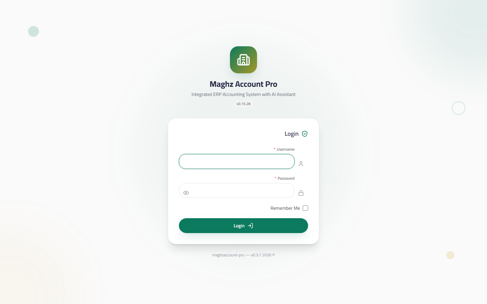

# Login — User Guide

> Signing in to the system with a username and password, and managing your password and session.

## Overview

After completing the First-Run Setup Wizard, or every time you open the system without an active session, the login screen appears with the application logo. After setup, the default is the administrator account with the username `admin` and the password you set (or the system generated) in step 4 of the wizard.

## The Login Screen

- **Access:** appears automatically when the application opens with no active session.

| Element | Description | Required |
|---|---|---|
| Username | The login name, example: `admin` | Yes |
| Password | The user's password | Yes |
| Remember me | Pre-fills the username on the next login — does not save the password | No |
| Show/hide (eye) button | Displays the password in plain text so you can verify it before clicking "Login" | — |
| "Login" button | Verifies the credentials and opens the system | — |

### The Error Message

When you enter wrong credentials, the following message appears:

> **"Incorrect username or password"**

The message is deliberately a single one for two reasons: it doesn't reveal to attackers whether the username is correct, and it doesn't indicate which of the two fields is wrong. Check:

1. That Shift isn't active or the keyboard isn't in the wrong language while typing the password.
2. Use the eye button to display the password before logging in.
3. That the user hasn't been disabled from the Users page (an inactive user cannot log in).

## "Remember Me" — What Exactly Does It Do?

| When enabled | When not enabled |
|---|---|
| Only the **username** is saved and pre-filled on the next login, with the box automatically ticked | The field starts empty every time |

> **Important:** "Remember me" does not save the password and does not open the session automatically — the password is requested at every login.

## Password Policy

When creating a new user or changing a password, the password must meet three conditions:

| Condition | Detail |
|---|---|
| Length | **At least 12 characters** |
| At least one letter | Arabic or Latin (A-Z / a-z) |
| At least one digit | 0-9 |

Examples: `Maghz@2026` (9 characters — rejected for length), `مغزى الحسابات 2026` (accepted), `Shop#Yemen2026` (accepted).

## Changing Your Password

You can change your password at any time without needing an administrator:

- **Path:** the user menu in the header (the user avatar at the top left) ← **Change Password**

| Field | Description |
|---|---|
| Current password | Must be entered correctly — the change is refused without it |
| New password | Must meet the password policy (12 characters + a letter + a digit) |
| Confirm password | Must match the new password |

The system verifies the current password first (fail-closed): a failed verification means no change. After success, use the new password on your next login — the current session continues.

## Logout

- **Path:** the user menu ← **Logout**
- The session ends immediately and you return to the login screen, and the event is recorded in the Audit Log.

## Automatic Logout (Session Protection)

To protect your business data from unattended devices:

| Behavior | Detail |
|---|---|
| Inactivity period | **30 minutes** |
| What counts as activity? | Moving the mouse, pressing keys, scrolling, touch |
| What happens when the period ends? | The system logs you out automatically to the login screen |
| Periodic check | The system checks the session every minute |

> If you return to your device and find the login screen — nothing went wrong; the idle timeout (30 minutes) expired and the system logged you out automatically.

## The Session Is Bound to the Device/Tab

The session is not "text that can be moved" — it is bound to the session fingerprint on the same device/tab you logged in from:

- A session replayed from another tab or device **is rejected and automatically cleared** when an attempt is made to resume it (protection against Session Fixation).
- If your user is deleted, disabled, or the database is re-initialized while a session exists, the system verifies your account still exists when the session is resumed and ends the session if it no longer does.
- On logout, session data is completely cleared from the device.

## Permissions After Login

What you see after logging in depends on your role:

| Role | What does it see? |
|---|---|
| `super_admin` | Everything without restriction |
| `admin` | Almost everything (except a few limited sensitive permissions such as `core.edit`) |
| `manager` | Operational modules: sales, POS, purchases, inventory, manufacturing, accounting, reports |
| `accountant` | Accounting, purchases, sales, and reports |
| `sales_rep` | Only its own sales, POS, and data (`sales.own`) |
| `viewer` | Read-only, with no adding or editing |

> **Note:** hiding menus by permission is a user-experience measure, but the real protection is that every route in the system is guarded — even if someone tries to type the URL directly, the page is refused. See `03-interface/README.md`.

## Common Errors & Fixes

| Message/Problem as shown | Cause | Solution |
|---|---|---|
| "Incorrect username or password" | Wrong credentials, a keyboard in another language, or the user is disabled | Check the keyboard language and use the eye button; if it persists, ask the administrator to check the user's status |
| I was asked to log in although I didn't log out | The 30-minute inactivity timeout expired | Log in again |
| I forgot the admin password | No direct recovery | Another admin changes it from the Users page, or re-run setup from Settings ← Re-initialize |

## Tips

- Enable "Remember me" only on your personal device — don't enable it on a shared device.
- An automatically generated password is stronger than a hand-picked one — store it in a password manager and the problem is solved.
- Log out of the cashier machine before leaving the shop — a manual logout is safer than waiting for the idle timeout.
