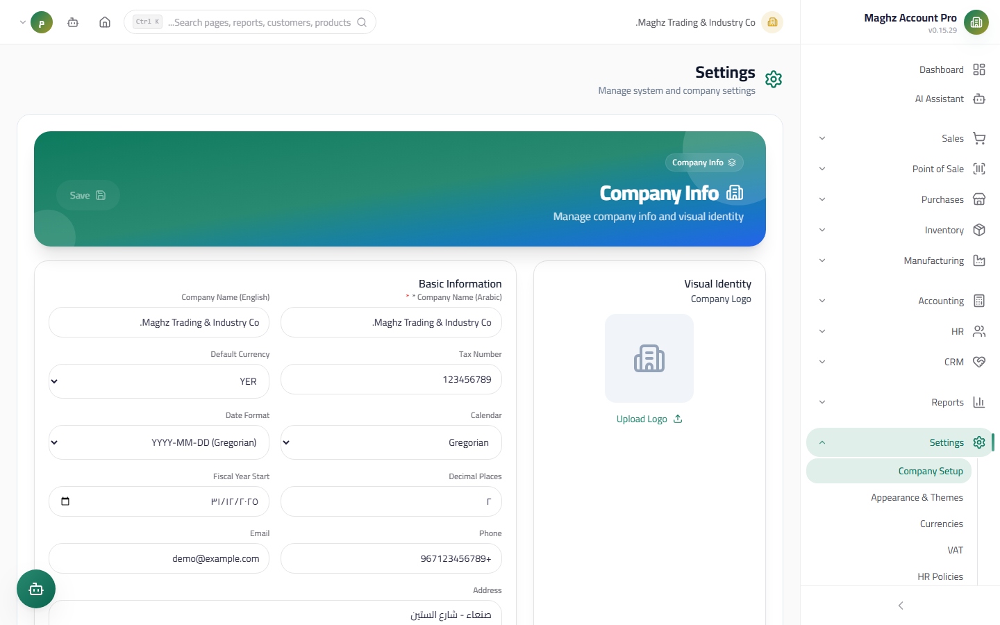

# Company Information — User Guide

> Your organization's identity card inside the system: logo, name, tax number, default currency, calendar, and display formats.

## Overview

The Company Information page is the first thing you should configure after installing the system. This data appears at the top of printed invoices, vouchers, and reports, and the default currency, calendar, and decimal places control how every amount and date is displayed across the whole system.

- **Access:** Sidebar ← Settings ← Company Information
- **Route:** `/settings/company`

## Access & Permissions

| Action | Permission |
|---|---|
| View the page | `settings.view` |
| Edit the data and save | `settings.edit` |

If you do not have `settings.edit`, the Save button is hidden and you cannot make changes from the interface.

## Screen: Company Information

- **Access:** Sidebar ← Settings ← Company Information
- **Purpose:** Enter the organization's official identity and configure the general display preferences.

### Fields

| Field | Description | Required/Optional |
|---|---|---|
| Company logo | An image uploaded from your device (any image format). **Maximum file size is 2 MB** — larger files are rejected with an error message. The logo appears on invoices and printed documents | Optional |
| Name (Arabic) | The organization's official name in Arabic. **The name is required** — you cannot save without entering it, and leading/trailing whitespace is trimmed automatically | Required |
| Name (English) | The name in English; it appears on English documents | Optional |
| Tax number | The tax registration number issued by the competent authority; it appears on printed invoices | Optional |
| Default currency | A dropdown populated from the **active currencies** defined on the Currencies page (the default appears first). If you have not defined any currencies yet, the field becomes free text (default value YER) | Optional (defaults to YER) |
| Calendar | Gregorian or Hijri. **Choosing the calendar changes the available date format options** in the next field | Optional (defaults to Gregorian) |
| Date format | How dates are displayed. For Hijri: `yyyy/MM/dd` (Hijri), `DD/MM/YYYY`, `YYYY-MM-DD`. For Gregorian: `yyyy-MM-dd`, `DD/MM/YYYY`, `YYYY/MM/DD` | Optional (defaults to `yyyy-MM-dd`) |
| Decimal places | Number of decimal places for displaying amounts, from **0 to 6**. A value outside this range is clamped automatically on save (for example, 9 is saved as 6) | Optional (defaults to 2) |
| Fiscal year start | The organization's fiscal year start date, used in periodic reports | Optional |
| Phone | The organization's phone number | Optional |
| Email | The organization's email (a standard email field) | Optional |
| Address | The full textual address | Optional |

### Buttons & Actions

| Button | Function |
|---|---|
| **Save** | Saves all changes. **The button stays disabled until the data actually changes** — if you modify nothing it remains gray. After saving, the company data in memory is refreshed immediately and appears on every screen without a restart |
| **Upload Logo** | Opens a file picker; the new logo is previewed as soon as you select it (before saving), and the actual upload happens on save |

## Step-by-Step Workflow

1. Go to: Sidebar ← Settings ← Company Information.
2. Click "Upload Logo" and choose an image smaller than 2 MB.
3. Enter the name in Arabic (required), the English name, and the tax number.
4. Choose the default currency from the dropdown (you must have defined it in advance on the Currencies page — see `02-branches-currencies.md`).
5. Choose the calendar (Gregorian/Hijri), then pick a date format from the options available for the chosen calendar.
6. Set the decimal places (2 suits most cases; use 0 if you deal in whole amounts only).
7. Set the fiscal year start and enter the phone, email, and address.
8. Click "Save" — a success message appears and the change is recorded in the Audit Log.

## Where Does This Data Appear?

The data on this page is never isolated — every module in the system reads from it:

| Data | Where it is used |
|---|---|
| Logo | Header of invoices, vouchers, printed documents, and PDF exports |
| Name (Arabic/English) | Header of all documents + the company name in the app's top bar |
| Tax number | Printed invoices and tax reports |
| Default currency | The default display currency on every screen + the assumed currency for new documents before you change it |
| Date format and calendar | Every date field displayed on screens and documents |
| Decimal places | Formatting of every amount displayed on screens and reports |
| Fiscal year start | Periodic reports built on the fiscal year |
| Phone/Email/Address | Footer of printed documents and contact information |

## Important Rules

- **Conditional save:** the Save button only enables when there is a difference between the displayed and saved data; this prevents empty saves and needless audit entries.
- **The name is required:** attempting to save with an empty name shows an error message and nothing is saved.
- **Changing the default currency later:** changes the display currency on screens and reports, but it does **not convert** the amounts stored in old documents — so set it correctly from the start.
- **Hijri calendar:** changes only the available display formats; dates are always stored in the database in a standard format.
- **Every save is recorded** in the Audit Log with the username and the time.
- **Company isolation:** this data belongs only to the active company in your session; if you switch the active company from the top bar you will see that company's own data.

## Common Errors & Fixes

| Message/Behavior | Cause | Solution |
|---|---|---|
| "Logo file is too large" | The selected file is larger than 2 MB | Shrink the image (compress or use smaller dimensions) and upload again |
| The Save button is disabled even though I made changes | The change was not captured yet, or you restored the original value | Change any field again and make sure the value differs from the saved one |
| "Name is required" | The Arabic name field is empty or contains spaces only | Enter the organization's name |
| The currency dropdown is empty in the default currency field | You have not defined any active currencies yet | Create the currencies first from: Settings ← Currencies, then return to this page |
| I cannot click Save at all | You do not have the `settings.edit` permission | Ask the system administrator to grant you the permission |

## Tips

- Use a square logo with a white or transparent background — it looks best on invoices.
- If your organization officially uses the Hijri calendar, choose Hijri before issuing the first invoice so all documents stay consistent.
- Double-check the tax number: it appears on every printed invoice and VAT filings are built on it.
- Set the contact details (phone/email/address) early; some partners reject invoices that lack complete organization information.
- After the first save, take a backup (see `08-backup-database.md`) — the page then becomes a "safe point" you can return to.
