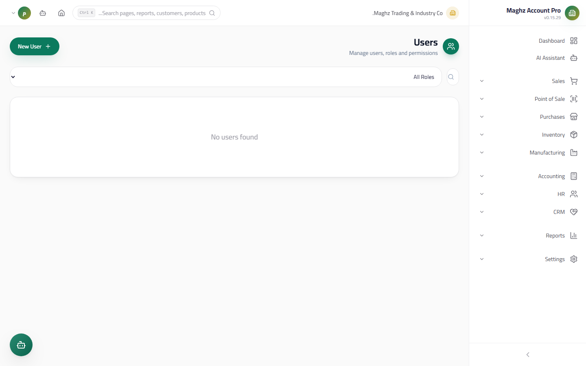
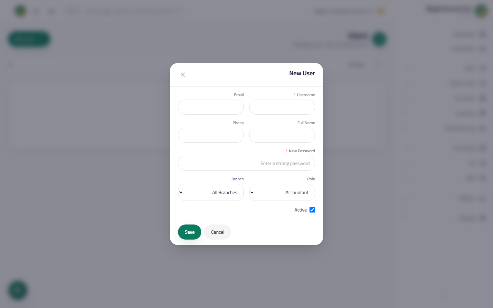
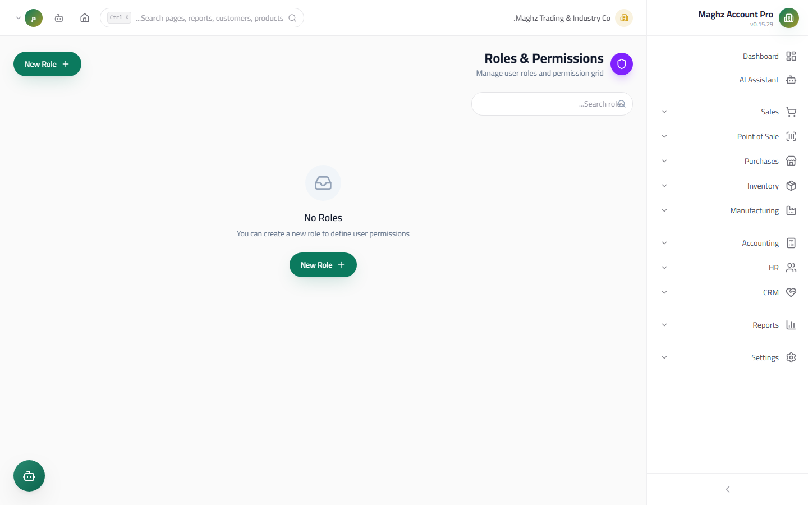
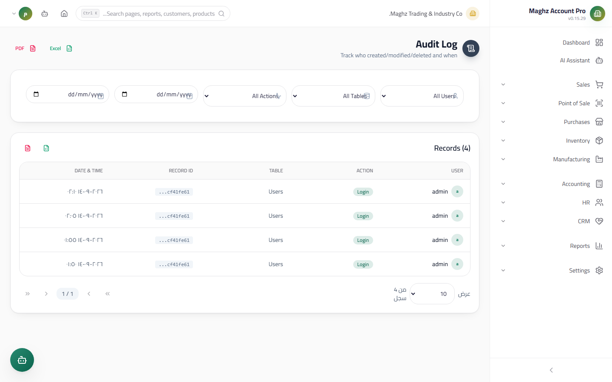

# Users, Roles & Permissions — User Guide

> Control who enters the system, what they see, and what they can do — with a full Audit Log of every sensitive action.

## Overview

This area manages three interconnected pages:

| Page | Path | Purpose |
|---|---|---|
| **Users** | Sidebar ← Settings ← Users (`/users`) | Create accounts and assign roles and branches |
| **Roles** | Sidebar ← Settings ← Roles (`/roles`) | Define permission groups (built-in and custom roles) |
| **Audit Log** | Sidebar ← Settings ← Audit Log (`/audit-logs`) | Review every sensitive action after it happens |

The core idea: **never grant a permission directly to a user — create a role, let the role carry the permissions, then add the user to the role.**

## Access & Permissions

| Page | Required permission | Notes |
|---|---|---|
| Users | `settings.users` | Without it you are redirected automatically to the Dashboard |
| Roles | `settings.roles` | Create and edit buttons appear only to holders of `settings.edit` |
| Audit Log | `settings.audit_log` | Without it, a clear denial screen appears explaining the missing permission |

**Built-in roles and their scope at a glance:**

| Role | Scope |
|---|---|
| `super_admin` (System Super Admin) | Everything without exception |
| `admin` (Administrator) | Everything **except** `core.edit` |
| `manager` (General Manager) | View, create, edit, and post in most modules; view settings; export reports |
| `accountant` (Accountant) | Full accounting (view/create/edit/post), sales and purchases without delete, reports with export |
| `sales_rep` (Sales Representative) | `sales.own` + `sales.create` + `sales.edit` **without** `sales.view` — sees the Sales module but only their own documents; likewise `pos.own` and `crm.own` |
| `viewer` (Viewer) | View-only across all operational modules — no create, edit, or export |

## The Permission Model

Every permission is written as `module.action` and displayed in a grid grouped by module:

### Operational Module Permissions

| Permission | Meaning |
|---|---|
| `module.view` | **Full view** — sees all company documents in the module |
| `module.own` | **"My documents only"** — lists are filtered automatically to show only the user's own documents |
| `module.create` | Create new documents |
| `module.edit` | Edit documents |
| `module.delete` | Delete documents |
| `module.post` | **Posting** — available in Accounting (`accounting.post`), Sales (`sales.post`), POS (`pos.post`), and Manufacturing (`manufacturing.post`); posting creates the journal entry and locks editing |

> **Important note about `own`:** a user holding `sales.own` without `sales.view` is not blocked from the menu — they see the full module, but the lists show only their own documents. That is how a sales rep works: they record their invoices and see their invoices, without access to colleagues' invoices.

### Special Permissions

| Group | Permissions |
|---|---|
| **Reports** | `reports.view` (view) / `reports.export` (Excel and PDF export) / `reports.custom` (Custom Report Builder) |
| **Settings** | `settings.view` (view) / `settings.edit` (edit settings) / `settings.users` / `settings.roles` / `settings.audit_log` |
| **AI** | `ai.use` (use the "Maghz" AI Assistant) / `ai.settings` (assistant settings) |
| **System** | `core.view` / `core.edit` |
| **Wildcard** | `*` — grants every permission without exception (use with extreme caution) |

## The Users Screen (`/users`)

- **Access:** Sidebar ← Settings ← Users
- **Purpose:** Manage login accounts and link them to roles and branches.
- **Filters:** a search box (username) and a **Filter by role** dropdown (Admin / Manager / Accountant / Sales Rep / Viewer / All roles).
- **The table:** shows the username (with an avatar from the first letter), the email, the role (as a badge), the branch, and the status (active/inactive).

### Add / Edit User

Click **New User** or the edit icon next to the row:

| Field | Description | Required |
|---|---|---|
| Username | The login identifier; appears in the Audit Log | Yes |
| Email | For contact and recovery | Optional |
| Full name | The display name | Optional |
| Phone | For contact | Optional |
| Role | Determines the permissions (see the permission model above) | Yes (default: Accountant) |
| Branch | Link the user to a specific branch, or "All branches" | Optional |
| Active account | Clearing it blocks sign-in while keeping the account | Enabled by default |

### User Actions

| Action | How it works |
|---|---|
| **View details** | A modal showing the email, phone, branch, full name, creation date, and last login |
| **Reset password** | Key icon → enter the new password → confirm |
| **Deactivate / Activate** | Toggle icon with a confirmation modal; deactivation blocks sign-in without deleting the user's history |
| **Delete** | Delete icon with a red confirmation modal |

> **Golden rule: you cannot delete yourself, deactivate yourself, or reset your own password from here.** The delete, deactivate, and reset-password buttons are **fully disabled** on your own account row. This prevents accidentally locking up the system.

## The Roles Screen (`/roles`)

- **Access:** Sidebar ← Settings ← Roles
- **Purpose:** Define who can do what, using reusable permission groups.
- **Display:** role cards in a grid; each card shows the name, the description, permission badges (the first 6 badges then `+N` for the rest), and a **"System" lock badge** for built-in roles.
- **Search:** a search box by name.

### Create / Edit / Clone / Delete a Role

| Action | Details |
|---|---|
| **New role / Edit** | A large modal with the name (required) and description + the **permission grid** |
| **Clone** | Creates a new role named "[role name] - Copy" with the same permissions — the fastest way to build a custom role from a close one |
| **Delete** | With a confirmation modal — **not available for system roles** |

### The Permission Grid

Displayed grouped by module (System, Accounting, Inventory, Sales, POS, Purchases, Manufacturing, HR, CRM, Reports, Settings, AI Assistant):

- Click a **module name** in the right column = **"select all"** for that module's permissions (click again to clear them).
- Or toggle each permission individually as a separate button.
- The module's box shows: a check mark (all selected), a partially filled box (partial selection), or empty (none).
- A counter at the top of the grid shows the number of selected permissions.

## System Roles (isSystem) — Locked

Built-in roles (such as System Super Admin, Accountant, and Viewer) carry the **"System"** badge with a lock icon. For them:

1. **No editing and no deleting** — the name and description fields are disabled, the permission grid is dimmed and non-clickable, and the delete button is absent.
2. The save button appears labeled **"Read-only"** and disabled.
3. A **yellow warning** appears at the top of the modal: "System role — read-only".

**The practical solution:** click **Clone** on the system role, edit the copy as you like, save it as a **custom role**, then assign users to it. This is how you extend the system without touching the core roles.

## Route Protection — Hiding the Menu Is Not Protection

Hiding an item from the sidebar is only a visual convenience. Real protection works at two levels:

1. **The sidebar** hides modules the user cannot access (`module.view` or `module.own` or `module.create`).
2. **Every route is protected at the URL level:** typing `/accounting` directly in the address bar without `accounting.view` **does not open the page** — you are redirected automatically to the Dashboard. The same applies to `/users`, `/roles`, and `/audit-logs`.

Sessions also end automatically after **30 minutes** of inactivity (refreshed with every click, keystroke, or scroll).

## The Audit Log Screen (`/audit-logs`)

- **Access:** Sidebar ← Settings ← Audit Log
- **Purpose:** a **read-only** log of every sensitive action — nothing in it can be edited or deleted.
- **What it records:** create, edit, delete, post, cancel, login, logout, password reset, user activation/deactivation.
- **Filters (5):** user, table (users, roles, accounts, journal entries, products, customers, sales invoices, purchase invoices, employees, warehouses), action, from date, to date — with a "Reset filters" button.
- **Details per record:** the user (with an avatar), the action as a colored badge, the table, the record ID, and the date and time. Edit records store the **old/new values**, and the **IP address** of the operation is recorded.
- **Export:** an Excel button and a PDF button — they export the current list (after filters) with Arabic labels, and the PDF is RTL-formatted with the company name.

## Recommended Step-by-Step Workflow

Example: hiring a new sales rep named "Sami" for the Aden branch:

1. Sidebar ← Settings ← Roles. The built-in roles are usually enough — the `sales_rep` role is ready. (For customization: clone `sales_rep`, add e.g. `crm.create`, and save.)
2. Sidebar ← Settings ← Users ← **New User**.
3. Enter the username `sami`, the full name, phone, and email.
4. Choose the role **Sales Representative** and the branch **Aden Branch**.
5. Leave "Active account" checked and save.
6. Give Sami the initial password; on any later issue, use **Reset Password**.
7. Later, monitor their activity from the **Audit Log** filtered by their name: their logins, their invoices, any edit.

## Important Rules

- Permissions are checked on the server at every sensitive operation, not only in the UI.
- `module.own` filters the lists to the user's own records, but it does not prevent creating new documents.
- Editing a role's permissions takes effect **immediately** for everyone holding the role (sessions are refreshed).
- Every operation on the Users and Roles pages (create/edit/delete/password reset/activation) is recorded in the Audit Log.
- A deactivated user is blocked from signing in immediately, and resuming their old session is refused.

## Common Errors & Fixes

| Message or observation | Cause | Solution |
|---|---|---|
| I don't see the "New User" button | The `settings.edit` permission is missing | Ask a `super_admin` to grant it to your role |
| The delete/deactivate buttons are grayed out on a specific user | It is your own account | Use another account to manage yours, or ask a higher administrator |
| "Read-only" in the role modal | The role is a system role (isSystem) | Click "Clone" and create a custom role |
| I typed a URL in the browser and was returned to the Dashboard | The module permission is missing — protection is working | Request the appropriate permission (`module.view` or `module.own`) |
| The rep cannot see colleagues' invoices | This is the intended `sales.own` behavior | Grant `sales.view` for full visibility if needed |
| A "You do not have permission to view the audit log" screen | `settings.audit_log` is missing | Granted to management only — contact your system administrator |

## Tips

- Start with the built-in roles; create custom roles only when there is a real need — fewer roles make review easier.
- Always use "Clone" instead of building a role from scratch.
- Review the Audit Log weekly and filter for the "delete" and "password reset" actions.
- When an employee leaves: **deactivate** the account instead of deleting it — it preserves the history of the documents linked to them.
