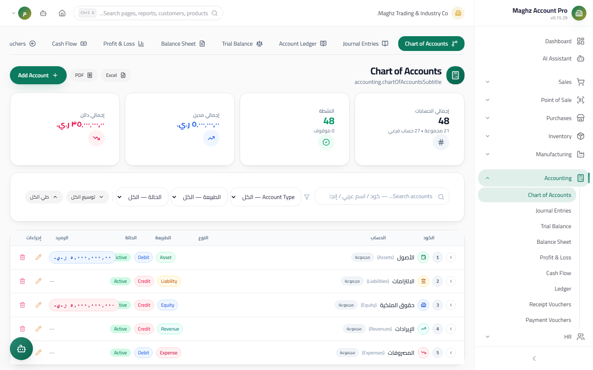

# Chart of Accounts — User Guide

> The hierarchical structure of your company's accounts — the foundation on which every entry and report is built.

## Overview

The Chart of Accounts is a complete, classified, tiered list of all accounts. Find it at: **Sidebar ← Accounting ← Chart of Accounts** (`/accounting/chart`). At first run you get a **ready-made Chart of Accounts** aligned with international standards (IFRS) under five main types — no need to build it from scratch; just add your detail accounts under it.

## The Hierarchy

Every account is either:

| Type | Meaning | How its balance is computed |
|---|---|---|
| **Group Account** | A node that aggregates children; no transactions are recorded on it directly | Its balance = **the sum of its children's balances**, automatically |
| **Detail account** | A final account on which entries are recorded | Its balance comes from its posted entries |

**The five types and their numbering prefixes:**

| Type | Prefix | Examples from the default tree | Default nature |
|---|---|---|---|
| Assets | `1` | Cash `11`, Accounts Receivable `12`, Inventory `13` | Debit |
| Liabilities | `2` | Accounts Payable `21`, Loans `22` | Credit |
| Equity | `3` | Capital `31` | Credit |
| Revenues | `4` | Sales Revenue `41` | Credit |
| Expenses | `5` | Salaries and Wages `51` | Debit |

In the screen, a Group Account appears with an expand arrow; click it to drill down to its children, and click the account itself to view its details.

## Two Tree Views and Export

The screen presents the same data in two ways:

| View | Form | Best for |
|---|---|---|
| **Tree view** (default) | An expandable/collapsible hierarchy; a Group Account carries its balance aggregated from its children | Understanding the structure and navigating |
| **Table view** | Flattened rows with columns: code, Arabic name, English name, type, nature, group/detail, balance | Quick scanning and comparison |

Both views obey the same filters, and both can be exported to **Excel** — the exported file contains all columns, with the type column in Arabic, the nature column (debit/credit), and the classification column (group/account).

## A Sample from the Default Tree

```
1 Assets (Group Account)
└── 11 Cash (Group Account)
 ├── 11101 Cash Box (Detail — Debit)
 └── 11102 Ahli Bank (Detail — Debit)
4 Revenues (Group Account)
└── 41 Sales Revenue (Group Account)
 └── 41101 Retail Sales (Detail — Credit)
```

Note: the balance of `11 Cash` = the balance of `11101` + the balance of `11102` — never attempt to record a transaction at the group level.

## Filters and Summary Cards



**The filters at the top of the screen:**

| Filter | Options | Behavior |
|---|---|---|
| Search | Free text | Matches the code, the Arabic name, or the English name, and keeps the parent path visible in the tree |
| Type | Assets / Liabilities / Equity / Revenues / Expenses | Shows matching accounts and their children |
| Nature | Debit / Credit | Shows accounts of one nature |
| Status | Active / Inactive | Shows active or suspended accounts |

**The summary cards:**

| Card | What it shows |
|---|---|
| Total accounts | The number of accounts (detail + group) |
| Groups | The number of Group Accounts |
| Total balances | The sum of the detail accounts' balances |
| Total debit side | The sum of the balances of debit-nature accounts |
| Total credit side | The sum of the balances of credit-nature accounts |

## Adding an Account

Click **Add Account**, then fill in:

| Field | Description | Required |
|---|---|---|
| Code | The account number within the hierarchy (e.g. `11102` under `111`) | Yes |
| Arabic name | e.g. "Main Cash Box" | Yes |
| English name | e.g. `Main Cash` | Optional |
| Parent | The parent Group Account — **selecting a parent inherits its type and nature automatically** and **suggests the next available code under the parent** | Recommended |
| Type | Assets/Liabilities/Equity/Revenues/Expenses (inherited from the parent) | Yes |
| Nature | Debit/Credit (inherited from the parent) | Yes |
| Group/Detail | Enable the option if the account is an aggregation node | Detail by default |
| Active | A suspended account appears in lists but cannot be used in new entries | Active by default |

### Opening Balance (Add Only)

When creating a detail account you can enter an **Opening Balance** and its side (debit/credit). The Opening Balance is posted as a balanced entry through the opening equity account, so it appears in the Account Ledger and the reports automatically. This field is **disabled when editing** — the balance cannot be edited manually.

### Automatic Code Suggestion

- When you select the **Parent**, the system suggests the **first available code** under it (e.g. parent `111` already has `11101` and `11102` → it suggests `11103`).
- The suggestion **never overwrites a code you typed manually**: once you type the code yourself the system treats it as "yours" and does not re-suggest when you change the parent.
- To return to the automatic suggestion, click the **Regenerate code** button.
- When editing an existing account, its current code is preserved and is not overwritten automatically.

## Important Rules

- **The code is unique within the company:** two accounts cannot share a code; the system rejects a duplicate code with a "Duplicate code" message.
- **An account with posted entries cannot be deleted** — and the balance cannot be edited manually (it mirrors the entries). To correct the balance of an account with activity, use a new **reversing entry**, not editing.
- **A Group Account carries no independent balance:** its balance is always computed from its children, so never record an entry on it directly.
- **Deleting an account requires confirmation:** a confirmation modal appears before execution, and the result appears as a success or error notification.
- Every add/edit/delete is recorded in the **Audit Log**.
- There is also a **duplicate-name guard**: when you type a name close to an existing account, a warning showing the similar account's card appears before saving.

### Summary Table: What Is Allowed and What Is Forbidden?

| Operation | Detail account with no entries | Detail account with entries | Group Account |
|---|---|---|---|
| Edit name/code/nature | ✓ | ✓ (the balance is not manually editable) | ✓ |
| Enter an Opening Balance | ✓ (at creation only) | ✗ (via an entry) | ✗ |
| Delete | ✓ with confirmation | ✗ — "Cannot delete an account that has journal entries" | ✗ if it has children |
| Add child accounts | ✗ (detail) | ✗ | ✓ |
| Record an entry on it | ✓ | ✓ | ✗ |

## Step-by-Step Workflow

Example: adding a "Cash Box - Aden" account under Cash:

1. Sidebar ← Accounting ← Chart of Accounts ← **Add Account**.
2. In the **Parent** field, select "Cash" (`111`).
3. Notice: the type (Assets) and the nature (Debit) are filled automatically, and the next available code is suggested — e.g. `11103`.
4. Type the Arabic name "صندوق عدن" (Aden Cash Box) and the English name `Aden Cash`.
5. Enter the Opening Balance if any — e.g. 500,000 debit.
6. Leave "Detail" and "Active" as they are and save.
7. Search for `11103` in the tree to confirm it appears under Cash.

## Common Errors & Fixes

| Message | Cause | Solution |
|---|---|---|
| "Duplicate code" | The code is used by another account in the same company | Type another code or click "Regenerate code" |
| "Cannot delete an account that has journal entries" | The account has posted entries | Suspend the account instead of deleting it, or use a reversing entry |
| The group account's balance cannot be edited | The group balance always = the sum of the children | Adjust the detail accounts' balances through entries |
| The suggested code changed after selecting a new parent | The suggestion works only before you type the code manually | Type your code manually or click "Regenerate code" |
| The account does not appear when creating an entry | The account is inactive or a group account | Activate the account, or use a detail account |

## Tips

- Don't over-nest: three levels (type ← group ← detail account) are enough for most businesses.
- Keep gaps in the numbering (`11101`, `11105`) to accommodate new accounts in the future without renumbering.
- Suspend abandoned accounts instead of deleting them — it keeps the history of old reports intact.
- Check the debit and credit cards after entering Opening Balances; their agreement is the first sign of correct entry.
- Standardize naming from the start ("Rent Expense", not "Rent" sometimes and "Monthly Rent" other times) — the duplicate guard helps, but naming discipline prevents a chaos of near-duplicate accounts.
- Review the Chart of Accounts with your accountant annually; merging rarely used accounts simplifies the Income Statement and the Balance Sheet.
