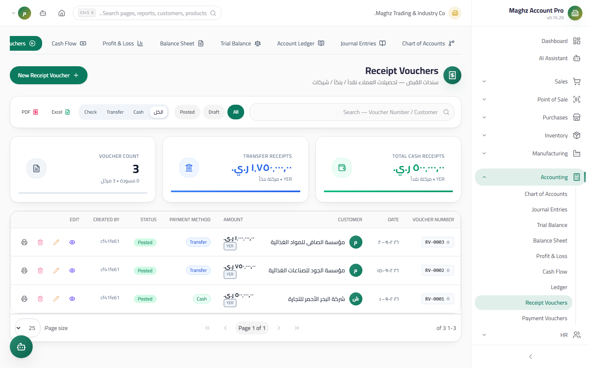
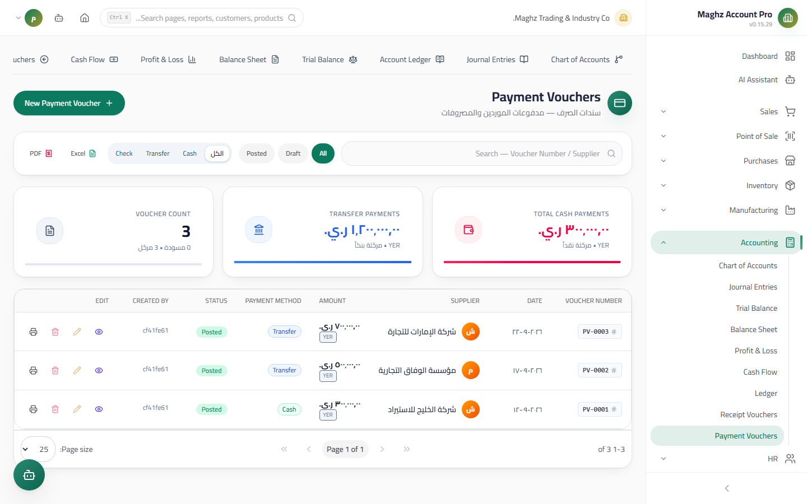

# Receipt Vouchers & Payment Vouchers — User Guide

> Daily cash movement: a Receipt Voucher for money received from customers, and a Payment Voucher for money paid to suppliers and for expenses — each generates its journal entry when posted.

## Overview

A voucher is an accounting document that records a cash (or cheque) movement in/out of the cash box. The two vouchers share the same structure and rules and differ in direction and counterparty:

| | **Receipt Voucher** | **Payment Voucher** |
|---|---|---|
| Path | Accounting ← Receipt Vouchers (`/accounting/receipt-vouchers`) | Accounting ← Payment Vouchers (`/accounting/payment-vouchers`) |
| Direction | Money **in** from a customer | Money **out** to a supplier or for an expense |
| Counterparty | A customer (**mandatory**) | **A supplier or an expense account — at least one of the two** |
| Effect when posted | Reduces the customer's balance | Reduces the supplier's balance or records the expense |

## Access & Permissions

| Action | Permission |
|---|---|
| View | `accounting.view` |
| Create a voucher | `accounting.create` |
| Edit/delete | `accounting.edit` / `accounting.delete` — **drafts only** |
| Post | `accounting.post` |

## The List and Filters

Both screens show a vouchers table with the columns: voucher number, date, party (customer/supplier), amount (with a "linked" icon when tied to an invoice), and the status as a colored badge.

- **Status filter:** All / Draft / Posted — to review pending drafts before the end of the day.
- **Print voucher:** an official receipt with the logo, the company details, the party name, the amount, and the payment method.
- **Export:** the voucher list can be exported to Excel/PDF from the toolbar.

## The Receipt Vouchers Screen

### The Fields

| Field | Description | Required |
|---|---|---|
| Voucher number | **Automatic from the sequence** — generated at save; do not type it manually | Automatic |
| Date | The collection date | Yes |
| Customer | From the customers list | Yes |
| Amount | The voucher value — **must be greater than zero** | Yes |
| Currency and exchange rate | The currency and its Base Currency equivalent (YER by default) | Optional |
| Payment method | **Cash by default**, with other options (a cheque with the cheque number, and the linked Cash Box) | Default: Cash |
| Linked invoice | Selecting an unpaid sales invoice for this customer, with **the amount applied to the invoice** | Optional |
| Status | Draft or Posted | Default: Draft |

### Linking to an Invoice

When you select an unpaid invoice for the customer:

- The system automatically suggests the applied amount (the smaller of the voucher amount and the invoice's remaining balance).
- **The applied amount cannot exceed the voucher amount** — the system rejects a larger value with the validation message: "The applied amount cannot exceed the voucher amount".
- If you save with an invoice without specifying the applied amount, the full voucher amount is applied.

## The Voucher Lifecycle

| Status | Meaning | What you can do in it |
|---|---|---|
| **Draft** | Not posted — no effect on the balance or the invoice | Edit, delete, **post**, print |
| **Posted** | Final — the journal entry has been issued and the balance updated | **Read and print only** |
| **Cancelled** | The voucher was cancelled | Appears in the list with a badge, for review only |

### What Happens on Posting?

Clicking "Post" executes **one atomic operation** — either all of it succeeds or everything rolls back:

1. **It creates the voucher's journal entry** (debit: Cash Box/Bank, credit: customer — the reverse for payment vouchers).
2. **It updates the customer's balance** on their record (reducing the debt by the voucher amount).
3. **It applies the amount to the linked invoice**, if any (updating the paid amount on the invoice).
4. **It flips the voucher's status** from Draft to Posted.

> **A posted voucher is uneditable** — you may not even edit the invoice link or the applied amount of a posted voucher; the system explicitly rejects it. Correction is done with a new opposing voucher or a notification from the relevant modules.

## The Payment Vouchers Screen — The Opposing Mirror

A payment voucher has the same structure as a receipt voucher and the same lifecycle, with two essential differences:

1. **The party:** it requires **a supplier or an expense account (at least one)** — the system's validation refuses to save with the message "A supplier or expense account is required" if both are left empty. Selecting a supplier opens their list of **unpaid purchase invoices** to link the voucher to.
2. **The effect when posted:** the entry is reversed (debit: the supplier or the expense account, credit: Cash Box), and the supplier's balance is reduced instead of the customer's.

**All receipt voucher rules also apply to the payment voucher:**

- **The sequence:** the voucher number is generated automatically from the document sequences.
- **Exclusivity:** a supplier **or** an expense account — neither are both mandatory together, nor may both be left empty.
- **Duplication:** the same document duplicate guard — an entry exactly matching an existing voucher is **blocked**, and a close match **raises a warning** before saving.
- **Posting:** atomic, with a journal entry + a balance update + a status flip, and the posted voucher is uneditable.

## Step-by-Step Workflow — A Numeric Example

Customer "Al-Noor Est." has an unpaid invoice and a current balance of **17,250 YER**. We receive from them a cash cheque for **10,000 YER**:

1. Accounting ← Receipt Vouchers ← **New Voucher**.
2. Date: today. Status: Draft.
3. Customer: "Al-Noor Est." — their unpaid invoices appear.
4. Link the invoice and let the applied amount suggest 10,000 (less than the voucher amount, so no overflow).
5. Amount: **10,000**. Payment method: **Cash** (the default). Select the Cash Box if you use more than one.
6. Save (draft) — then review it and click **Post**.
7. In one stroke the system created the entry, reduced the customer's balance, applied the amount to the invoice, and flipped the status to Posted.

**The accounting result:**

| Item | Before | After |
|---|---:|---:|
| Customer balance (Accounts Receivable) | 17,250 YER | **7,250 YER** |

And recorded in the books:

| Account | Debit (YER) | Credit (YER) |
|---|---:|---:|
| Cash Box `11101` | 10,000 | |
| Customer — Al-Noor Est. `12..` | | 10,000 |

A mirror example for a payment voucher: we paid supplier "Gulf Supplies" 25,000 from the Cash Box → a Payment Voucher, party = the supplier, amount = 25,000, post → the supplier's balance drops by 25,000 and the entry: debit the supplier / credit the Cash Box.

### A Payment Voucher on an Expense Account (No Supplier)

We paid 8,000 YER in cash for office electricity — there is no supplier here, so choose an **expense account**:

| Field | Value |
|---|---|
| Date | Today |
| Expense account | "Electricity & Water Expense" (`511..`) |
| Amount | 8,000 |
| Payment method | Cash |

After posting:

| Account | Debit (YER) | Credit (YER) |
|---|---:|---:|
| Electricity & Water Expense `511..` | 8,000 | |
| Cash Box `11101` | | 8,000 |

Note: this payment appears immediately in the **Income Statement** under expenses — while a supplier-settlement payment never passes through the Income Statement because it settles a debt rather than creating a new expense.

## Important Rules

- **The amount is always greater than zero** — no voucher at zero or with a negative value.
- **Paid invoices do not appear** in the linking list — only unpaid ones.
- A voucher linked to an invoice transfers a payment to that invoice, while an unlinked voucher only reduces the customer's overall balance.
- With multiple currencies, the **Base Currency equivalent** is stored and computed server-side.
- Every create, edit, delete, and post is recorded in the **Audit Log**.
- The Post button requires the `accounting.post` permission — without it you can see the vouchers but cannot post them.

## Common Errors & Fixes

| Message | Cause | Solution |
|---|---|---|
| "The applied amount cannot exceed the voucher amount" | You entered an applied amount larger than the voucher value | Reduce the applied amount or link the voucher to a larger invoice |
| "A supplier or expense account is required" (payment voucher) | The party was left empty | Select a supplier or an expense account |
| "Cannot modify invoice link..." | You are trying to edit the invoice link on a posted voucher | Create a new voucher to correct the situation |
| The edit/delete buttons are disabled | The voucher is posted | Uneditable by design — correct it with an opposing voucher |
| The voucher number cannot be typed into | The number is automatic from the sequence | This is correct — save and the number will be generated |

## Tips

- Post the vouchers daily and link them to their invoices — a linked voucher makes the receivables aging and the account statement accurate.
- Don't leave voucher drafts piling up; the actual cash box may drift from what the reports show.
- Enter the cheque number in its field when paying by cheque — it appears when printing and eases the bank reconciliation.
- Check the customer's balance before and after a large voucher; the difference must equal the voucher amount exactly (as in the example: 17,250 − 10,000 = 7,250).
