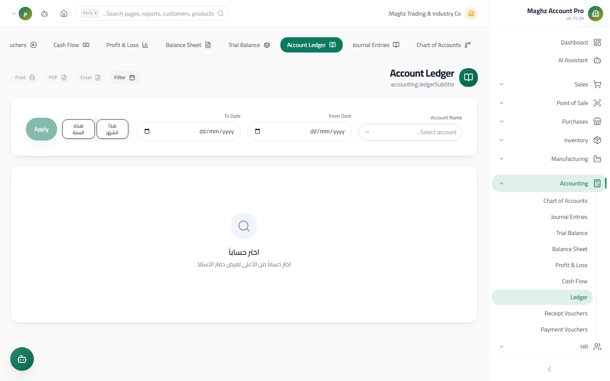
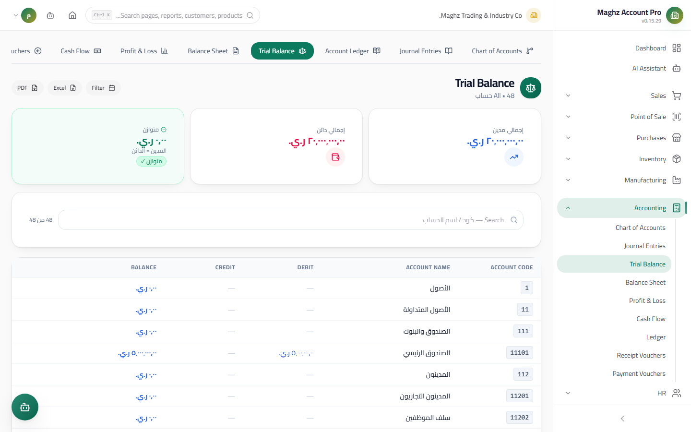
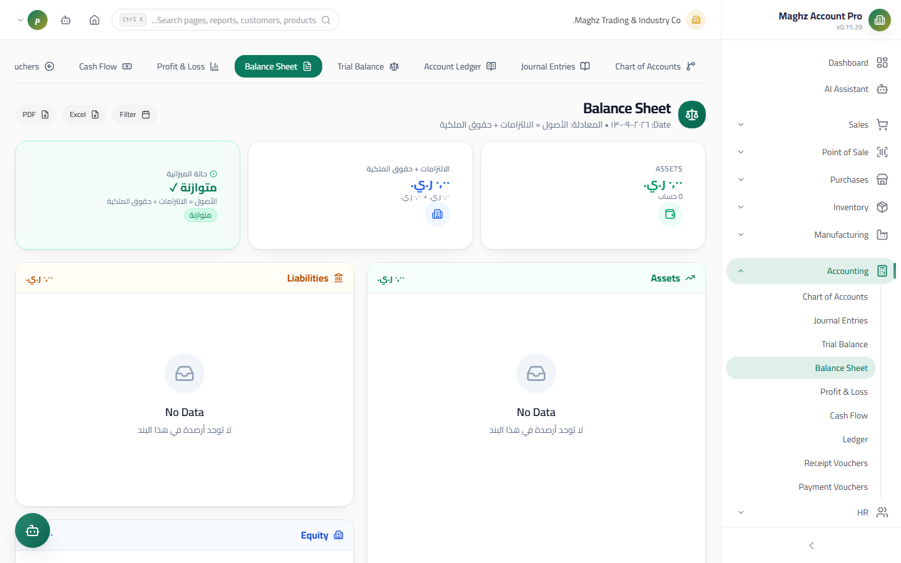
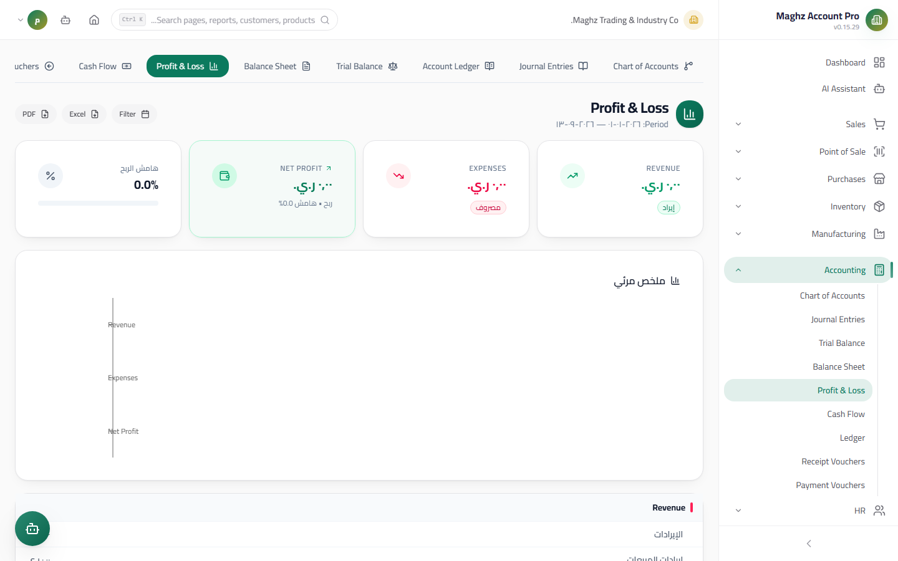
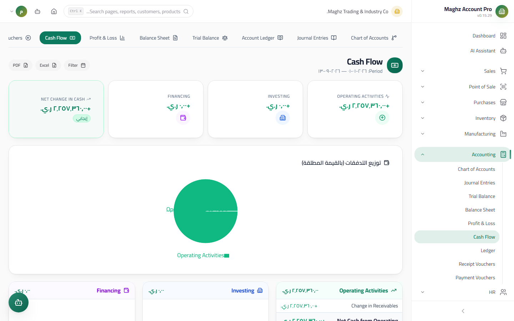

# Financial Reports — User Guide

> The four approved reports (Trial Balance, Balance Sheet, Income Statement, Cash Flow Statement) + the Account Ledger — all read from posted entries only.

## Overview

These screens are the Accounting module's output. Everything you posted — entries, vouchers, invoices — appears here ready to read and export:

| Report | Path | The question it answers |
|---|---|---|
| **Account Ledger** | `/accounting/ledger` | What are this account's transactions, and how did its balance accumulate? |
| **Trial Balance** | `/accounting/trial` | Are the books balanced? And what is each account's balance? |
| **Balance Sheet** | `/accounting/balance` | What do we own and owe at a moment in time? |
| **Income Statement** | `/accounting/profit` | Did we profit in this period, and by how much? |
| **Cash Flow Statement** | `/accounting/cashflow` | Where did the cash come from, and where did it go? |

## Access & Permissions

- Every report requires `accounting.view` to view.
- **Export** to Excel and PDF is available in every report (plus `reports.export` for the general Reports Hub).
- **Dates in local time** — all date filters are read in your device's local date, and the display uses the Arabic format.

## Account Ledger

- **Access:** Accounting ← Account Ledger
- **Purpose:** a detailed statement of one account's transactions with a **Running Balance** row by row.

**How to use it:**

1. Select the **account** from the dropdown.
2. Set the **period** (from date — to date), or leave it empty for all transactions.
3. Read the table: each transaction with its date, description, debit, credit, and the **Running Balance** after it.
4. At the top, **summary cards:** the total debit, the total credit, and the net balance.
5. The **Opening Balance** appears as the first row: the balance of everything posted **before** the start of the selected period, so the transactions start from a correct balance, not from zero.
6. **Export:** Excel or PDF with the same columns and the selected period.

> Typical use: a bank reconciliation (filter the bank account for a specific month), or reviewing a customer's statement before calling them.

## Trial Balance

- **Access:** Accounting ← Trial Balance
- **Purpose:** show all accounts with their balances up to a specific date, and verify that the books are balanced.

**Features:**

- **As-of date:** a single date filter ("as-of date") + ready **quick periods** (today, this month, this quarter...) for instant jumps.
- For each account: the code, the name, **debit, credit, balance**.
- A totals row at the bottom: the total debit must equal the total credit — if they don't match, something is wrong in the input.
- **Jump to the ledger:** hover over an account row and a link appears taking you **directly to the Account Ledger** for the same account, with the period carried over.
- **Balances come from posted entries only** — drafts never appear here.
- Search by name/code + Excel/PDF export with a header showing the company name and the date.

## Balance Sheet

- **Access:** Accounting ← Balance Sheet
- **Purpose:** a financial snapshot **as of a date**: what you own (assets) versus what you owe (liabilities) and what remains for the owner (equity).

**Structure:**

| Section | Content |
|---|---|
| Assets | Accounts of the "Assets" type grouped by the tree, each Group Account with its children |
| Liabilities | Accounts of the "Liabilities" type |
| Equity | Accounts of the "Equity" type + the period's result |

### The Automatic Balance Indicator

At the top of the report, a live indicator verifies the accounting equation:

**Assets = Liabilities + Equity** (within a **0.01** tolerance)

- If it holds: a green **"Balanced"** badge ✓
- If not: a yellow badge shows the **difference amount** in rials — e.g. "Difference 12,500 YER". Look for the missing entry or an account assigned the wrong nature.
- **As-of date:** change the date to see the Balance Sheet at any earlier moment.
- Excel/PDF export.

## Income Statement

- **Access:** Accounting ← Income Statement
- **Purpose:** measure performance over a **period** (from — to): revenues, expenses, and net profit.

**Content:**

1. **Revenues:** all the "Revenues" type accounts with their balances for the period + the total revenues.
2. **Expenses:** all the "Expenses" type accounts with their balances for the period + the total expenses.
3. **Net profit** = revenues − expenses, in a highlighted row (a positive balance = profit, negative = loss).
4. A **summary chart** (bars) comparing revenues, expenses, and net profit visually.
5. Excel/PDF export.

## Cash Flow Statement

- **Access:** Accounting ← Cash Flow Statement
- **Purpose:** track the cash movement using the **indirect** method — it explains why cash changed even though the net profit is a different number.

**The three sections:**

| Section | What it aggregates |
|---|---|
| **Operating** | Starts from **net profit**, then non-cash adjustments: **depreciation**, and changes in **Accounts Receivable and Payable** and **Inventory** |
| **Investing** | Buying and selling **fixed assets** |
| **Financing** | The movement of **loans** and **equity** (capital injection, withdrawals) |

The report ends with the **net change in cash** = the sum of the three sections, which should theoretically match the difference between the cash balance at the start and at the end of the period.

## One Unified Numeric Example Across the Four Reports

To understand how the reports relate to each other, consider a business after its first month where it posted: capital of 1,000,000 in cash, merchandise purchases of 400,000 in cash, cash sales of 300,000 (cost of goods sold 180,000), and rent of 50,000:

**The Trial Balance at month end:**

| Account | Debit (YER) | Credit (YER) |
|---|---:|---:|
| Cash Box | 850,000 | |
| Inventory | 220,000 | |
| Capital | | 1,000,000 |
| Sales Revenue | | 300,000 |
| Cost of Sales | 180,000 | |
| Rent Expense | 50,000 | |
| **Total** | **1,300,000** | **1,300,000** |

**The Income Statement for the month:** revenues 300,000 − (cost of sales 180,000 + rent 50,000) = **net profit 70,000**.

**The Balance Sheet at month end:** assets (cash 850,000 + inventory 220,000 = 1,070,000) = equity (capital 1,000,000 + the period's net profit 70,000) → the **"Balanced"** indicator ✓

**The Cash Flow for the month:** operating +100,000 (profit 70,000 + the inventory change, positive in effect here since purchase and sale are combined, as shown in detail in the report) + financing +1,000,000 − investing 0 → the **net change in cash** matches the Cash Box balance.

> The example is simplified for learning; in reality the operating section aggregates the receivables, inventory, and depreciation changes in detail, as in the sections table above.

## Opening Balances — How Do They Appear in the Reports?

The Opening Balance is not entered as a "side input" but is **posted as balanced entries** through the **opening equity account**:

- When you enter an Opening Balance for an account (from the Chart of Accounts), the system generates an entry: debit/credit the account itself, with the counterparty in the opening equity account.
- The result: the Opening Balance **appears automatically** in the Account Ledger (as an opening row), and in the Trial Balance, the Balance Sheet, and the Income Statement — with no manual handling and without breaking the accounting equation.

## Important Rules

- **Balances come from posted entries only** in all five reports — a draft does not exist accounting-wise.
- The "Balance Sheet" and "Trial Balance" are point-in-time (**as-of date**), while the "Income Statement" and "Cash Flow" cover a **period** (from — to).
- The Balance Sheet's balance indicator tolerance is **0.01** — any larger difference deserves immediate investigation.
- Editing posted entries is forbidden; every correction appears in the reports as a new entry once posted.
- Every report is exportable to Excel/PDF, and printing follows the RTL direction with the company name.

## Common Errors & Fixes

| Observation | Cause | Solution |
|---|---|---|
| The Balance Sheet is "unbalanced" by a difference | A missing entry or an account assigned the wrong type | Review the Trial Balance, then the Account Ledger of the suspect account |
| An account's balance doesn't match its ledger | You are reading a report that includes drafts or a different period | Make sure all the entries are posted and the two periods match |
| A group account shows zero while its details have balances | The screen was refreshed before the computation completed | Reload — the group balance is aggregated from the children only |
| Opening balances don't appear in the report | The opening entry is still a draft | Post the Opening Balance entry |
| The balance sheet is unbalanced after entering opening balances | The counterparty wasn't recorded or was duplicated | Make sure every opening balance passed through the opening equity account |

## Tips

- Adopt a routine: a Trial Balance at each month end ← Balance Sheet ← Income Statement; three reports in this order catch most errors early.
- Use the "as-of date" in the Trial Balance to compare month ends (30/6 vs 31/7) and spot illogical jumps.
- The jump link from the Trial Balance to the ledger is the fastest investigation path: a strange balance ← Account Ledger ← the suspicious transaction.
- The net change in cash must always be explainable — if you can't explain it, review your receivables and inventory; they are what consumes the most of the gap between profit and cash.
