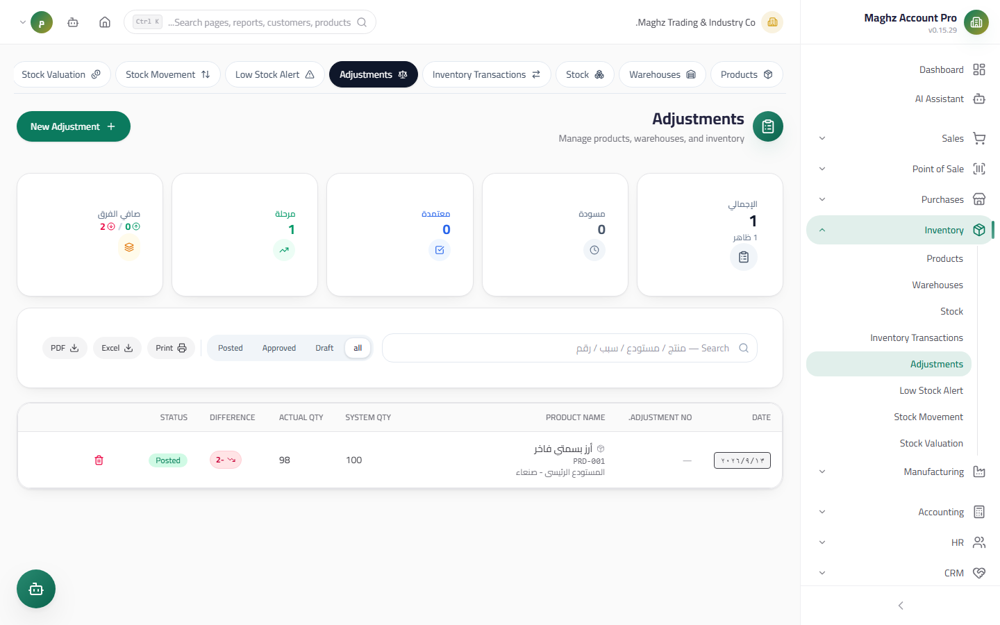

# Stock Adjustments (Stock Counts) — User Guide

> Document the physical count differences between the book quantity and the actual quantity, with an approve-and-post cycle that generates the journal entry and corrects the balance.

## Overview

The adjustment is the official document for count differences: breakage, damage, loss, or a counting error. Access it from: **Sidebar ← Inventory ← Adjustments** (`/inventory/adjustments`).

## Access & Permissions

| Action | Permission |
|---|---|
| View the list | `inventory.view` |
| Create/edit an adjustment | `inventory.create` / `inventory.edit` |
| Approve an adjustment | `inventory.edit` |
| Post an adjustment | `inventory.edit` (after approval) |
| Delete | `inventory.delete` — **drafts only** |

## Adjustments Screen

- **Access:** Sidebar ← Inventory ← Adjustments
- **Purpose:** Manage the full counting cycle from entry to posting

### KPIs at the Top of the Screen

| Indicator | Description |
|---|---|
| **Drafts** | Adjustments not yet approved |
| **Approved** | Awaiting posting |
| **Posted** | Their inventory and accounting effect has been executed |
| **Positive Differences** | The sum of increases (actual more than book) |
| **Negative Differences** | The sum of absolute shortages |
| **Net Difference** | Positive minus negative |

### Adjustment Fields

| Field | Description | Required |
|---|---|---|
| **Adjustment Number** | `ADJ-` prefix from document sequences | Auto |
| **Date** | The count date | Yes |
| **Product** | The counted item | Yes |
| **Warehouse** | Where the count took place | Yes |
| **System Quantity** | The current book balance — shown automatically for review | Yes |
| **Actual Quantity** | What was actually counted on the shelves | Yes |
| **Difference** | **Calculated automatically** = actual − system (displayed colored: green for positive, red for negative) | Auto |
| **Reason** | Damage, breakage, measurement error… appears in the journal entry and the movement log | Optional |
| **Unit Cost** | The cost used to value the difference in the journal entry | Optional |

## Document Lifecycle

| Status | Meaning | What you can do in it |
|---|---|---|
| **Draft** | You entered the result and no one has reviewed it | Edit, delete, **Approve** |
| **Approved** | A permitted user reviewed it and agreed | **Post** — editing is closed |
| **Posted** | Its effect was executed: balance correction + journal entry | Read-only |
| **Rejected** | Excluded without execution | Read-only |

## Workflow — Add ← Approve ← Post

1. **Add:** enter the physical count; the system calculates the difference automatically and saves a **draft**.
2. **Approve:** the "Approve" button records the approver and the time, and flips the status to **Approved**.
3. **Post:** the "Post" button (shown only on approved adjustments) executes a single **atomic transaction**:

| Posting step | Effect |
|---|---|
| Stock movement | A log entry of type `adjustment` referencing `ADJ-…` with the reason |
| Balance correction | **The item's balance is set to the actual quantity** in the relevant warehouse |
| Journal Entry | **Generated only if the difference is non-zero**: difference value = difference × unit cost |

**Governing rule: a zero difference cannot be posted** — the system blocks it with an explicit message; a zero-difference adjustment needs no journal entry and no correction in the first place.

### Journal Entry Effect

| Difference | Debit account | Credit account |
|---|---|---|
| **Negative** (shortage — inventory shrinkage) | Inventory Shrinkage Expense | Inventory |
| **Positive** (surplus — inventory gain) | Inventory | Inventory Surplus Income |

The entry value = `difference × unit cost` — so fill in the unit cost accurately.

## Step-by-Step Workflow — Numeric Example

Counting "Orange Juice" in the Main Warehouse: book 180 pieces, actual 176:

1. Sidebar ← Inventory ← Adjustments ← **New Adjustment**.
2. Product: "Orange Juice". Warehouse: Main Warehouse. Date: `2026-09-12`.
3. System quantity shows: `180`. Enter the actual: `176` → **the difference is calculated automatically: −4**.
4. Reason: "Packaging damage". Unit cost: `500` YER.
5. **Save** → adjustment `ADJ-00003` is a **draft** (the balance has not changed yet).
6. Review the result with the storekeeper, then click **Approve**.
7. Click **Post** — one atomic effect:

| Effect | Details |
|---|---|
| Stock movement | `adjustment` with quantity 4, reference `ADJ-00003`, reason "Packaging damage" |
| New balance | 176 pieces in the Main Warehouse |
| Difference value | 4 × 500 = **2,000 YER** |

The resulting journal entry:

| Account | Debit (YER) | Credit (YER) |
|---|---:|---:|
| Inventory Shrinkage Expense | 2,000 | |
| Inventory | | 2,000 |

If the count had been 183 instead of 180 (a +3 surplus), the entry would reverse: debit Inventory 1,500 / credit Inventory Surplus Income 1,500.

## Important Rules

| Rule | Details |
|---|---|
| The difference is automatic | Do not type the difference manually — it is computed from (actual − system) |
| Approve before posting | No posting directly from a draft |
| A zero difference is rejected for posting | It has no accounting value and no balance correction to justify |
| Posting sets the balance to the actual | It does not add or subtract — the final balance = the actual quantity |
| Posted adjustments are fixed | No editing or deletion — correct with a new reversing adjustment |
| The cost values the difference | The journal entry value = the difference × the entered unit cost |

## Common Errors & Fixes

| Message | Cause | Solution |
|---|---|---|
| "Cannot post an adjustment with a zero difference" | Actual = system | No need to post — keep it as a count record or delete it |
| The "Post" button does not appear | The adjustment is a draft (not approved) | Approve it first |
| The edit button is disabled | The adjustment is approved or posted | Editing is for drafts only; correct with a new adjustment |
| The journal entry came out with an unexpected value | The unit cost is empty or wrong | Review the unit cost before posting — there is no editing afterwards |
| The balance changed in a different warehouse than expected | The wrong warehouse was selected at entry | The posted adjustment is fixed — create a corrective adjustment for the right warehouse |

## Tips

- Make the approver someone other than whoever entered the count — a simple separation that catches entry errors.
- Always fill in the **Reason**: it is what appears in the journal entry and the movement log and makes later review possible.
- Review the "Positive Differences" and "Negative Differences" cards monthly — a recurring shortage pattern means a security or process problem.
- Before posting, confirm that the unit cost reflects the product's current cost, because the journal entry value is built on it.
- Count a limited set of items on a rotating schedule (cycle counting) instead of closing the entire warehouse.
