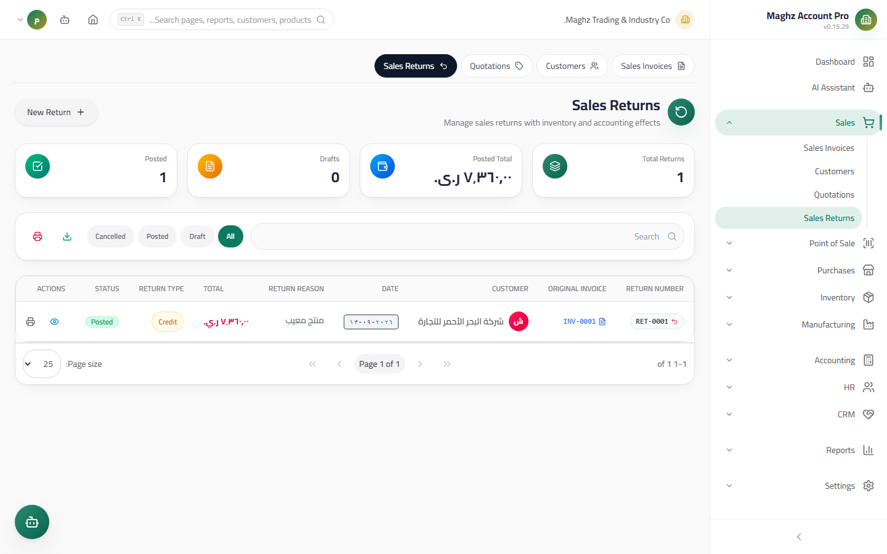

# Sales Returns — User Guide

> A goods return from the customer against an original invoice: it reduces the customer balance, restores stock, and issues a sales return journal entry — atomically on posting.

## Overview

A sales return documents goods coming back after a sale: a manufacturing defect, shipping damage, or a customer rejection. It is linked to an original invoice and posts to generate its full effect. Access it from: **Sidebar ← Sales ← Returns** (`/sales/returns`).

## Access & Permissions

| Action | Permission |
|---|---|
| View the list and details | `sales.view` |
| Create/edit a return | `sales.create` / `sales.edit` |
| Delete a draft | `sales.delete` |
| Post a return | `sales.post` |

## The List

A table showing: return number, customer, **original invoice** (with its number), date, total, **reason**, status, and action buttons.

- **Search** by return number and customer + a **status filter** + a **customer filter** + **server-side pagination**.
- **Excel/PDF export** of the displayed results.

## New Return Screen

- **Access:** Sidebar ← Sales ← Returns ← the **New Return** button
- **Purpose:** Document goods coming back from a customer

### Fields

| Field | Description | Required |
|---|---|---|
| **Return Number** | Generated automatically with the `SR-` prefix from document sequences | Auto |
| **Original Invoice** | Select a **posted** invoice with an outstanding balance — **its lines load automatically** after selection | Yes |
| **Customer** | **Locked** from the original invoice — not selected manually | Auto |
| **Date** | The date the goods came back | Yes |
| **Lines** | From the loaded invoice lines: product, unit with its factor, returned quantity, unit price | Yes |
| **Reason** | **Mandatory** — defect, damage, rejection… appears in the journal entry and the list | Yes |
| **Notes** | Additional details | Optional |

The return price is based on the original invoice's price (after its line discount, if any) — you can adjust it according to your policy.

## Document Lifecycle

| Status | Meaning | What you can do in it |
|---|---|---|
| **Draft** | Has affected nothing | Edit, delete, **Post** |
| **Posted** | The journal entry was issued, stock returned, and the customer balance decreased | Read and print only |
| **Cancelled** | Cancelled before posting | Read-only |

**Editing and deletion are for drafts only** — a posted return is a fixed accounting record.

## Posting Effects (Atomic)

The **Post** button executes a **single transaction** that succeeds entirely or rolls back entirely:

| Effect | Details |
|---|---|
| **Sales return journal entry** | Debit "Sales Returns" with the total / credit **Accounts Receivable** with the same value |
| **Stock restoration** | Within the posting statements — the deduction is reversed back into stock: inbound movements referencing the return number |
| **Customer balance reduction** | The customer's balance decreases by the return total (the full amount unless a partial payment is preserved) |
| **Status** | Flipped to **Posted** within the same transaction |

The running balance in the customer's account statement counts the posted return as a credit line after the invoice.

## Step-by-Step Workflow — Numeric Example

A damaged carton of juice came back from invoice `INV-00052`:

1. Sidebar ← Sales ← Returns ← **New Return**.
2. The number appears automatically: `SR-00006`.
3. **Original invoice:** select `INV-00052` (Al-Noor Est.) — **its lines load**: juice cartons at 9,000. The customer is locked: Al-Noor Est.
4. Returned quantity: `1` carton. Reason: "Packaging damage — photographed in the attachments".
5. Total = `9,000`. **Save** → draft `SR-00006` (nothing has changed yet).
6. Inspect the goods physically, then click **Post** — the atomic effect:

| Effect | Details |
|---|---|
| Stock | +12 base pieces return to the warehouse, a movement referencing `SR-00006` |
| Customer balance | 487,100 − 9,000 = **478,100** YER |

The resulting journal entry:

| Account | Debit (YER) | Credit (YER) |
|---|---:|---:|
| Sales Returns | 9,000 | |
| Accounts Receivable — Al-Noor Est. | | 9,000 |

7. Open the customer's statement: you will find a "Return `SR-00006` — credit 9,000" line after the invoice line, with the running balance updated.

## Important Rules

| Rule | Details |
|---|---|
| The reason is mandatory | A return without a documented reason is not accepted |
| A return against an invoice | It is built on a posted invoice — no free-standing return without a reference |
| The customer is locked | Inherited from the original invoice, preventing human error |
| Returns are in the Base Unit | A returned carton = 12 base pieces going back into stock |
| Posted returns are fixed | Correct with a new reversing return or a management decision |
| The effect is the invoice's inverse | A reversing entry + stock coming back + balance going down — in a single transaction |

## Common Errors & Fixes

| Message | Cause | Solution |
|---|---|---|
| "Return not found or not in draft status" | Posting an already posted return | Check its status from the list |
| "Cannot modify lines of a posted return." | Editing a posted return's lines | Create a reversing return |
| "Cannot change status of a posted return." | Trying to flip a posted return's status | The status is protected after posting |
| "Cannot delete posted return. Cancel it first." | Deleting a non-draft return | Only drafts can be deleted |
| The invoice does not appear in the selection list | The invoice is a draft, or fully paid with no outstanding balance | Choose from posted invoices with an outstanding balance |
| The balance decreased more than expected | The return equals the entire outstanding balance | Normal — check the account statement line by line to verify |

## Tips

- Document the **Reason** with reviewable detail ("Packaging damage — batch PRD-00012") — it is the first thing you will be asked about two months later.
- Inspect the returned goods **before** posting: posting returns them to stock as sellable value.
- Review the "Draft" filter daily — a forgotten return means a customer balance higher than reality.
- Use the customer's account statement after posting to confirm the return line and the running balance are reflected.
- If the return will be exchanged, create a new invoice for the replacement instead of trying to edit the return.
