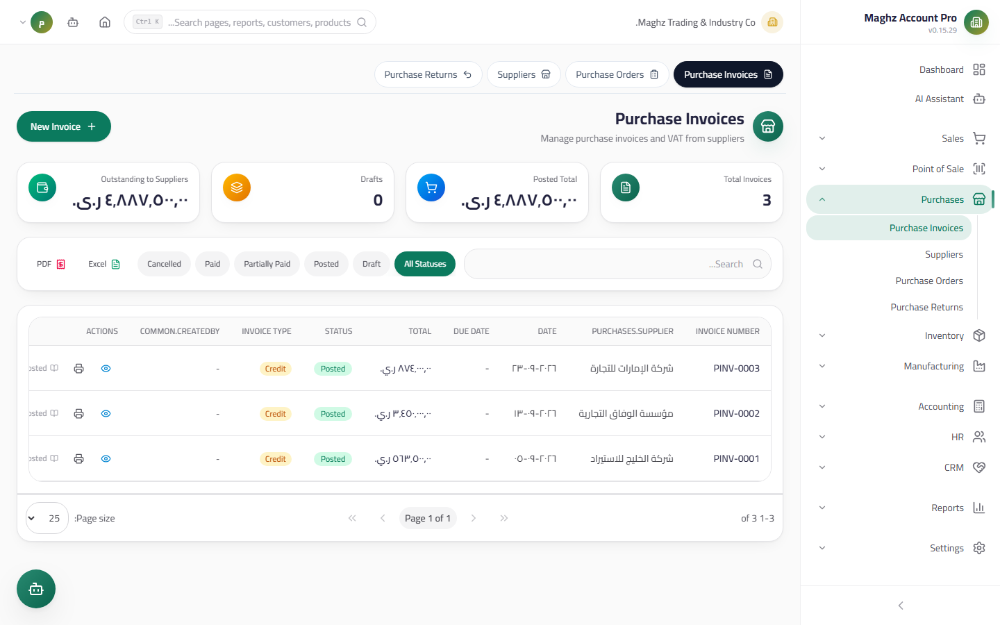
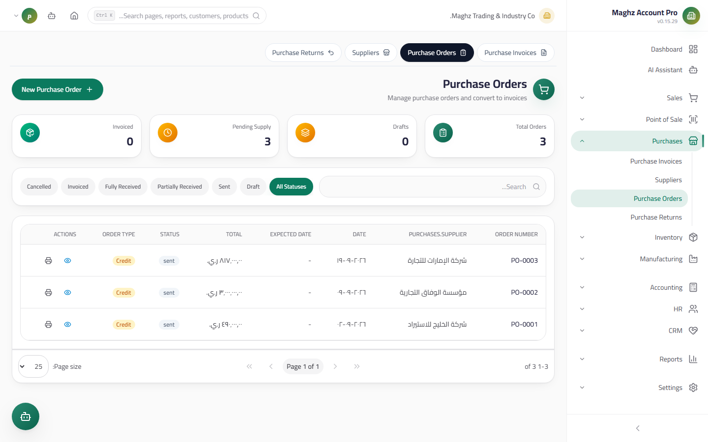

# Purchase Invoices & Purchase Orders — User Guide

> Receiving goods from suppliers: a purchase invoice as powerful as the sales invoice (units, discounts, VAT, currencies) plus purchase orders that convert into invoices, with atomic posting effects.

## Overview

A Purchase Invoice documents what you received from a supplier and what you owe them. When posted it executes **atomically**: a Journal Entry (debit Inventory + input tax / credit Accounts Payable or cash), **inbound stock movements**, and an **increase in the supplier balance**. A Purchase Order is the pre-order that converts into an invoice upon receipt. Access them from: **Sidebar ← Purchases ← Invoices** or **← Purchase Orders**.

## Access & Permissions

| Action | Permission |
|---|---|
| View the lists and details | `purchases.view` |
| Create/edit a Draft | `purchases.create` / `purchases.edit` |
| Delete a Draft | `purchases.delete` |
| Post a purchase invoice | `purchases.post` |

## Purchase Invoice — List

- **KPI cards:** total invoice count, total value, and **total outstanding AP** (what you currently owe suppliers).
- **Search** by invoice number and supplier + a **status filter** + a **supplier filter** + **server-side pagination** + **Excel/PDF export**.

## New Purchase Invoice Form

Follows the same pattern as the sales invoice:

| Section | Fields |
|---|---|
| **Header** | Supplier, date, **due date**, payment type (**Cash** — shows a **Cash Box** selector — or **Credit**), **currency + exchange rate** with a base-currency equivalent preview, notes |
| **Lines** | Product (shows stock and barcode), **multi-unit selector** (switching the unit brings its own purchase price), quantity, unit price, line discount % |
| **Total discount & tax** | An amount or percentage discount capped at the subtotal + **VAT** at the company rate (15% by default) |

**Saving:** creates the invoice as a **Draft** numbered with the `PINV-` prefix from document sequences.

## Purchase Invoice Lifecycle

| Status | Meaning | What you can do in it |
|---|---|---|
| **Draft** | Has affected nothing | Edit, delete, **Post** |
| **Posted** | Entered stock, increased the supplier balance, and issued the Journal Entry | Settle via a Payment Voucher, read, print |
| **Partially Paid** | Partly settled by a payment voucher | Continue settling |
| **Paid** | Fully settled | Read, print |
| **Cancelled** | Cancelled | Excluded from everything |

## Posting Effects (Atomic)

A single transaction that succeeds entirely or rolls back entirely:

1. **Journal Entry:** debit **Inventory** with the subtotal (after discounts) + debit **Input VAT** with the VAT / credit **Accounts Payable** with the total — or credit the **selected Cash Box account** if it is a cash purchase.
2. **Inbound stock movements** for each line (type `in` referencing the invoice number) + a **quantity increase** — in the **base** quantity for multi-unit lines.
3. **The supplier balance increases by the outstanding amount** (total − paid) — for credit invoices only.

**A cash invoice is automatically marked Paid** the moment it posts and does not affect the supplier balance.

### Paying Suppliers

Payments are not managed from the invoices screen; they go through **Payment Vouchers** in the **Accounting** module: a posted voucher is linked to the posted invoices being settled, decreases the supplier balance, and flips their status **Partially Paid** then **Paid**.

## Purchase Order

- **Access:** Sidebar ← Purchases ← Purchase Orders
- **Purpose:** A pre-order to a supplier before receipt

| Field | Description | Required |
|---|---|---|
| **Order number** | Automatic `PO-` prefix | Auto |
| **Supplier + date** | The basis of the order | Yes |
| **Expected date** | When receipt is expected | Recommended |
| **Payment type** | Cash / Credit — inherited by the invoice | Optional |
| **Lines** | Products with expected quantities and prices | Yes |

### Purchase Order Lifecycle

| Status | Meaning |
|---|---|
| **Draft** | Being prepared — editable, deletable, convertible |
| **Sent** | Reached the supplier and awaiting delivery |
| **Partially Received** | Part of the quantities arrived |
| **Received** | Everything arrived |
| **Invoiced** | Converted into a purchase invoice |
| **Cancelled** | Cancelled |

### The "Convert to Purchase Invoice" Button

Appears on the **Draft** and does the following: creates a purchase invoice **Draft** from the order's lines linked to it (`purchaseOrderId`), and marks the order **Invoiced**. Complete the invoice (VAT, discounts) then post it — only then does stock enter and the supplier balance increase.

### Purchase Order KPIs

Drafts, **Pending** (sent + partially received, awaiting delivery), and Invoiced.

## Step-by-Step Workflow — Full Numeric Example

Buying 20 cartons of juice (conversion factor 12) from Al-Khair:

1. Sidebar ← Purchases ← Invoices ← **New Invoice**.
2. Supplier: "Al-Khair Distribution Warehouses". Date: `2026-09-12`. Due: `2026-10-12`. Payment: **Credit**. Currency: YER.
3. **Line:** "Orange Juice" — unit: **carton** (brings its purchase price `6,000`), quantity: `20`.
4. Subtotal = `120,000`. Total discount of `2%` = `2,400` → net `117,600`. VAT 15% = `17,640`. **Total = `135,240`**.
5. **Save** → Draft `PINV-00030`. Review it then click **Post** — the atomic effect:

| Effect | Details |
|---|---|
| Inventory | +`20 × 12 = 240` base units, an `in` movement referencing `PINV-00030` |
| Supplier balance | 500,000 + 135,240 = **635,240** YER |

The resulting Journal Entry:

| Account | Debit (YER) | Credit (YER) |
|---|---:|---:|
| Inventory | 117,600 | |
| Input VAT | 17,640 | |
| Accounts Payable — Al-Khair | | 135,240 |
| **Total** | **135,240** | **135,240** |

*If it were cash via the "Main Cash Box": credit the cash box 135,240, and the invoice is automatically marked **Paid** with no effect on the supplier balance.*

6. Later you paid 100,000 with a payment voucher linked to the invoice: the status becomes **Partially Paid** and the balance 535,240.
7. *(Order-based flow)* if the purchase was pre-ordered as `PO-00015`: click "Convert to Purchase Invoice" on the order's Draft — `PINV-00030` is created from its lines and the order flips to **Invoiced**.

## Important Rules

| Rule | Details |
|---|---|
| `PINV-` and `PO-` come from the system | Automatic numbering from document sequences — never type them manually |
| A Draft enters nothing | No stock, no Journal Entry, and no balance before posting |
| Input versus output VAT | A purchase posts **input VAT** (an asset you deduct), unlike sales (output VAT you pay) |
| Stock is stored in the Base Unit | A carton enters as 12 base units — the Conversion Factor is fixed on the line |
| The order moves nothing | Until converted into an invoice and posted — a purchase order has no stock effect |
| Payments from Accounting | Payment Vouchers are the only way to settle suppliers and flip statuses |

## Common Errors & Fixes

| Message as shown in the system | Cause | Solution |
|---|---|---|
| "Invoice not found or not in draft status" | Posting an already-posted invoice | Check its status from the list |
| "Cannot delete posted invoice…" | Deleting a non-Draft invoice | Correct it with a purchase return |
| The balance did not increase after saving | The invoice is a Draft | Post it |
| The invoice did not flip to Paid | The Payment Voucher is a Draft or not linked to invoices | Post the voucher and link the settled invoices |
| Stock increased in an unexpected warehouse | Posting uses the first created warehouse by default | Move it immediately with a stock transfer to the correct warehouse |
| The purchase order refuses conversion | Its status is not Draft | Convert from the Draft — or create an invoice manually with the reference |

## Tips

- Work with the **order → invoice** pair for large orders: the order documents the agreement, and the invoice documents the actual receipt.
- Fill in the **due date** — it is the basis of the AP Aging and payment prioritization.
- Check the **total outstanding AP** KPI before committing to new purchases — it protects your liquidity.
- Buy in the supplier's original currency with a correct exchange rate — the base-currency equivalent is stored with the invoice for reporting.
- Reconcile input VAT with the supplier's tax invoices monthly — it is what you will deduct from output VAT.
