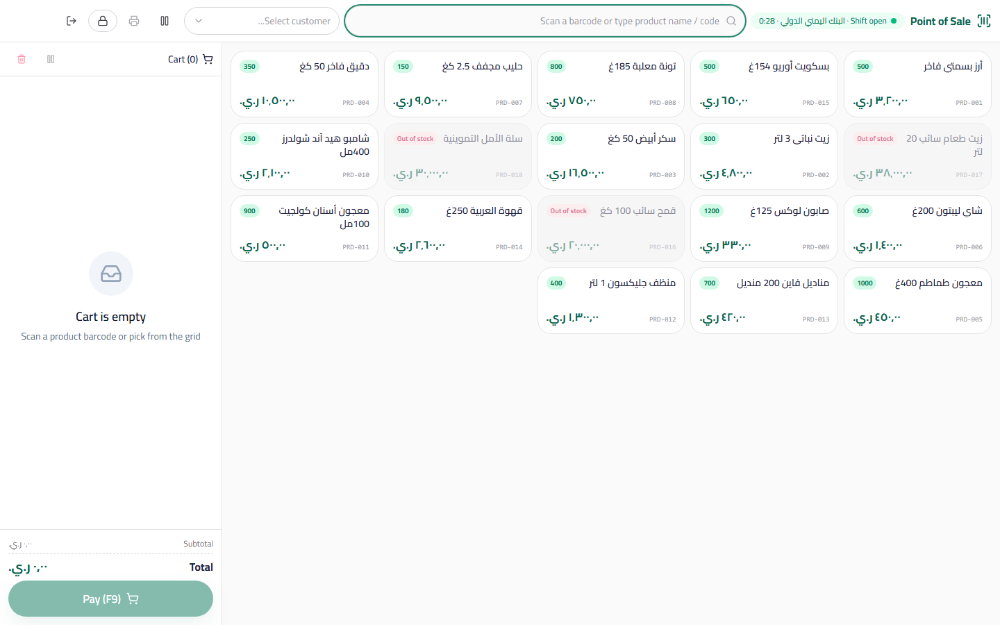

# Cashier Screen — User Guide

> The main POS screen: touch grid + barcode + cart + atomic checkout + a thermal receipt, in full-screen view.

## Overview

The cashier screen is the module's daily destination for the cashier. It opens from the sidebar ← Point of Sale (or directly at `http://…/pos`) and runs full-screen outside the app shell. Access permission: at least `pos.view`.

## Locked Until a Shift Is Open

As soon as the screen appears, it checks whether the current user has an open Shift:

- **No open Shift** → the screen shows only the opening prompt: choose the **Cash Box** and enter the **opening float** in the drawer (the cash available when the Shift starts), then click "Open Shift".
- **Open Shift** → the **shift badge** appears at the top of the screen: the Cash Box name + the **elapsed time** since opening (updating live).

## Top Bar

| Element | Description |
|---|---|
| Search / barcode | The main search field. Press **F2** to focus it instantly (the current text is selected to be overwritten). |
| Hardware barcode scanner | Supports "Keyboard Wedge" scanners — the scanner types the code and sends Enter. Scanning searches exactly by barcode, SKU, or code, and the first match is added straight to the cart. |
| Customer selector | The default list shows the **Walk-in Customer**. Change the customer before a credit sale. |
| Held carts | A button showing the suspended carts (resume / discard) — see below. |
| Reprint last receipt | Prints the 80mm receipt of the last sale of the current Shift. |
| Close Shift | Opens the closing and count dialog (detailed in [02-shifts.md](./02-shifts.md)). |
| Exit | Closes the cashier screen and returns to the app shell. |

## Touch Grid

- **Large tiles** showing: product name, code, price, and a **live stock badge** (the total available quantity across all warehouses).
- **Out of stock is not tappable**: the tile appears grayed out when stock is zero — it cannot be tapped (unless you enable "Allow negative stock" in Settings).
- In-grid search is **debounced** — it does not fire a query on every keystroke, only after you pause typing for a moment, keeping typing smooth on large databases.
- The grid shows active products that have a selling price only, capped at 200 results.

## Cart Panel

| Action | How |
|---|---|
| Increase/decrease quantity | The **+ / −** buttons on each line (reaching zero removes the line) |
| Delete a line | The ✕ button on the line |
| Clear the cart | The trash button at the top of the panel |
| Same product in different units | **Separate lines** — a "carton" and a "piece" of the same product are two independent lines keyed by `product + unit` |

**Totals** are computed with literally the same logic as sales invoices:

1. Line discount (%) on each item
2. → Subtotal
3. → Invoice-level Value Added Tax (per the company's VAT settings)
4. → Total

Every step is rounded to the decimal places set in the company settings, so the receipt matches exactly what will post to the books.

**Loss protection:** the cart, the current customer, and the held carts are saved locally (`localStorage` under the key `maghzaccount-pos`) — refresh the page or restart the device and the in-progress sale will not be lost. Switching companies empties the cart automatically (another company's data is meaningless here).

## Held Carts

Hold a sale and serve the next customer:

1. With a ready cart and another customer in the queue, press **F10** (or the hold button).
2. The cart is stored with its name, time, and customer, and the current panel is cleared.
3. Serve the next customer normally.
4. From the held carts list: **Resume** returns the cart to the panel (replacing whatever is in it), or **Discard** deletes it permanently.

## Keyboard Shortcuts

| Key | Action |
|---|---|
| **F2** | Focus the search field (and select its text) |
| **F9** | Open the payment dialog |
| **F10** | Hold the current cart |

## Payment Dialog — Three Modes

### 1. Cash

- **Quick cash** buttons: the exact amount (the total), then 500 / 1000 / 5000 / 10000.
- Any amount entered above the total shows the **change due** instantly in prominent green.
- A pure cash sale works without selecting a customer (it is recorded on the Walk-in Customer).

### 2. Credit

- Requires a **registered customer** — you cannot sell on credit to the Walk-in Customer.
- The full amount is added to the customer's balance and appears in their statement and aging.

### 3. Mixed

- Type the cash received, and the **credit remainder is computed automatically** (total − cash).
- Requires a registered customer for the credit portion.
- There is a **cash shortage check**: if the cash entered is less than the total, the difference is treated as credit — make sure a customer is selected before continuing.

## Payment — What Actually Happens (Atomic Checkout)

When you click "Confirm Payment", a **single atomic operation** runs in the database — either everything succeeds or everything fails:

| Step | What happens |
|---|---|
| 1. Shift check | The Shift is read inside the transaction with a lock (`FOR UPDATE`) — if it was closed between opening the dialog and paying, the operation is rejected with a clear message |
| 2. Invoice | A real sales invoice is created on `sales_invoices` flagged `is_pos = true`, linked to `shift_id` and the Cash Box |
| 3. Lines | The invoice lines are inserted with the unit, its Conversion Factor, and the base quantity |
| 4. Payments | One payment row is recorded per method used in `pos_payments` (cash and/or credit) |
| 5. Journal Entry | The Journal Entry posts immediately: **debit** the Cash Box (the drawer's GL account) for the cash portion + **debit** Accounts Receivable for the credit portion / **credit** the Sales account + **credit** output VAT |
| 6. Inventory | Outbound movements are created and stock is deducted (from the warehouse richest in stock for each product) |
| 7. Status | **"Paid"** if the full amount was settled in cash, or **"Posted"** with the credit portion added to the customer's balance |
| 8. Recomputation | Totals are recomputed on the server from the same lines — any manual total tampering from the interface is rejected on a mismatch |

Numbering: a new receipt number from the `POS-` sequence, fully independent of the `INV-` sequence (receipt details below).

## Thermal Receipt

- **`POS-` numbering** with six zero-padded digits (example: `POS-000123`) — independent of `INV-` invoice numbering.
- An **80mm RTL-oriented** template through the browser print window (suitable for thermal printers).
- Receipt content, in order:
 1. Company header (name, **Tax Number**, address, phone)
 2. Receipt number, date, cashier name, and customer name (if any)
 3. Lines (name, quantity × unit price, total)
 4. Subtotal, discount, tax, total
 5. Payment split: **cash / credit**, and the **change due** if any
 6. A **custom footer** from POS settings (example: "Thank you for your visit — exchange within 14 days")
- **Auto-print** after payment (set from POS settings), with the option to **reprint the last receipt** from the top bar at any time.
- If the browser blocks pop-ups, nothing will print — allow pop-ups for the app's site.

## Numeric Example

A mixed sale: 2 × juice (250 YER) + 1 × biscuits (400 YER) with 5% tax:

| Item | Calculation | Value |
|---|---|---|
| Subtotal | 2×250 + 400 | 900 YER |
| Tax 5% | 900 × 0.05 | 45 YER |
| Total | 900 + 45 | 945 YER |
| Cash received | | 1000 YER |
| Change due | 1000 − 945 | 55 YER |

The Journal Entry posted at payment: debit the Cash Box 945 / credit Sales 900 / credit output VAT 45.

## Common Errors & Fixes

| Message as shown in the system | Cause | Solution |
|---|---|---|
| "المخزون لا يكفي" (Insufficient stock) — disabled tile | The product's stock is zero and negative stock is disallowed | Enable `pos.allowNegativeStock` or check the stock |
| "فارق في الإجمالي: المتوقع X المستلم Y" (Total mismatch: expected X, received Y) | Manual tampering with the total or a network glitch | Reopen the payment dialog — the server recomputes |
| "أُغلقت الوردية أثناء عملية الدفع" (The Shift was closed during checkout) | A simultaneous close from another device | Open a new Shift and redo the payment |
| The print window does not appear | A pop-up blocker | Allow pop-ups then reprint from "Reprint last receipt" |
| The scanner adds the wrong product | A code duplicated between two products | Check barcode/SKU uniqueness on the product card |

## Tips

- Teach cashiers just the three shortcuts: F2 / F9 / F10 — enough to run the entire register from the keyboard.
- Put the best sellers at hand level in the grid (the grid sorts by name — name your products smartly).
- Reprint the last receipt instead of re-selling when a customer disputes a lost receipt.
