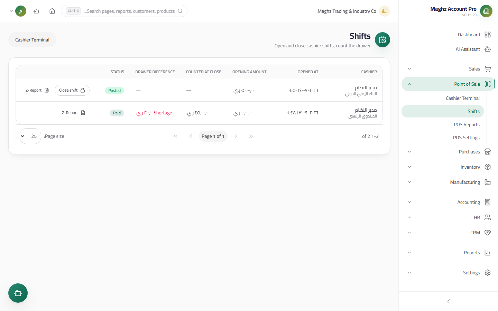

# Shifts — User Guide

> Managing Cash Box shifts: opening, closing with a physical count, computing the difference, and the closing Z Report.

## Overview

The Shifts screen is the POS cash-watch log. Every sale is linked to a Shift, and every Shift is linked to a cashier and a Cash Box — so you know exactly who sold, when, and how much was in their drawer.

- **Access:** Sidebar ← Point of Sale ← Shifts (`/pos/shifts`).
- **Permission:** `pos.view` to view; shift management falls under the `pos.*` permissions.

## Shifts Screen

A page-by-page table showing all Shifts (newest first) across all cashiers and Cash Boxes:

| Column | Description |
|---|---|
| Shift number / Cashier | The username that opened the Shift |
| Cash Box | The linked box (it has a GL account in the Chart of Accounts) |
| Open / close time | The Shift's start and end date and time |
| Opening float | The cash declared in the drawer at opening |
| Closing amount | The amount **actually counted** at closing |
| Expected | Opening float + the sum of cash payments |
| **Difference** | Counted − expected, **color-coded**: green "Balanced" (zero), blue "Over", red "Short" |
| Status | Open / Closed |

### The One-Shift Rule

- **Only one open Shift per user** — the rule is enforced at the database level (a unique partial index), not just in the interface, so it cannot be bypassed even from two devices at once.
- Trying to open a second Shift is rejected with the message: "لديك ورديـة مفتوحة — أغلقها قبل فتح ورديـة جديدة" (You have an open Shift — close it before opening a new one).

## The Two-Entry Interface

Shifts can be managed from two places:

| Place | When to use it |
|---|---|
| The cashier screen (`/pos`) | Opening the Shift in the morning and closing it in the evening — the buttons live in the top bar and work from the same screen |
| The Shifts screen (`/pos/shifts`) | Daily/weekly review across all cashiers, printing the Z Report of a past Shift, tracking historical differences |

From the Shifts screen you can view the details of any closed Shift: its payments breakdown (cash/credit per invoice) and the list of its `POS-` numbered receipts with each receipt's total — the complete reference when reconciling the drawer against the invoices.

## Step-by-Step Workflow

### Opening a Shift

1. Open the cashier screen (`/pos`) — the opening prompt appears if you have no open Shift.
2. Choose the **Cash Box** (pre-filled from Settings if you set the default).
3. Enter the **opening float** — the actual cash in the drawer at the start (example: 50,000 YER as an operating float).
4. Click "Open Shift" — the opening time is stamped and the shift badge becomes visible in the top bar.

### Closing a Shift

1. Click "Close Shift" from the top bar (or from the Shifts screen).
2. A dialog opens showing the Shift summary computed from real data:

| Item | Source |
|---|---|
| Invoice count | Non-cancelled POS invoices in the Shift |
| Net sales | The sum of invoice totals |
| **Cash payments** | The sum of cash payment rows in the Shift |
| Credit amounts | The sum of credit payments (they do not enter the drawer) |
| Opening float | As declared at opening |
| **Expected in drawer** | = opening float + cash payments |

3. Physically count the cash in the drawer and enter the **counted amount**.
4. The **difference = counted − expected** is computed and stored with the Shift:
 - Example: opening 50,000 + cash 320,000 = expected **370,000**. You counted 368,500 → difference **−1,500 (Short)**.
5. Add **optional notes** (the reason for the difference, for example: "a note torn during collection").
6. Confirm the close — the "Closed" status and closing time are stamped, and the Shift is locked against any new sale.

> **Safety during closing:** if a payment happens at the same moment you close the Shift, the atomic checkout transaction checks the Shift status inside the lock and fails with a clear message — no orphaned sales after closing.

### The Z Report

After closing (or during it) the Z Report prints — the Shift's official reference document, in an 80mm template:

| Line in the report | Meaning |
|---|---|
| Cash Box / Cashier | The Shift in question |
| Open / Close | The Shift's times |
| Invoice count | Completed sales |
| Total sales | Net after discount |
| Discounts / Tax | Period totals |
| Cash payments / Credit amounts | The payment-method split |
| Opening balance | The opening float |
| Expected in drawer | Opening + cash |
| Counted amount | The physical count |
| **Difference (Balanced/Over/Short)** | The final result, color-coded |
| Notes | What the cashier wrote at closing |

## Shift Lifecycle

| Status | Meaning | What you can do in it |
|---|---|---|
| **Open** | The user's active Shift | Sell, hold carts, reprint, close |
| **Closed** | The archived Shift | View, print the Z Report, review in reports — no editing, no selling |

## Important Rules

- **Credit never enters the drawer:** "Expected in drawer" counts **cash payments only**; credit amounts go to the customer's balance and appear as a separate line in the report for review.
- **The difference is stored, not recomputed:** the values (counted, expected, difference) are saved as columns in the Shifts table at the moment of closing, so they remain a fixed historical record even if invoices change later.
- **Recurring differences = a warning:** watch the Shifts screen weekly — a cashier with repeated shorts needs training or review.
- Shifts load page by page (server-side pagination) so they stay fast with thousands of records.

## Automatic Cash-Difference Posting (`POS-DIFF`)

Closing does more than store the difference — it **posts it as an entry** with a `POS-DIFF-` reference (once per shift, and the entry is idempotent: re-closing never duplicates it):

| Difference | Entry |
|---|---|
| Short (counted < expected) | Debit shortage `52901` / credit the treasury account |
| Over (counted > expected) | Debit the treasury account / credit surplus `41901` |

The −1,500 short example above: debit `52901` **1,500** / credit the main-box account **1,500**. Two conditions: the cash box must be **linked to a ledger account** (no account → honest rejection before closing, not after), and the fiscal year must be open.

## Automatic Walk-in Customer (`CASH`)

Pure cash sales (a passer-by with no customer card) need no manual customer creation: when saving without a customer the system provides the `CASH` customer automatically (name lookup first, then single-statement creation with no race window). A cash invoice gets `paid_amount = total` with status **paid**, and the customer balance is **untouched**.

## Full Numeric Example

| Item | Value (YER) |
|---|---|
| Opening float | 50,000 |
| Shift sales (10 invoices) | 425,000 |
| Of which cash | 320,000 |
| Of which credit (2 registered customers) | 105,000 |
| Expected in drawer | 50,000 + 320,000 = **370,000** |
| Counted amount | 368,500 |
| **Difference** | **−1,500 (Short)** |

## Common Errors & Fixes

| Message as shown in the system | Cause | Solution |
|---|---|---|
| "لديك ورديـة مفتوحة" (You have an open Shift) | A second open for the same user | Close the current one first |
| "الوردية غير موجودة أو مغلقة" (Shift not found or closed) | A double close from two screens | Refresh the list — the close happened from the other device |
| "المبلغ غير صالح" (Invalid amount) at opening | A negative or non-numeric opening float | Enter a positive number (0 is accepted for an empty drawer) |
| The difference grows day after day | Ignoring small coins or a mis-entered credit sale | Review the Shift's payment rows from the Z Report and compare them with the receipts |

## Tips

- Make Shift opening/closing happen at fixed times (shift start / shift end) to make reconciling the Cash Box's GL account with its statement easier.
- Print the Z Report and staple it to the paper drawer count — it is what the accountant relies on when posting.
- Do not open a new Shift with a large opening float; a small float minimizes difference losses.
