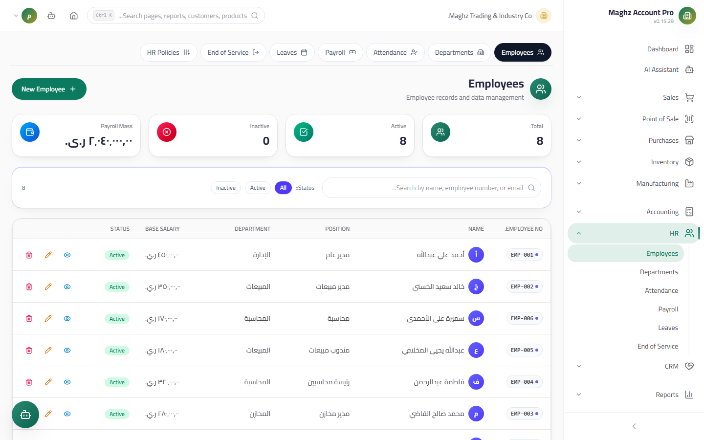
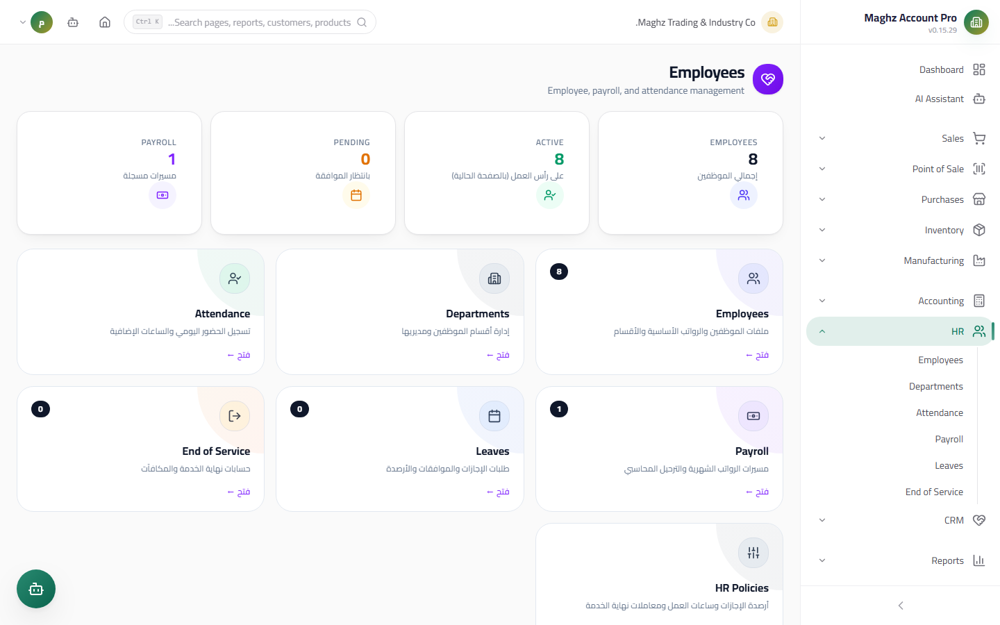
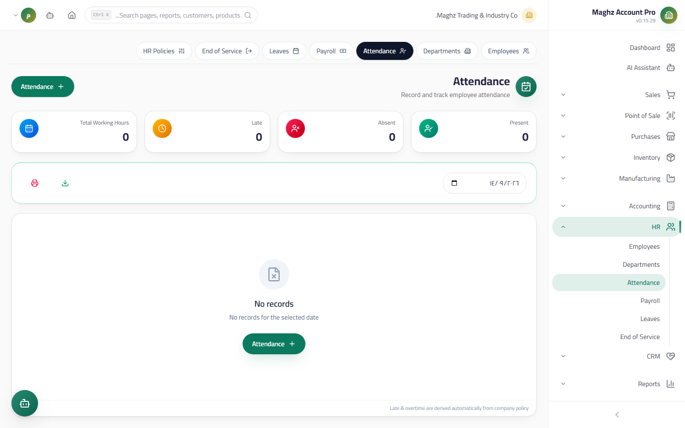

# Employees, Attendance & Leave — User Guide

> Employee records and departments, a daily attendance log with late-arrival and overtime inference, and leave management with balances.

## Overview

This file covers the HR data foundation: the Employees screen (a full record that feeds payroll runs and end of service), the Departments screen, the daily attendance log, and the Leave screen. All derived numbers (late arrival, overtime, balances) are computed by the HR engine itself from the policies configured in Settings.

- **Access:** Sidebar ← HR.
- **Permissions:** `hr.view` to view, `hr.create` to add, `hr.edit` to edit, `hr.delete` to delete.

---

## Employees

### The Employees Screen

- **Access:** HR ← Employees.

### Employee Record Fields

| Field | Description | Required |
|---|---|---|
| Employee number | An internal identifier | Required |
| Name | The full name | Required |
| National ID | The employee's identity | Optional |
| Contact details | Phone / email | Optional |
| Department | From the Departments screen | Optional |
| Position | The job title | Optional |
| Grade | The job grade | Optional |
| Hire date | Used to derive years of service (for end of service) | Required |
| End of service date | Filled in when the employee leaves | Optional |
| Base salary | The source of truth for payroll accounting — the basis for payroll runs and end of service | Required |
| Active | Only an active employee appears in payroll runs | Required |
| Photo/attachments | The employee's files | Optional |
| **Opening Balance** | **Advances and loans owed by the employee** when you start using the system — posted through the opening balance equity (Opening Balance) | Optional |

> **Opening Balance:** entered once when creating the employee (it cannot be edited after posting — a "Posted" alert appears). The value represents the employee's old advances, and it is booked within the opening balance journal entries so the employee statement is consistent from day one.

---

## Departments

- **Access:** HR ← Departments — a full CRUD screen (add/edit/delete).
- Each department has a name and a description, and it is used to group employees and in attendance and payroll reports.
- A department linked to employees cannot be deleted — reassign them to another department first.

---

## Attendance

### The Attendance Screen

- **Access:** HR ← Attendance.
- **Purpose:** a log of one record per **employee / day**: check-in time, check-out time, and status.

### Attendance Record Fields

| Field | Description |
|---|---|
| Employee + date | The record key |
| Check-in / Check-out | Accepts a **time only** (`08:20`) or a **full timestamp** (`2026-08-31 08:20`) — the engine extracts the time from either format |
| Status | **Present / Absent / Late / On Leave** |

### What the Engine Infers Automatically

The engine reads the check-in and check-out punches and the HR policies, and computes:

| Inference | Formula |
|---|---|
| **Late arrival** | Check-in after the official start + a **15-minute grace period** (configurable via `hr.lateGraceMinutes`). Example: official start 08:00 — a check-in at 08:14 is not late; a check-in at 08:16 is late |
| **Overtime** | Worked − **8 standard hours** (configurable via `hr.standardWorkHours`), never below zero |
| Hours worked | Check-out − check-in |

> **Note:** the overtime inferred here feeds the payroll run (the "Overtime" component in the formula). No overtime is computed for an absent employee or an incomplete punch record.

---

## Leave

### The Leave Screen

- **Access:** HR ← Leave.

### Leave Request Fields

| Field | Description |
|---|---|
| Employee | The requester |
| Type | **Annual / Sick / Emergency / Unpaid** |
| From / To | The leave period — the day count is inclusive of both ends |
| Reason | Free description |

### The Request Lifecycle

| Status | Meaning | Transitions |
|---|---|---|
| **Pending** | Awaiting the manager's decision | → Approved / Rejected / Cancelled |
| **Approved** | Counted in the balances | Final |
| **Rejected** | Rejected and excluded from the balances | Final |
| **Cancelled** | Cancelled after or before approval | Final |

### Annual Entitlement Balances

Each type has an annual balance from the HR policies (configurable):

| Type | Default entitlement | Notes |
|---|---|---|
| Annual | 21 days/year (`hr.leave.annualDays`) | Approved and pending requests are deducted from the balance |
| Sick | 30 days/year (`hr.leave.sickDays`) | |
| Emergency | 30 days/year (`hr.leave.emergencyDays`) | |
| **Unpaid** | **Unlimited** | No cap — its value is deducted from the month's salary in the payroll run |

The Leave screen shows, for each employee, the entitlement, the used amount, and the remaining balance for each type.

### The Overlap Report

When creating or approving a leave, the system checks for intersection with the employee's other leaves: two periods overlap if `start of first ≤ end of second AND start of second ≤ end of first`. Overlapping leaves appear in the **Overlap Report** so you can fix them before approving payroll.

## Step-by-Step Workflow — An Example

1. Create the "Production" department from the Departments screen.
2. Create the employee "Ahmed Saleh": hired on 2022-03-01, base salary 150,000 YER, opening balance 40,000 (an old advance).
3. Record his attendance on 2026-09-10: check-in `08:25`, check-out `17:30` → the engine infers: **Late** (after 08:15), 9.05 hours worked, **1.05 hours of overtime**.
4. Submit an annual leave for him from 2026-09-20 to 2026-09-24 (5 days) → Pending → the manager approves → his annual balance decreases by 5 days.

## Important Rules

- **The base salary on the record is the source of truth** — payroll runs and end of service read from it, and any derived number supplied by the user is ignored.
- The "On Leave" status in attendance produces neither a late arrival nor overtime.
- A pending leave counts against the balance (tentatively) until it is rejected or cancelled.
- Deleting an employee who has attendance/payroll records is normally not allowed — deactivate him instead of deleting.

## Common Errors & Fixes

| Problem | Cause | Solution |
|---|---|---|
| The employee does not appear in the payroll run | Not active or a zero salary | Activate the record and enter the base salary |
| Late arrival is not computed | The check-in is within the grace period or the status is set manually | Check the grace period (15 minutes) and the status |
| The leave balance does not match | Old pending requests hold the balance | Review the pending requests and decide on them |
| The opening balance cannot be edited | It was posted with the opening balances | Adjust it through a manual adjustment entry with your accountant |

## Tips

- Enter the attendance punches daily (or import a whole department at once) — the payroll runs read the aggregated overtime from them.
- Configure the HR policies (grace period, standard hours, balances) before the first payroll run so all months stay consistent.
- Record new advances as financial records, not as edits to the opening balance — the opening balance is for old balances only.
