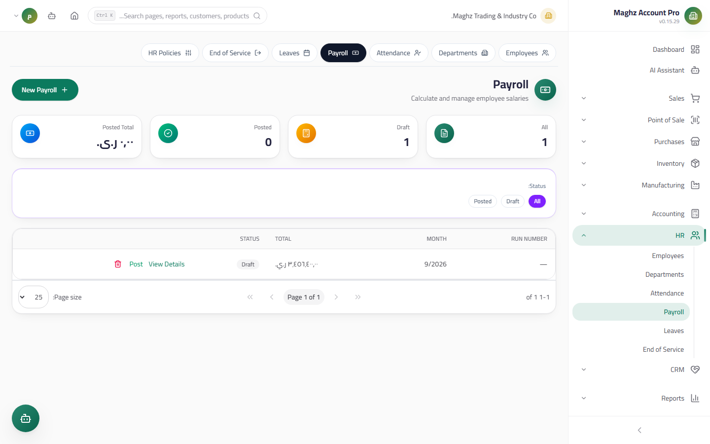
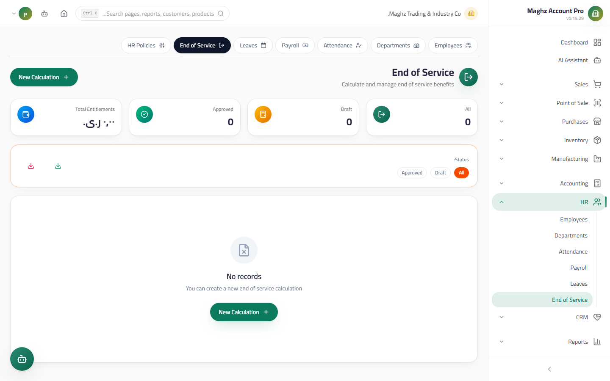

# Payroll Runs & End of Service — User Guide

> A monthly payroll computed entirely on the server from employee records, components, and attendance, plus end-of-service benefits with a progressive formula paid from a cash box.

## Overview

This file covers two financial HR processes:

1. **Payroll Runs** — running a full month with self-computed derived figures and posting their journal entry.
2. **End of Service** — a loyalty award computed with a progressive formula, with an approval and payment cycle.

All calculations live in the **payroll engine** (`payrollEngine.ts`) — pure functions reused by the engine, the operator, and the UI, while the server recomputes everything and ignores any derived figures supplied by the client (protection against tampering and fabrication).

- **Access:** Sidebar ← HR ← Payroll / End of Service.
- **Permissions:** `hr.view` to view, `hr.create` to run, `hr.edit` to approve, `hr.delete` to delete.

---

## Payroll Runs



### Running a Payroll

1. **Access:** HR ← Payroll ← **New Payroll**.
2. Choose the **month and year** — active employees are gathered with their salaries from their records, and their overtime is gathered from attendance.
3. **Automatic preview:** the engine computes every line immediately (there is no "save a draft with manual figures").
4. Adjust what you need (a manual override per employee — see below), then save.
5. **Post** — the journal entry is created and the payroll is locked.

### The Payroll Lifecycle

| Status | Meaning | What you can do in it |
|---|---|---|
| **Draft** | Computed and previewed, not yet accounted for | Edit the overrides, recompute, delete |
| **Posted** | The journal entry is posted | View and print only — no editing and no deletion |

### The Payroll Line Formula

```
Net Salary = Base Salary + Allowances (earning components) − Deductions (deduction/tax/insurance components) + Overtime
```

| Component | Calculation |
|---|---|
| Base salary | From the employee record (source of truth) |
| Allowances and deductions | From the **components defined in Settings**: each component has a code, a name, a type (earning / deduction / tax / insurance), and a calculation method of **a fixed amount or a percentage of the base salary** |
| **Overtime** | The hourly rate = **base salary ÷ 30 ÷ standard hours**, then × overtime hours × **a multiplier of 1.5** (`hr.overtimeRate` is configurable) |
| Gross | Base salary + allowances + overtime |

### Numeric Example — Overtime

An employee with a base salary of 150,000 YER, 8 standard hours, a multiplier of 1.5, who worked 10 overtime hours:

- Hourly rate = 150,000 ÷ 30 ÷ 8 = **625 YER**
- Overtime = 625 × 10 × 1.5 = **9,375 YER**

### Numeric Example — A Full Line

| Item | Calculation | Value (YER) |
|---|---|---|
| Base salary | Employee record | 150,000 |
| Housing allowance | 20% of base | +30,000 |
| Transport allowance | Fixed amount | +10,000 |
| Overtime | 625 × 10 × 1.5 | +9,375 |
| Loan deduction | Fixed amount | −20,000 |
| Insurance | 5% of base | −7,500 |
| **Gross** | | **199,375** |
| **Net** | 199,375 − 27,500 | **171,875** |

### Manual Override per Employee

Before saving, you can, for each employee:

- **Replace a component value** (example: a 25% housing allowance for this employee only).
- **Add direct allowances/deductions** applied after the components.

> **A strict rule:** the engine **computes every derived figure itself and ignores what the client sends** — any manual net or gross sent from the UI is not stored; it is always recomputed from base salary + components + overrides on the server.

### Totals

The payroll totals bar shows: **Gross, Deductions, Net, and total overtime hours** — these are the figures of the journal entry at posting.

### Posting entry (Gross-up) — numeric example

A run with gross 507,500, deductions 27,000, net 480,500. Pressing "Post" executes **one atomic entry together with the status flip** (never an entry without a flip, never a flip without an entry):

| Account | Debit (YER) | Credit (YER) |
|---|---|---:|
| Salaries expense (gross) | 507,500 | |
| Salaries payable `21501` (net) | | 480,500 |
| Payroll deductions payable `21502` | | 27,000 |

The deductions line is **omitted when zero** (a deduction-free run = two lines only). A zero run (gross or net zero) is **rejected** — zeros are never posted.

### Leave provision (`21504`)

The accrued liability for unused annual leave is posted periodically as a true-up against `21504`:

| Case | Entry |
|---|---|
| Provision top-up | Debit salaries expense / credit `21504` |
| Excess provision | Debit `21504` / credit salaries expense |

> **Why it matters:** without a provision, liabilities surface suddenly at settlement. The provision spreads the cost over the periods it was earned — per IAS 19.

### Components

Payroll components are defined in **Settings** (not in the payroll run): a code, an Arabic name, a type (earning/deduction/tax/insurance), a method (fixed/percentage), and a default value. Editing a component affects new payroll runs only — posted runs are preserved with their figures.

---

## End of Service



### The End of Service Screen

- **Access:** HR ← End of Service.

### Creating an End-of-Service Record

| Field | Description |
|---|---|
| Employee | The hire date and base salary are read from it |
| Termination date | The last working day |
| **Reason** | **Resignation / Termination / Contract expiry / Retirement** |
| Notes | Free description |

**Years of service and the award are computed by the server** — any figure supplied by the user is ignored. If the award computes to zero, the record is rejected.

### The Record Lifecycle

| Status | Meaning | Effect |
|---|---|---|
| **Draft** | Computed, awaiting approval | Edit/delete, no journal entries |
| **Approved** | An entry posted: debit end-of-service expense (`52501`) / credit end-of-service liability (`21503`) | Awaiting payment |
| **Paid** | Paid in cash | Settled through a cash box only — no manual status payment |
| **Cancelled** | Cancelled | Final |

### The Progressive Award Formula

```
Award = (first ≤5 years × first-years multiplier × monthly salary)
 + (years beyond 5 × beyond-5 multiplier × monthly salary)
```

- The default multipliers are **0.5** for the first five years and **1.0** beyond (`hr.eos.firstYearsMultiplier` / `hr.eos.beyondYearsMultiplier` — **configurable from the HR policies** without code changes).
- Years of service are displayed to **two decimal places** (using 365.25 days per year).
- The screen shows the **breakdown of the two parts** separately.

### A Numeric Example (from the system itself)

An employee who served **7 years** with a monthly salary of **100,000 YER**:

| Part | Calculation | Value (YER) |
|---|---|---|
| First 5 years | 5 × 0.5 × 100,000 | 250,000 |
| Beyond 5 years | 2 × 1.0 × 100,000 | 200,000 |
| **Total award** | (5×0.5 + 2×1.0) × 100,000 | **450,000** |

### Payment via a Cash Box

1. Approve the record (the expense/liability entry is posted).
2. Click **Pay** and choose the **cash box** — mandatory ("A cash box is required to settle the payment").
3. In a single atomic transaction: the payment entry is posted (credit the cash box) and the record is stamped "Paid" with the payment date and cash box.

## Important Rules

- **No manual figures:** net, award, and years of service are all engine outputs; server-side recomputation is always the reference.
- **Posting locks the payroll:** a posted payroll cannot be edited — to correct it, create an adjusting payroll for the following month.
- **Overtime comes from attendance:** the payroll hours are aggregated from the attendance records; they are never invented.
- **End of service passes through approval before payment:** you cannot go directly from Draft to Paid.
- The journal entries are automatic: the payroll run (salary expense/liabilities versus net payable), the approval (end-of-service expense/liability), the payment (disbursed from the cash box).

## Common Errors & Fixes

| Message as shown in the system | Cause | Solution |
|---|---|---|
| "مستحقات نهاية الخدمة صفر" (End-of-service benefit is zero) | A termination date before the hire date, or a zero salary | Check the hire and termination dates and the base salary |
| "لا يمكن الدفع قبل اعتماد الاستحقاق" (Cannot pay before the benefit is approved) | Attempting to pay a draft record | Approve it first |
| "الخزنة مطلوبة لتسوية الدفع" (A cash box is required to settle the payment) | Paying end of service without a cash box | Select the cash box in the payment dialog |
| The payroll does not include an employee | The employee is inactive or has no salary | Activate the record and enter the base salary |
| Overtime is zero despite working | The attendance records are incomplete or the check-out precedes the check-in | Fix the attendance punches before running the payroll |

## Tips

- Run the payroll after closing the month's attendance — late attendance will not enter the payroll period.
- Use overrides for individual cases (loans, one-time bonuses) and do not modify the global components for the sake of a single employee.
- Monitor the balance of the "End-of-Service Liability" account (`21503`) — approved, unpaid benefits accumulate there.
- Set the end-of-service multipliers from the HR policies according to your company's regulations / local labor law before the first record.
