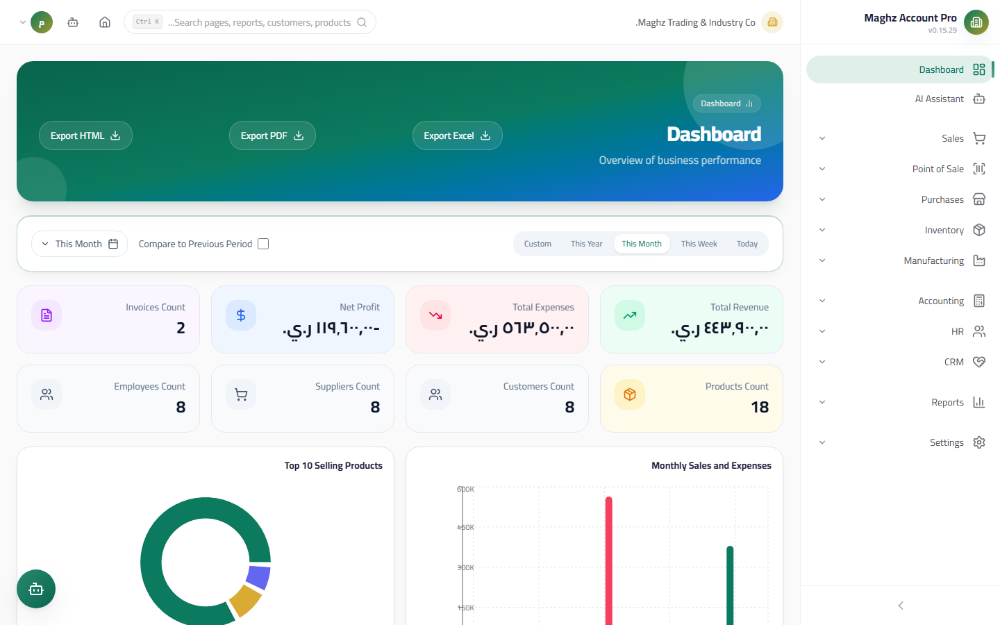

# Main Dashboard — User Guide

> The system's landing screen: it gathers the key performance indicators (KPIs) and charts from all modules in one place, with period filters and comparison.

## Overview

The dashboard is the home page shown right after login (the `/` route). It displays:
- Financial and operational KPI cards with the ability to compare against the previous period.
- Detailed indicators for the Manufacturing, Purchases, Inventory, HR, and CRM modules.
- 8 analytical charts (revenue/expense, top products, receivables aging, cash flow, sales trend, profit trend, category share, opportunity funnel).
- An alerts area and quick actions.

## Access & Permissions

- Required permission: `reports.view` to view, `reports.export` to export.
- A user without `reports.view` sees an explicit "You do not have permission to view this page" message with an icon.
- The export buttons appear disabled for a user without `reports.export`.

| Role | View | Export |
|---|---|---|
| `super_admin` / `admin` | Yes | Yes |
| `manager` | Yes | Yes |
| `accountant` | Yes | Yes |
| `sales_rep` | Yes | No |
| `viewer` | Yes | No |

## Filters (the toolbar at the top of the dashboard)

| Filter | Options | Notes |
|---|---|---|
| **Period** | Today / Week (last 7 days) / Month (current month) / Year (current year) / Custom | Default: current month |
| **From — To** | Two date fields | They appear only when "Custom" is selected; if left empty, the last 30 days are used |
| **Compare with previous** | A checkbox | When enabled, a previous period of the same length as the current one is computed automatically, and the change percentage (%) appears with an up/down arrow on the cards |
| **Reset filters** | A button | Resets the period to "Month" and turns off the comparison |

## KPI Cards

They appear in a 4-column grid, and some of them are **clickable**, taking you straight to the relevant page:

| Card | Content | Compare with previous | On click |
|---|---|---|---|
| Total Revenue | The sum of non-cancelled sales invoices in the period | Yes (percentage) | Sales Invoices |
| Total Expenses | The sum of non-cancelled purchase invoices in the period | Yes (percentage) | Income Statement |
| Net Profit | Revenue − expenses | Yes (percentage) | Profit Analysis |
| Invoice Count | The number of sales invoices in the period | No | Sales Invoices |
| Product Count | Active products | No | Products |
| Customer Count | Total customers | No | Customers |
| Supplier Count | Total suppliers | No | Suppliers |
| Employee Count | Total employees | No | Employees |

> **Rule:** revenue and expenses are computed from the actual invoices (the `cancelled` status is excluded), and the relative change shows "↑" in green and "↓" in red with the absolute percentage value.

### CRM Indicators (the CRM section)

| Indicator | Meaning |
|---|---|
| Total leads | The number of records in Leads |
| Open opportunities | Opportunities that are not Won/Lost |
| Pipeline value | The sum of the open opportunities' values |
| Conversion rate | (Open opportunities ÷ leads) × 100 |
| Deals won | The number of opportunities closed successfully |
| Deals lost | The number of opportunities closed without success |
| Average deal size | The average value of the won deals |

### Other Module Indicators

| Section | Indicators |
|---|---|
| **Manufacturing** | Total work orders, orders in planning, completed, total production costs |
| **Purchases** | Purchase order count, pending orders, total purchase value, **outstanding payables (AP)** |
| **Inventory** | Inventory value, low-stock items, warehouse count, stock movement count |
| **HR** | Total employees, active among them, pending leave requests, total payroll |

> The extra sections are hidden automatically when their data is unavailable.

## Charts

| Chart | Type | What it shows | Important note |
|---|---|---|---|
| Revenue vs. Expenses | Grouped bars | Sales and purchases monthly | If the period spans 60 days or less, it switches automatically to a **daily breakdown**, and months without data appear as zero |
| Top 5 Products by Sales | Bars | Products by invoice line value in the period | Descending order, cancelled excluded |
| **Receivables Aging** | Bars | Outstanding receivables split into 0-30 / 31-60 / 61-90 / 90+ days | Based on the due date; paid and cancelled invoices are excluded |
| Cash Flow | Bars (in/out) | Cash account movements from the journal entries | Cash box and treasury accounts are detected **by name** — name your cash accounts with these words so the chart renders correctly |
| Sales vs. Purchases Trend | Dual lines | The last 30 days of the selected period | Daily |
| Profit Trend | Lines | Sales − purchases per day over the last 30 days | Derived from the previous trend chart |
| Product Category Share | Pie/percentage | The distribution of inventory value (quantity × cost price) across categories | The top 6 categories; uncategorized items appear as "Uncategorized" |
| Opportunity Funnel (pipeline by stage) | Funnel | The distribution of opportunities and their value across the sales stages | From the CRM section |

## Alerts & Quick Actions

The **Alerts card** (bottom left) — every item is a link that takes you straight to the target:

| Alert | What it means | Link |
|---|---|---|
| Low stock | Items that reached the minimum alert threshold in any warehouse | Products |
| Overdue invoices | Sales invoices past their due date and not fully paid | Sales Invoices |
| Old debts (90+ days) | Receivables past 90 days in the aging report | Customer Statement |
| Employees | Total employees | Employees |

The **Quick Actions card** — colored buttons: a new sales invoice, a new journal entry, a new product, a new customer.

## Export

Three buttons in the dashboard header (they require `reports.export`):

| Button | Output |
|---|---|
| Export Excel | An `.xlsx` file with the KPI table (Indicator \| Value): revenue, expenses, net profit, invoice count, product count, customer count |
| Export PDF | A PDF file with the same table plus a company name header and the report date |
| Export HTML | An HTML file ready for sharing with the same formatting |

- The file name follows the format `Dashboard_YYYY-MM-DD`.
- The header carries the active company name, and the page direction follows the UI language (RTL/LTR).

## Common Errors & Fixes

| Situation | Cause | Solution |
|---|---|---|
| "لا تملك صلاحية لعرض هذه الصفحة" (You do not have permission to view this page) | Your role lacks `reports.view` | Ask the manager to grant the permission from the Roles page |
| The export buttons are grayed out | Your role lacks `reports.export` | Ask for the export permission to be granted |
| No data | No movements in the selected period | Widen the period (e.g. "Year") or click "Reset filters" |
| The cash flow chart is zero | The cash account names do not match the detection words | Rename the account to include "صندوق", "نقد", or "خزينة" |
| The comparison percentage does not appear | "Compare with previous" is off, or the previous period was zero | Enable the option; periods whose predecessor was zero produce no percentage |

## Tips

- Start your day with the "Today" filter to review the sales activity, and review "Receivables Aging" weekly to track collections.
- Enable "Compare with previous" before the monthly review meetings so the growth percentages appear directly on the cards.
- Click any card to jump to its details — the dashboard is a launching point, not a final destination.
- Use "Custom" to compare specific campaigns or seasons (e.g. Ramadan versus the back-to-school peak).
