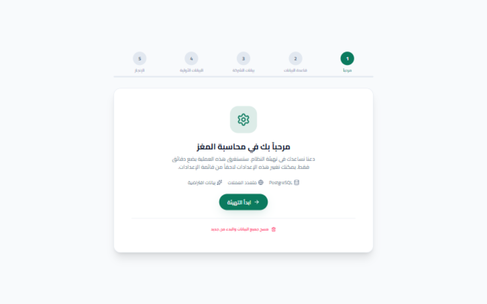
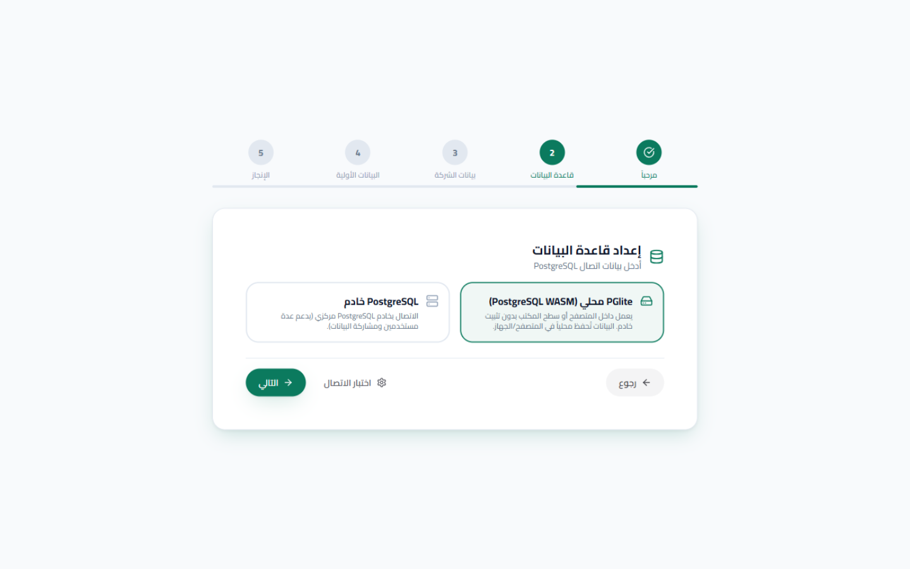
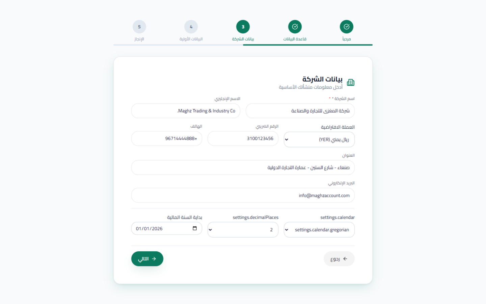
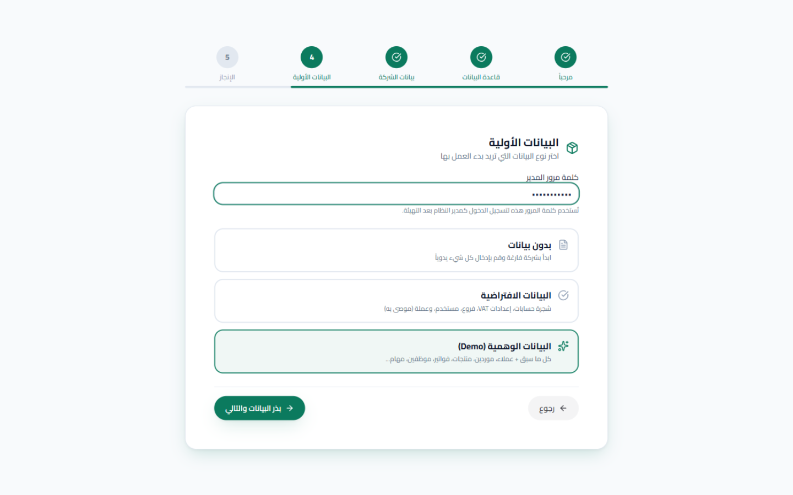
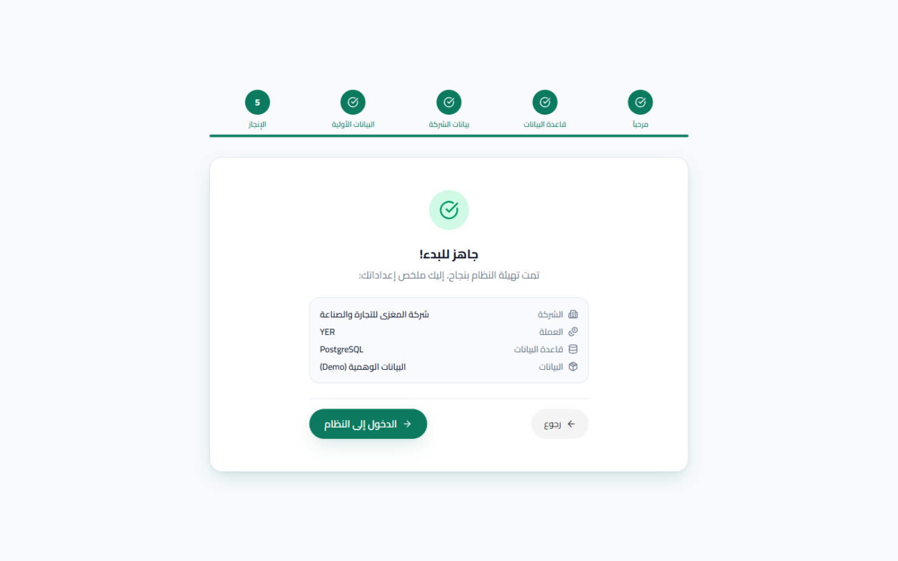

# First-Run Setup Wizard — User Guide

> Setting up the system in 5 steps: Welcome, Database, Company Information, Initial Data, then Finish.

## Overview

The Setup Wizard appears automatically the first time you run the system, or when you re-run it from Settings. It walks you through 5 short steps to configure the database, your business, and the starting data — at the end you are ready to log in as the administrator. The progress bar at the top of the screen always shows where you are, and you can go back one step at any time before finishing.

## Step 1: Welcome

A welcome screen showing the system's main capabilities (PostgreSQL, multi-currency, ready-made Default Data) and a **"Start" (ابدأ)** button to continue.

### The "Erase All Data and Start Fresh" Option

At the bottom of the welcome screen there is a full data-erasure option — use it only if you have a previous setup you want to get rid of permanently:

1. Click **"Erase all data and start fresh" (مسح جميع البيانات والبدء من جديد)**.
2. A yellow warning appears: "All database data will be deleted. This action cannot be undone".
3. Enter the **admin username** and **admin password** to verify your identity.
4. Tick the confirmation box: "I understand this action will permanently erase all data".
5. Click **"Yes, erase all data" (نعم، امسح جميع البيانات)**.

| Element | Required? | Note |
|---|---|---|
| Admin username | Yes | Example: `admin` |
| Admin password | Yes | Verified by the system before execution |
| Confirmation box | Yes | The erase button stays disabled until you tick it |

> **Warning:** The deletion is permanent and covers all database data (invoices, customers, products, journal entries). If you have important data, take a backup first from Settings ← Backup.

## Step 2: Database

Here you choose where your data is stored — two cards to choose from:

| Option | When to choose it |
|---|---|
| **Local PGlite (PostgreSQL WASM)** | A single machine with no server installation — data is stored locally on your machine |
| **PostgreSQL server** | Multiple users sharing their data through a central server on the network |

When choosing the external PostgreSQL, enter: **Host**, **Port**, **Database name**, **Username**, **Password**.

Press the **"Test Connection" (اختبار الاتصال)** button in both cases:

- Success: a green message appears with the name of the connected database (and the server version in PostgreSQL mode).
- Failure: a red message appears with the reason — correct the details and retry before continuing.

> See `01-installation.md` for the full comparison between the two options and connection error solutions.

## Step 3: Company Information

Enter your business identity — this data appears on invoices and reports.

| Field | Description | Required/Optional |
|---|---|---|
| Company name | The Arabic name — appears in the header and on invoices | Required |
| English name | Appears when switching to the English interface | Optional |
| Default currency | YER (default) / SAR / USD / AED / KWD / QAR — this is the **Base Currency** in which all reports are computed | Required |
| Tax number | Appears on invoices when Value Added Tax applies | Optional |
| Phone | The business contact number | Optional |
| Address | The business address | Optional |
| Email | The business email | Optional |
| Calendar | Gregorian or Hijri | Required (default: Gregorian) |
| Decimal places | 0 / 2 / 3 / 4 decimal places for displaying amounts — 2 suits most cases, and 0 suits the Yemeni Rial | Required (default: 2) |
| Fiscal year start | The day your accounting year begins (default: January 1) | Optional |

> **Important:** The default currency determines the **Base Currency** for the whole system. Changing it later is possible but requires reviewing product prices and exchange rates — choose it deliberately now.

## Step 4: Initial Data

Here you choose what should be prepared for you when starting, and set the admin password.

### Admin Password

The **Admin Password (كلمة مرور المدير)** field at the top of the step — it is used to log in as the system administrator after setup. Enter your own password, or leave the field to generate a strong password automatically (depending on your version).

> **Important notice:** if the system generates the password automatically, it is shown **only once** in a distinctive yellow box after seeding completes — copy it and store it immediately. It cannot be recovered later except by re-running the setup.

### Data Options

| Option | What does it include? | For whom? |
|---|---|---|
| **No data** | A completely empty company — you enter everything manually | Those who want to build everything themselves |
| **Default Data** (recommended) | The ready-made Chart of Accounts, VAT settings, branches, the admin user, the currency | The right starting point for most businesses |
| **Demo Data** | Everything above + customers, suppliers, products, invoices, employees, tasks, ... | Training and exploration — **do not use it in a production environment** |

Choose an option and then press **"Seed data and continue" (بذر البيانات والتالي)** (or "Skip" if you chose "No data"). A green success message appears when seeding completes.

## Step 5: Finish

A summary screen showing your settings before entering:

| Item | What does it show? |
|---|---|
| Company | The name you entered in step 3 |
| Currency | The chosen default currency |
| Database | The connection type |
| Data | The chosen option (none / default / demo) |

Review the summary — if you need a change, use the "Back" button to reach the desired step. When ready, press **"Enter the system" (الدخول إلى النظام)**: the system saves all your settings and reloads the application to show the **Login** screen (see `03-login.md`).

## Re-running the Setup Wizard

If you need to change the database connection or re-seed the Default Data after a period of use:

- **Path:** Sidebar ← Settings ← Re-initialize
- **Who is allowed?** Only the `admin` or `super_admin` role — any other role sees an "Unauthorized" screen.

Steps:

1. A warning card appears clarifying what actually happens: **re-initialization does not delete database data** — it only re-runs the setup wizard to change connection settings or re-seed the Default Data.
2. Tick the confirmation box: "I understand this will re-run the setup wizard next time".
3. Click **"Re-initialize now" (إعادة التهيئة الآن)** (the button is visible only to those with the `settings.delete` permission).
4. The system reloads the page and starts the wizard from step one.

> **Note:** the difference between this option and "Erase all data" on the welcome screen: re-initialization only re-runs the wizard without deleting data, whereas "Erase all data" permanently deletes everything.

## Common Errors & Fixes

| Message as shown in the system | Cause | Solution |
|---|---|---|
| "Please enter the admin password before continuing" | The password field is empty when choosing to seed data | Enter the password and repeat "Seed data and continue" |
| "Connection test failed" | Wrong PostgreSQL details or the server is down | Check the Host/Port/username/password and make sure the service is running |
| "Unauthorized — only administrators can re-initialize the system" | Your role is not admin/super_admin | Ask the system administrator to perform the re-initialization |
| "Invalid color" or a save error at the end of the wizard | A temporary connection conflict | Retry; if it repeats, check the database connection |

## Tips

- Start with "Default Data" — the ready-made Chart of Accounts saves you hours of manual setup, and you can edit it later.
- Demo Data is excellent for training, but don't mix it with your real business data — create a separate database to try it.
- Store the admin password in a safe place as soon as it is generated — the system never shows it again.
- The company name and its details can be edited later from Sidebar ← Settings ← Company Information.
