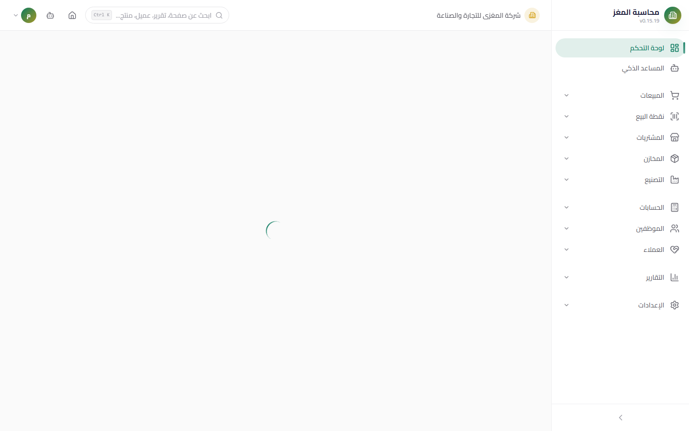
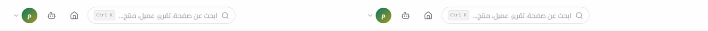
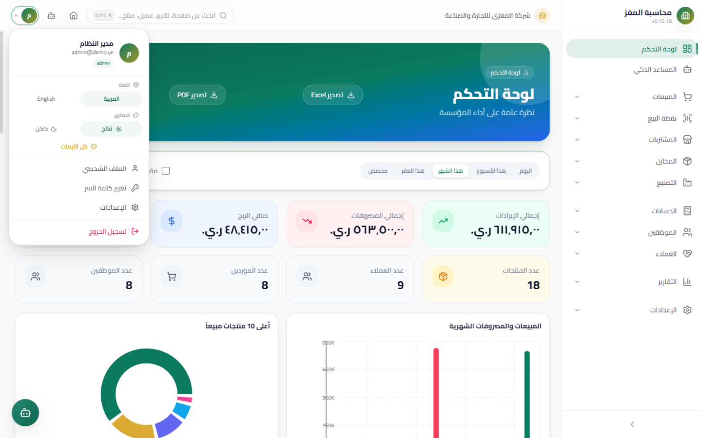
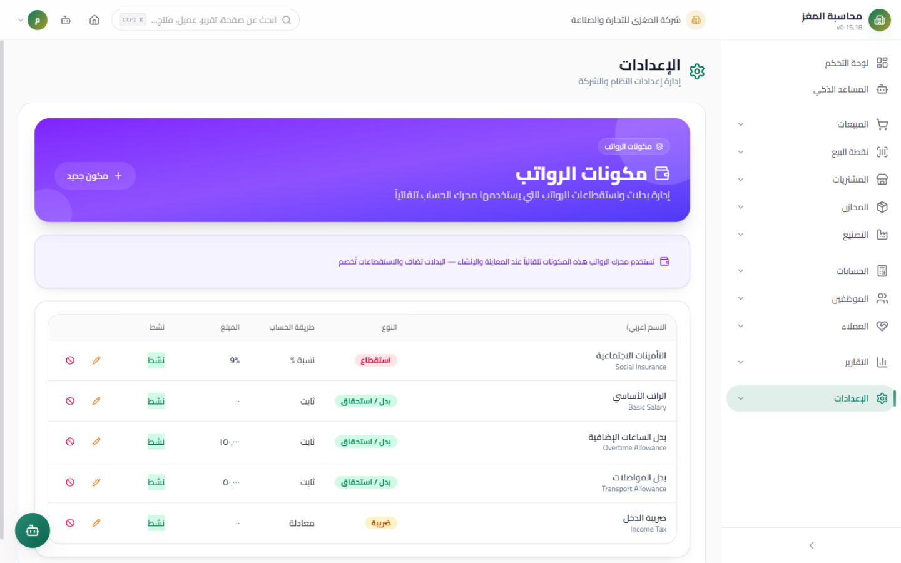

# General Interface — User Guide

> A tour of the screen structure: the sidebar, the header, the user menu, themes, and text direction.

## Overview

After signing in, the main screen appears with a right-to-left (RTL) layout and consists of:

| Part | Location | Purpose |
|---|---|---|
| Sidebar | Right side of the screen (in Arabic mode) | Navigation between the 13 modules |
| Header | Top of the screen | Active company, global search, home button, assistant, user menu |
| Content area | Center | The current page |
| Bottom tab bar | Bottom of the screen (mobile only) | Quick access to the first 4 modules + "More" |

## The Sidebar

The sidebar is the map of the system. Modules are grouped logically:

| Group | Modules |
|---|---|
| Home | Dashboard, the "Maghz" AI Assistant (المساعد الذكي «مغزى») |
| Operations | Sales, POS, Purchases, Inventory, Manufacturing |
| Management | Accounting, HR, CRM |
| Analysis | Reports (Reports Hub) |
| System | Settings |

- Each section has its own hub page — click the section name to open it, or click the collapse arrow next to it to expand its list of sub-pages.
- When the sidebar is collapsed, only icons are shown, with a tooltip showing the section name on hover.

### Permission-Based Hiding — and Why It Is Not Protection on Its Own

Modules your role cannot access are **hidden from the sidebar** automatically. For example, a sales representative (`sales_rep`) does not see Settings or Accounting, while an administrator (`admin`) sees everything.

> **Important warning:** Hiding menu items is an organizational measure for a cleaner experience, not the actual protection. Real protection means that **every route in the system is protected independently** — even if a user types the URL of a page they are not allowed to open directly in the address bar, the page is rejected and its data is never displayed. The rule: the permission is checked on every route, and hiding is merely its visual reflection.

### Scrolling and Collapsing

| Action | How | Result |
|---|---|---|
| Collapse/expand the sidebar | Arrow button at the bottom of the sidebar | Switches between full width (names and icons) and collapsed mode (icons only) — your choice is saved |
| Scroll between sections | Mouse wheel inside the sidebar | All sections scroll vertically |
| Mobile / small screens | Menu button in the header | The sidebar appears as a sliding drawer with a dim overlay; it closes when you click outside or press Escape |

## The Header

A bar at the top of the screen that stays fixed on every page:

| Element | Location | Function |
|---|---|---|
| Active company | Top right (logo + name) | Shows the organization whose data you are working on — everything you create is recorded under this company |
| Global search | Top center (or magnifier icon) | Searches pages, customers, suppliers, products, and invoices — also opens with `Ctrl+K` |
| Home button | House icon | Instant return to the Dashboard |
| AI Assistant | Robot icon | Appears only for users with the `ai.use` permission — opens the "Maghz" AI Assistant page |
| User menu | Top left (user avatar + arrow) | All account and appearance options — detailed below |

## The User Menu

Click the user avatar in the header to open the menu:

| Option | Function |
|---|---|
| **Identity card** | User avatar, name, email, and role badge (e.g. `admin`) |
| **Language** | Instant switch between **Arabic** and **English** — the interface and its direction change immediately |
| **Appearance** | Switch between **Light mode** and **Dark mode** |
| **All Themes** | Quick link to the Appearance & Themes page (see below) |
| **Profile** | Edit full name, phone, and personal photo |
| **Change Password** | Requires entering the current password — details in `02-getting-started/03-login.md` |
| **Settings** | Link to the main Settings page |
| **Sign Out** | Ends the session and returns to the login screen |

## Themes Page (Appearance & Themes)

- **Access:** Sidebar ← Settings ← Appearance & Themes (or User Menu ← All Themes)

Here you control the visual identity of the system:

| Feature | Details |
|---|---|
| **Brand themes** | Ready-made system themes in both light and dark modes (Emerald and Gold) — activated with one click |
| **My own themes** | Create a custom theme in your company colors, then edit or delete it |
| **Live preview** | Before saving you see a real preview of the menu, header, and buttons in the chosen colors |

### Creating a Custom Theme

1. Click **New Theme (ثيم جديد)**.
2. Enter the theme name **in both Arabic and English** (both are required).
3. Choose the **mode**: light or dark.
4. Set the colors — each field accepts hex format only (`#RRGGBB`):

| Color | What it controls |
|---|---|
| Primary color (emerald) | Primary buttons, active links, and highlight elements |
| Accent color (gold) | Badges and secondary touches |
| Background | The general window background |
| Surface (cards) | Background of cards and tables |
| Main menu background | Sidebar background |
| Header background | Top bar background |
| Link color (default) | Text of inactive menu items |
| Link color (active) | Text and icon of the section you are in |
| Icon color (default) | Inactive menu icons |

5. Choose the **font**: Cairo, Inter, Plex, or the system font.
6. Preview, then save — the theme activates immediately and you can return to the brand theme at any time. Deleting an active theme automatically reverts you to the default brand theme.

## Text Direction (RTL)

The system is Arabic-first:

- The default interface is **right-to-left (RTL)**: the sidebar sits on the right, the header is mirrored, and forms read naturally in Arabic.
- When you switch to English from the user menu, the direction flips entirely to LTR — tables, fields, and icons swap positions automatically.
- Technical fields (passwords, codes, document numbers such as `INV-0001`) are always displayed left-to-right inside the Arabic interface to guarantee correct reading.

## Quick Routes Map

Full paths to the most-used pages (follow the same pattern for every module):

| Page | Full path |
|---|---|
| Dashboard | Sidebar ← Dashboard |
| New sales invoice | Sidebar ← Sales ← Sales Invoices ← **New Invoice (فاتورة جديدة)** button |
| Cashier screen | Sidebar ← POS ← Cashier Screen |
| New journal entry | Sidebar ← Accounting ← Journal Entries ← **New Entry (قيد جديد)** button |
| Customer statement | Sidebar ← Reports ← Customer Statement |
| Add a user | Sidebar ← Settings ← Users |
| Backup | Sidebar ← Settings ← Backup |
| Reset the wizard | Sidebar ← Settings ← Reset Setup |

## Tips

- Memorize `Ctrl+K` — global search is the fastest way to reach any page or record without navigating menus.
- Set up a theme in your company colors and share the sense of identity with your team — the light/dark switch works with any theme.
- The company name in the header is a constant reminder: if you manage more than one organization, always confirm the active company is correct before issuing any invoice.
- On mobile, use the bottom tab bar and then "More" to reach the remaining modules — the same permissions apply there.
