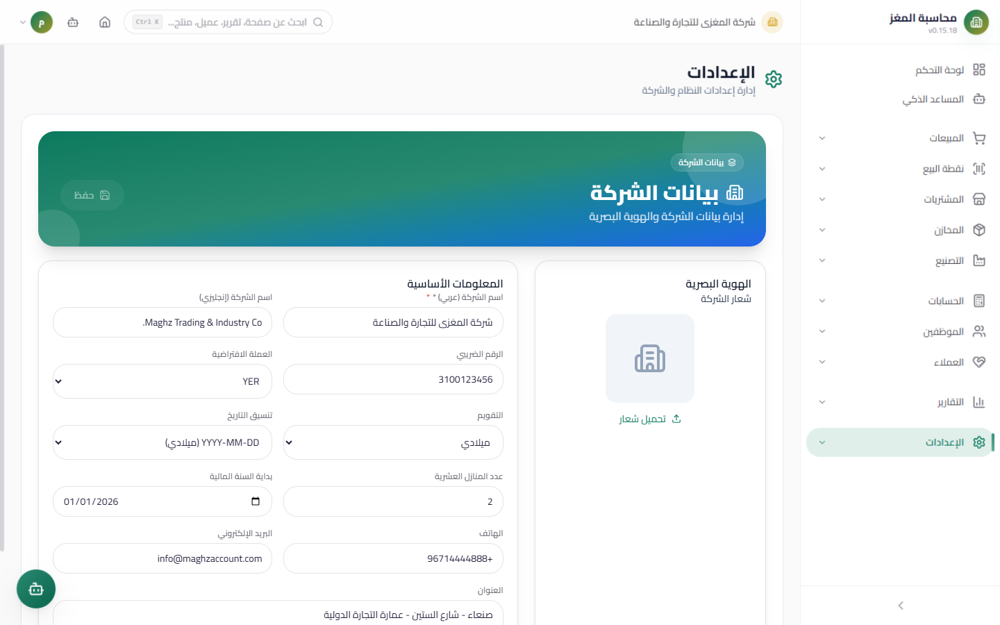

# Branches & Currencies — User Guide

> Define the organization's branches, and manage currencies, exchange rates, and the base currency.

## Overview

This page documents two sections of the settings: **Branches** (the organization's operating locations) and **Currencies** (the base currency plus the working currencies with their exchange rates). Currencies are the backbone of any multi-currency handling in invoices, vouchers, and reports — see also `16-multicurrency/README.md`.

---

## Section One: Branches



### Branches Screen

- **Access:** Sidebar ← Settings ← Branches
- **Purpose:** Record the organization's locations (the main branch and other branches) and link transactions to them.

#### Fields

| Field | Description | Required/Optional |
|---|---|---|
| Name | The branch name as it appears on screens and documents | Required |
| Code | A short code for the branch (e.g. `SNA` for the Sana'a main branch) | Optional |
| City | The city where the branch is located | Optional |
| Phone | The branch contact phone | Optional |
| Active | An active branch appears in branch selection lists; a disabled branch stays saved but unused | Optional (defaults to active) |

#### Buttons & Actions

| Button | Function |
|---|---|
| **New Branch** | Opens the add form above the table |
| **Save** | Saves the new branch or the edit and records it in the Audit Log |
| **Edit** (pencil) | Fills the form with the branch's data for editing |
| **Delete** (trash) | Asks for **explicit confirmation** in a dialog before deleting; deletion is permanent and is recorded in the Audit Log |

#### Example

| Name | Code | City | Phone | Status |
|---|---|---|---|---|
| Main Branch | SNA | Sana'a | 01-123456 | Active |
| Aden Branch | ADN | Aden | 04-654321 | Active |
| Taiz Branch (temporarily closed) | TAZ | Taiz | — | Inactive |

---

## Section Two: Currencies


### Currencies Screen

- **Access:** Sidebar ← Settings ← Currencies
- **Purpose:** Define the currencies the organization deals in, with an exchange rate for each, and designate the base currency.

#### Fields

| Field | Description | Required/Optional |
|---|---|---|
| Code | The currency's international code — **3 Latin letters, mandatory** (e.g. `YER`, `USD`, `SAR`). The length is validated on save | Required |
| Name | The currency's name (e.g. Yemeni Rial, US Dollar) | Required |
| Symbol | The symbol displayed next to amounts (e.g. ر.ي, $) | Optional |
| Exchange rate | See the exchange rate rule below | Required (defaults to 1) |
| Active | Only active currencies appear in the currency selection lists on invoices and vouchers | Optional (defaults to active) |

#### Buttons & Actions

| Button | Function |
|---|---|
| **New Currency** | Opens the add form above the table |
| **Star** | **Sets the currency as the default (base currency)** — a filled golden star means the currency is the base. Assigning it moves the star automatically from the previous currency (there cannot be two defaults) |
| **Edit / Delete** | As usual, with confirmation for deletion |

> **The default (base) currency cannot be deleted** — it has no delete button and no star toggle, because all reports and totals are aggregated in it.

### The Exchange Rate Rule (Very Important)

**`rate(currency) = how much of the base currency equals 1 of this currency`**

The base currency always has a rate of `1` (the Yemeni Rial YER by default):

| Currency | Rate | Meaning |
|---|---|---|
| YER | 1 | The base currency |
| USD | 1500 | 1 US Dollar = 1500 Yemeni Rial |
| SAR | 400 | 1 Saudi Riyal = 400 Yemeni Rial |

**The conversion formula from any currency to another:**

```
Converted value = Value × Source rate ÷ Target rate
```

**Example 1 — from Dollars to Yemeni Rial:** 100 USD
`100 × 1500 ÷ 1 = 150,000 YER`

**Example 2 — from Saudi Riyal to Dollars:** 2,000 SAR
`2000 × 400 ÷ 1500 = 533.33 USD`

**Example 3 — from Dollars to Saudi Riyal:** 100 USD
`100 × 1500 ÷ 400 = 375 SAR`

### What Is Stored With Every Financial Document

Every financial document created in a non-base currency (an invoice, a receipt voucher, a payment voucher) stores three values:

| Value | Description |
|---|---|
| **Currency** | The code of the chosen currency (e.g. USD) |
| **Exchange rate at creation time** | Captured automatically from the Currencies page when the document is created; changing the exchange rate later does **not modify** old documents |
| **Base currency amount** | The amount converted into the base currency — **always computed server-side** on save; no client-side (browser) calculation is ever trusted for any final rounding |

This guarantees that reports aggregated in the base currency stay accurate even after rates fluctuate.

## Step-by-Step Workflow

1. Go to: Sidebar ← Settings ← Branches, add the main branch (the name is required) and save it.
2. Move to: Sidebar ← Settings ← Currencies.
3. Add the currencies: click "New Currency", enter a 3-letter Latin code, the name, the symbol, and the exchange rate against the base currency.
4. Set the base currency by clicking the star icon on the row of the desired currency (usually YER).
5. Make sure every currency you intend to use on invoices is "active".
6. Return to Company Information (`01-company.md`) and choose the default currency from the dropdown.

## Important Rules

- **The exchange rate is always against the base:** do not save the USD rate against SAR; save it against YER only, and conversion between two non-base currencies goes through the base automatically.
- **Updating rates:** edit the exchange rate on the Currencies page whenever the market rate changes; new documents will use the new rate, while old ones keep their historical rate.
- **Every action (add/edit/set default/delete) is recorded in the Audit Log.**
- Branches are not just text: they are used for filtering and linking (e.g. linking a cash box to a branch).

## Common Errors & Fixes

| Message/Behavior | Cause | Solution |
|---|---|---|
| "Code and name are required" | You left the code or the name empty | Enter the currency code (3 Latin letters) and its name |
| "The code must be 3 characters" | The code is shorter or longer than 3 characters, or uses non-Latin letters | Use the standard international code such as USD |
| "Name is required" on branches | The branch name is empty | Enter the branch name, then save |
| The delete button does not appear for a currency | This is the default currency | Assign another currency as default first if you really want to remove it, or leave it |
| Converted amounts in reports do not match my expectations | The exchange rate is outdated or was entered inverted | Remember: the rate = the value of 1 unit of the currency in the base currency (USD = 1500, not 0.00067) |
| The buttons are not visible | You lack `settings.create` / `settings.edit` / `settings.delete` | Ask the system administrator for the permission |

## Tips

- Give branches distinctive names (city + activity) because they appear in many dropdown lists.
- Do not create currencies you will not use — every active currency appears in the invoice lists and increases the chance of a wrong pick.
- Review the Audit Log after any bulk exchange rate change to confirm the edits were made by your account only.
