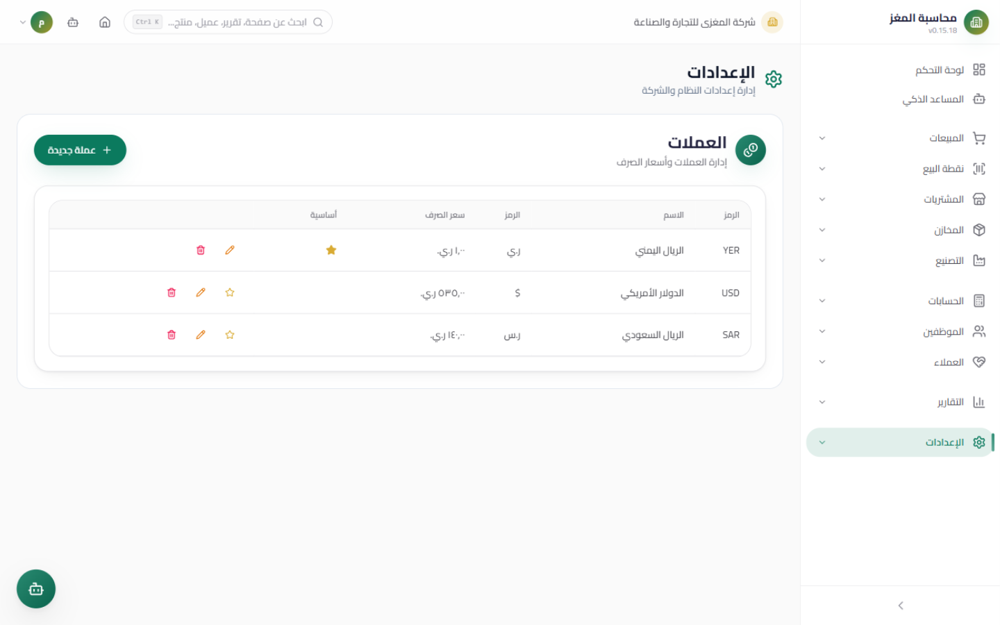

# Value Added Tax (VAT) Settings — User Guide

> Manage tax types, their rates, and their accounting accounts, plus the options for showing tax and discount on invoices.

## Overview

The tax settings page is the single place where you define the VAT types your organization deals with. Each tax type links a percentage to a GL account that receives the tax amount on posting. The page also controls two invoice display options: show discount and show tax.

- **Access:** Sidebar ← Settings ← Value Added Tax
- **Route:** `/settings/vat`

## Access & Permissions

| Action | Permission |
|---|---|
| View the types and options | `settings.view` |
| Add a tax type | `settings.create` |
| Edit a tax type | `settings.edit` |
| Delete a tax type | `settings.delete` |

Every add/edit/delete and every change to the display options is recorded in the Audit Log.

## Screen: Tax Types

- **Access:** Sidebar ← Settings ← Value Added Tax
- **Purpose:** Define the VAT types that appear in the selection lists on invoices (sales and purchases).

### Fields

| Field | Description | Required/Optional |
|---|---|---|
| Name | The tax type's name (e.g. "VAT 15%", "Exempt", "Zero-rated") | Required |
| Rate | The tax rate from **0 to 100%** with decimal fractions supported (e.g. 5, 15, 7.5). Any value outside this range is rejected | Required |
| GL account | The account from the Chart of Accounts that **the tax amount is posted to** on posting — a "sales tax payable" account for your sales and a "purchase tax" account for your purchases | Optional (strongly recommended) |
| Active | Only active types appear for selection on invoices | Optional |

### Buttons & Actions

| Button | Function |
|---|---|
| **New Type** | Opens the add form (the suggested starting rate is **15%**) |
| **Save** | Saves the type after validating the name and rate, and records it in the Audit Log |
| **Edit** (pencil) | Opens the type in the edit form |
| **Delete** (trash) | An explicit confirmation dialog before permanent deletion |

### The Suggested Default Rate

When you open the "New Type" form, the rate is pre-filled with **15%** — the recommended standard VAT rate. Adjust it according to your country's rules or the type of goods (for example: 5% for essential goods, 0% for exempt items).

## Screen: Invoice Display Options

- **Access:** At the bottom of the same tax page, a separate card titled "Show Options on Invoices"
- **Purpose:** Control what appears on printed and shared documents.

| Option | Setting key | Function |
|---|---|---|
| **Show discount on invoices** | `invoice.showDiscount` | When enabled, the discount line and its value appear on the printed invoice |
| **Show tax on invoices** | `invoice.showVat` | When enabled, the VAT line and its value appear on the printed invoice |

> **Saving is instant:** each toggle is saved the moment you flip it, with no save button, and the change is recorded in the Audit Log. If the save fails, an error message appears and the toggle reverts to its saved value.

## Full Numeric Example

A sales invoice of **10,000 YER** with 15% tax:

| Item | Calculation | Amount (YER) |
|---|---|---|
| Total before tax | — | 10,000 |
| VAT 15% | 10,000 × 0.15 | 1,500 |
| **Final total** | 10,000 + 1,500 | **11,500** |

**Accounting impact on posting** (assuming the tax type is linked to the sales tax account):

| Account | Debit | Credit |
|---|---|---|
| Accounts Receivable / Cash Box | 11,500 | |
| Sales | | 10,000 |
| Sales tax payable (the linked account) | | 1,500 |

## Step-by-Step Workflow

1. Go to: Sidebar ← Settings ← Value Added Tax.
2. Click "New Type", enter the name (e.g. "VAT 15%"), and confirm the rate is 15.
3. Choose the linked GL account from the Chart of Accounts (the sales tax account for sales, the purchase tax account for purchases).
4. Leave "Active" checked and save.
5. Repeat the steps for every other tax type (5%, 0%, exempt, ...).
6. At the bottom of the page, enable "Show discount" and "Show tax" according to what you want on your invoices.
7. Try issuing a test invoice and verify: tax total = 15% of the total before tax.

## Important Rules

- **The linked GL account is what receives the tax on posting** — if you leave it empty the system will calculate the amounts but will not post the tax to a proper account; see `06-default-accounts.md` to also link the default tax accounts.
- **The rate must be between 0 and 100 only:** fractions are allowed (step 0.01) but any negative value or value above 100 is rejected with an error message.
- **Deleting a tax type used on old invoices does not change the old invoices** — the tax is stored in them with its value at creation time, but you will no longer be able to select it on a new invoice.
- The discount/tax display options are company-level display settings and affect all new documents immediately after you flip them.

## Common Errors & Fixes

| Message/Behavior | Cause | Solution |
|---|---|---|
| "Invalid rate" | The rate is negative or greater than 100 | Enter a value between 0 and 100 (fractions such as 7.5 are accepted) |
| "Name is required" | The name field is empty | Enter a descriptive name for the tax type |
| The invoice does not show the tax line | The "Show tax on invoices" option is disabled | Enable the toggle from the invoice display options card |
| The tax is calculated but does not appear on its account in the journal entry | The tax type was not linked to a GL account | Edit the type and choose the account from the Chart of Accounts |
| I do not see the "New Type" button | You lack `settings.create` | Ask the system administrator for the permission |

## Tips

- Include the rate in the type's name itself ("VAT 15%") so the correct type is easy to pick on the invoice without checking the rate.
- Create a 0% type named "Tax Exempt" instead of issuing invoices without a tax type — it makes tax reports easier.
- Link your sales types to an output tax (liability) account and your purchase types to an input tax (asset) account for a clean reconciliation at filing time.
