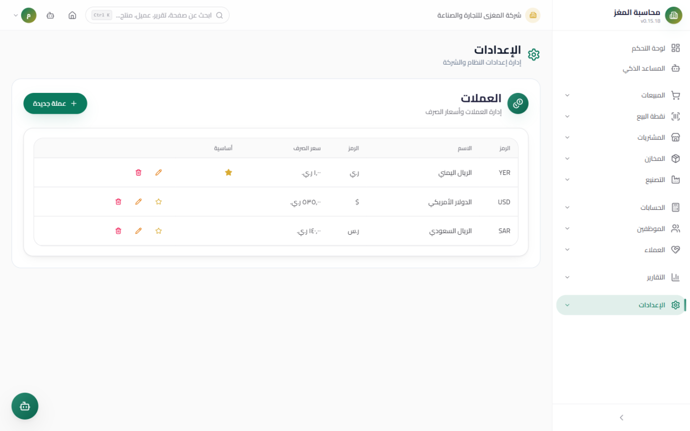

# Document Sequences — User Guide

> Full control over the shape and order of every document's number: prefix, number, padding, step, and yearly reset.

## Overview

The Document Sequences page manages **an independent sequence for every document type**. Invoices, vouchers, purchase orders, and work orders all draw their numbers automatically from here at the moment of creation. You can control the entire number format — for example `INV-2026-00042` — and preview the next number before it is issued.

- **Access:** Sidebar ← Settings ← Document Sequences
- **Route:** `/settings/document-sequences`

## Access & Permissions

| Action | Permission |
|---|---|
| View the sequences and the preview button | `settings.view` |
| Edit sequence fields and enable/disable | `settings.edit` |

Every edit is recorded in the Audit Log.

## Screen: The Sequences Table



- **Access:** Sidebar ← Settings ← Document Sequences
- **Purpose:** Display all document types in one table, with inline editing of the fields directly in the row.

### Fields (per document type)

| Field | Description | Example |
|---|---|---|
| Prefix | The fixed text at the start of the number | `INV-` |
| Suffix | Optional text at the end of the number | `-Y` |
| Start number | The number the sequence starts from on first use | 1000 |
| Current number | The last number issued from the sequence — you can edit it manually to jump to a specific number | 1041 |
| Increment step | How much the number increases with each new document (usually 1) | 1 |
| Zero padding length | The number of digits the number is padded to with leading zeros | 5 → `00042` |
| Yearly reset | When enabled, the number returns to its start with each new fiscal year | ✓ |
| Active | An on/off switch for the sequence (a green/gray toggle button) | ✓ |

### Buttons & Actions

| Button | Function |
|---|---|
| **Preview** (eye) | Shows the **next number** exactly as it will be issued (prefix + padding + suffix) without issuing it — it does not consume a number |
| **Edit** | Opens the row's fields for editing |
| **Save** | Saves the row's changes and records them in the Audit Log |
| **Enable toggle** | Instantly switches the sequence between enabled and disabled |

## Document Types and Their Unified Prefixes

The numbering is **completely independent per type**: the counter in `INV-` never interacts with `PINV-`.

| Prefix | Document type | Module |
|---|---|---|
| `INV-` | Sales invoice | Sales |
| `PINV-` | Purchase invoice | Purchases |
| `QOT-` | Quotation | Sales |
| `PO-` | Purchase order | Purchases |
| `SR-` | Sales return | Sales |
| `PR-` | Purchase return | Purchases |
| `ADJ-` | Stock adjustment | Inventory |
| `TRF-` | Stock transfer | Inventory |
| `POS-` | POS receipt | POS — **numbered independently of `INV-`** |
| `WO-` | Work order | Manufacturing |

Other types are numbered by the same mechanism: journal entries, receipt voucher, payment voucher, payroll run, employee, customer (`CUS-`), supplier, product (`PRD-`).

## How the Final Number Is Built

```
Prefix + [number padded to the padding length] + Suffix
```

**Example:** prefix `INV-`, current number 41, padding 5, no suffix:

```
INV-00041
```

**Example with yearly reset:** prefix `INV-`, suffix `-26`, first invoice after the reset:

```
INV-00001-26
```

## Who Draws Numbers From Here

| Document | Sequence | Note |
|---|---|---|
| Sales invoice / quotation / sales return | `sales_invoice` / `quotation` / `sales_return` | At creation directly |
| Purchase invoice / purchase order / purchase return | `purchase_*` | At creation directly |
| **Receipt voucher / payment voucher** | `receipt_voucher` / `payment_voucher` | **The receipt voucher fails if no number is available** — if the sequence is disabled or the number cannot be generated, an error message appears and the voucher is not saved |
| POS receipt | `pos_receipt` | Independent of sales invoices |
| Stock adjustment/transfer, work order | `stock_adjustment` / `inventory_transfer` / `work_order` | At creation |

## Step-by-Step Workflow

**Example: configuring sales invoices to start at 1000 with the format `INV-01000`:**

1. Go to: Sidebar ← Settings ← Document Sequences.
2. Find the "Sales Invoice" row and click "Edit".
3. Set: prefix `INV-`, start number `1000`, current number `1000`, increment step `1`, padding length `5`.
4. Enable "Yearly reset" if you want the count to restart with each fiscal year.
5. Click "Save".
6. Click "Preview" and verify the next number shows `INV-01000`.
7. Create a test invoice: it should draw `INV-01000` automatically, then the next one `INV-01001`.

**Example: renumbering manually:** if your paper records are numbered up to `INV-00500`, change the "Current number" to 500 and save — the next invoice will be `INV-00501`.

## Important Rules

- **The number is issued at the moment of creation and never reused:** deleting an invoice does not return its number to the counter.
- **Preview does not consume a number** — it is safe to use at any time.
- **The receipt voucher and other vouchers do not work with a disabled sequence:** disable a sequence only if you know the module will not create documents of that type.
- **Editing the "Current number" is your responsibility:** setting it lower than already-issued numbers may cause apparent duplicates in new documents.
- **The numbering is independent per type and per company** — no overlap between companies or between types.

## Common Errors & Fixes

| Message/Behavior | Cause | Solution |
|---|---|---|
| "Could not generate the voucher number" when saving a receipt voucher | The `receipt_voucher` sequence is disabled or missing | Enable the sequence from this page (the toggle) or redefine it |
| Preview shows an error message | The sequence is not initialized for this type | Click "Edit" then "Save" to initialize it, or refresh the page |
| Numbers run consecutively with no zeros (INV-1, INV-2) | Padding length = 0 | Change the "Zero padding length" to 4 or 5 |
| A new invoice reused an old number | The "Current number" was reduced manually | Set the current number higher than the last issued number |
| Numbers jump in large steps | The increment step is greater than 1 by mistake | Set it back to 1 |
| The enable toggle is not visible | You lack `settings.edit` | Ask the system administrator for the permission |

## Tips

- Use a padding length of 4-5 digits; it sorts numbers correctly when exporting to Excel and unifies document display.
- Yearly reset suits organizations whose tax regulations require annually renewed numbering (invoice 2026 starts from 00001).
- Do not change the prefix after invoices have been issued with it except for a strong administrative reason — mixed prefixes in the archive make searching harder.
- Use "Preview" before closing the fiscal year to confirm the yearly reset is in place before the first invoice of the new year.
