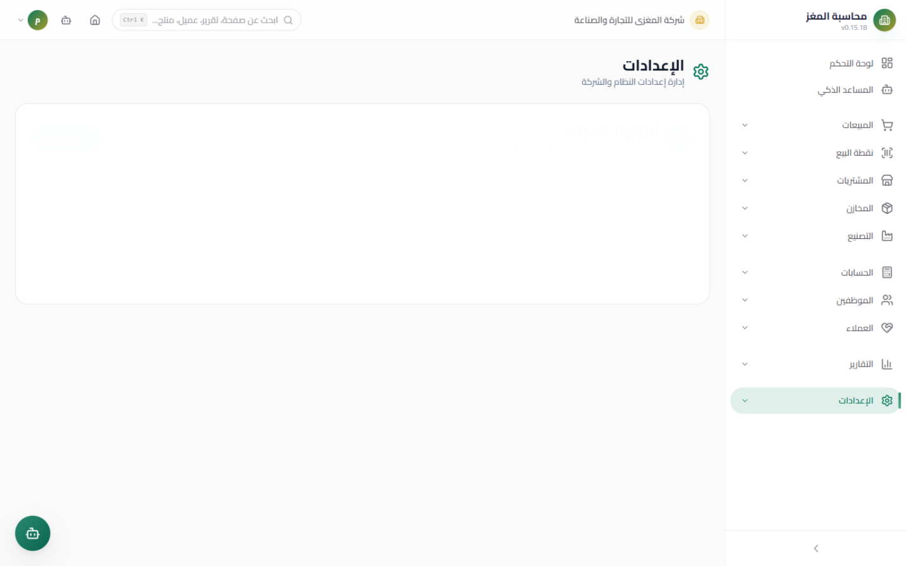
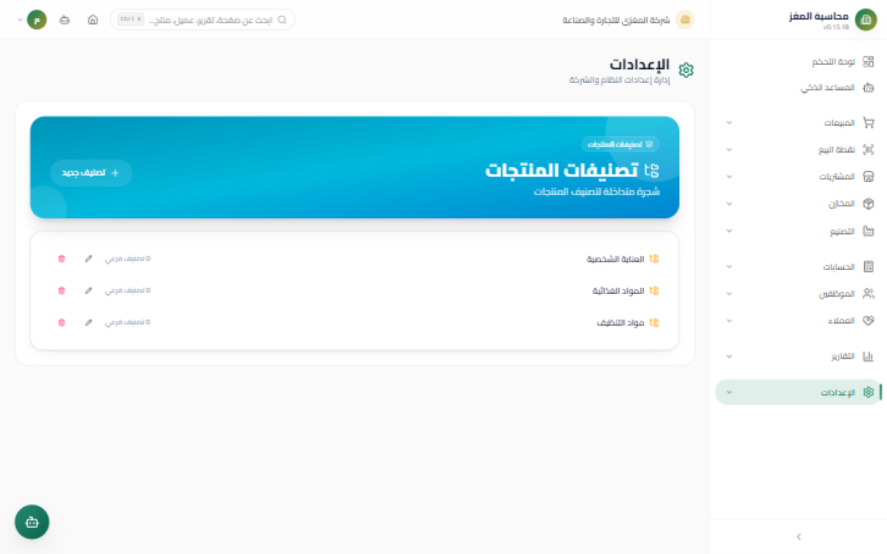
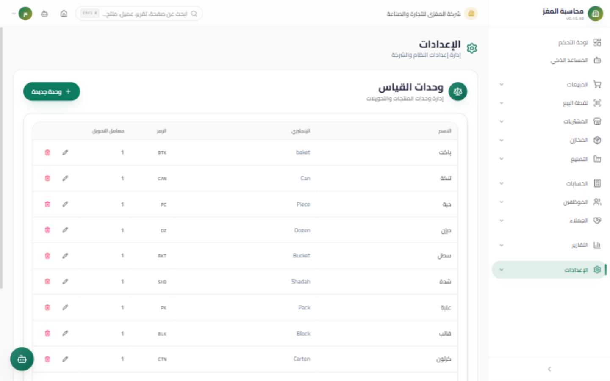
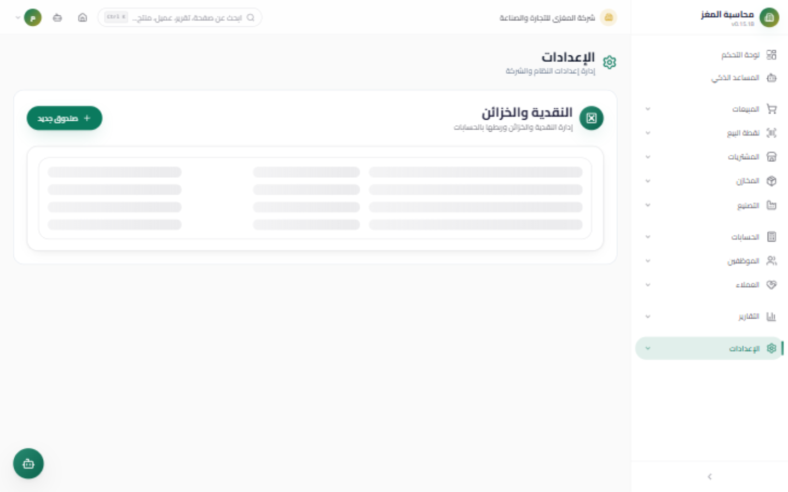
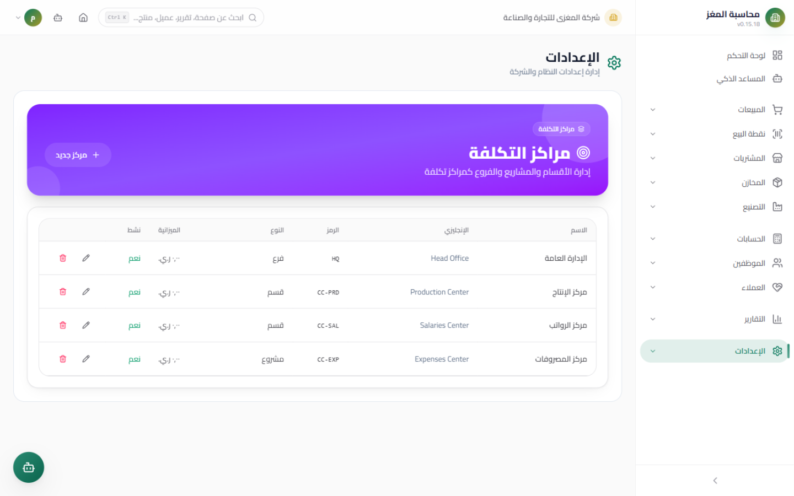

# Classifications — User Guide

> Product types, product categories, units of measure, cash boxes, and cost centers: the organizational layer you build inventory and cash handling on.

## Overview

This group of settings pages gathers all the classification and organization tools: the product type (one primary classification), its categories (multiple hierarchical tags), and its units of measure, plus cash boxes and cost centers. All of them are recorded per company, and any change is written to the Audit Log.

- **Location:** Sidebar ← Settings ← (Product Types | Product Categories | Units of Measure | Cash Boxes | Cost Centers)
- **Permissions:** View `settings.view`, Add `settings.create`, Edit `settings.edit`, Delete `settings.delete`

## The Type vs. Category Relationship (Read This First)

| Tool | Nature | Example |
|---|---|---|
| **Product type** | A **single** primary classification per product — it determines the product's behavior across modules | "Finished Goods" (appears in Sales, Purchases, and Inventory) vs. "Raw Material" (appears in Manufacturing) |
| **Product categories** | **Multiple** tags per product, arranged in a hierarchical tree | The product "Orange Juice" carries: Food ← Beverages, and also "Ramadan Offers" |

The rule: **the type = one primary classification that determines behavior; the categories = multiple tags for grouping and filtering.**

---

## 1. Product Types



- **Access:** Sidebar ← Settings ← Product Types (`/settings/product-types`)
- **Purpose:** Simple CRUD for the product types that determine where each product appears.

### Fields

| Field | Description | Required/Optional |
|---|---|---|
| Arabic name | The type's name | Required |
| English name | The type's name in English | Optional |
| Code | A short code | Optional |
| Appears in Sales / Purchases / Inventory / Manufacturing | Toggles that control whether products of this type appear in each module | Optional |
| Track stock | Whether products of this type are subject to quantity tracking | Optional |
| Has a BOM (Bill of Materials) | Whether a BOM may be defined for products of this type | Optional |
| Active | The type's status | Optional |

Adding and editing happen through a popup window, and deletion goes through an explicit confirmation dialog.

---

## 2. Product Categories



- **Access:** Sidebar ← Settings ← Product Categories (`/settings/product-categories`)
- **Purpose:** A hierarchical tree of tags linked to products in a **many-to-many relationship**: one product may carry several categories, and one category groups several products.

### Screen & Actions

| Action | Description |
|---|---|
| **New Category** | A window with the category name + **parent category** (optional) — choosing a parent makes it a child under that parent |
| **Edit** | Change the name or move the category to another parent |
| **Delete** | A confirmation dialog; deletion is **nested**: adding/removing any node rebuilds the displayed tree immediately |
| **Expand/Collapse** | Arrow buttons next to every node that has children, with a "number of sub-categories" counter |

### How to Link Categories to Products

The linking is done from the Products page (Inventory): when creating or editing a product you select several categories for it from the tree. The categories are then used as filters in the product list and reports.

**Example tree:**

```
Food
├── Beverages
│   └── Juices
└── Canned Goods
Building Materials
└── Sanitary Ware
```

---

## 3. Units of Measure



- **Access:** Sidebar ← Settings ← Units of Measure (`/settings/units`)
- **Purpose:** Define the units products are bought and sold in (piece, carton, kilo, ...).

| Field | Description | Required/Optional |
|---|---|---|
| Arabic name | The unit's name | Required |
| English name | The unit's name in English | Optional |
| Code | A short code | Optional |
| Conversion Factor | How many base units this unit equals | Defaults to 1 |

**Example:** a "Carton" unit with a conversion factor of 12 means one carton = 12 base units (pieces). Stock is always stored in the Base Unit — see the Inventory guide.

---

## 4. Cash Boxes



- **Access:** Sidebar ← Settings ← Cash Boxes (`/settings/cash-boxes`)
- **Purpose:** Define each **Cash Box** linked to a GL account in the Chart of Accounts. Every cash movement goes through a box: POS sales, cash invoices, receipt and payment vouchers, payroll disbursement, and end-of-service settlements.

### Fields

| Field | Description | Required/Optional |
|---|---|---|
| Name | The box's name (e.g. "Main Branch Cash Box") | Required |
| Code | A short code displayed in a monospace font | Optional |
| Opening Balance | The cash balance when you start using the box | Defaults to 0 |
| GL account | The GL account linked to the box (usually the "Cash on Hand" account) | Optional — recommended |
| Branch | The branch the box belongs to | Optional |
| Custodian | The user responsible for the box | Optional |
| Active | Whether it appears in the box selection lists | Defaults to active |

> The table shows each box's current balance next to its name. Deletion requires explicit confirmation.

---

## 5. Cost Centers



- **Access:** Sidebar ← Settings ← Cost Centers (`/settings/cost-centers`)
- **Purpose:** Allocate expenses and revenues across responsibility centers (departments, projects, activities).

| Field | Description | Required/Optional |
|---|---|---|
| Arabic name | The center's name | Required |
| English name | The name in English | Optional |
| Code | A short code | Optional |
| Type | The center's type (a department or otherwise) | Defaults to department |
| Budget | The center's planned budget — displayed next to it with an expense comparison | Defaults to 0 |

**Example:** create the "Sales", "Maintenance", and "Expansion Project" centers with their budgets, then allocate expenses to them for per-center profitability reports.

## Step-by-Step Workflow

1. **Product types:** Sidebar ← Settings ← Product Types ← "New Type" ← enter "Finished Goods" and enable Sales/Purchases/Inventory ← Save.
2. **Categories:** Settings ← Product Categories ← create "Food" (no parent) then "Beverages" (parent: Food) ← Save.
3. **Units:** Settings ← Units of Measure ← add "Piece" (factor 1) and "Carton" (factor 12).
4. **Cash boxes:** Settings ← Cash Boxes ← "New Cash Box" ← name + GL account + branch ← Save.
5. **Cost centers:** Settings ← Cost Centers ← add your centers with their budgets.
6. Link all of the above when entering products (type + categories + units) and when operating POS (the cash box).

## Important Rules

- The type and the category are functionally different: do not turn categories into types to split inventory — it is the type that determines behavior (stock tracking, BOM, the visible unit).
- The cash box is linked to a GL account: any shift shortage or overage is reflected on that account — see the POS guide (Z Report).
- Do not delete a category used by many products before moving its products to a replacement category.
- Every action on the five pages is recorded in the Audit Log with the username and the time.

## Common Errors & Fixes

| Message/Behavior | Cause | Solution |
|---|---|---|
| "Name is required" | You left the Arabic name empty | Enter the name and save |
| The category does not appear as a branch | You did not choose a "Parent category" when creating it | Edit it and choose the desired parent |
| I cannot find a cash box on the POS screen | The box is inactive or linked to another branch | Activate the box or link it to the correct branch |
| Deletion fails | The record is in use (products linked to the category/type, or movements on the box) | Move the usages elsewhere first, or keep the record |
| The center's budget does not appear in the report | The budget value was not entered | Edit the center and enter the budget |

## Tips

- Do not over-nest the categories: a tree 2-3 levels deep is enough for any practical filtering.
- Give every cash box a specific custodian — it clarifies responsibility when settling shift differences.
- Review each cost center's budget vs. actual expenses monthly in the Reports Hub.
