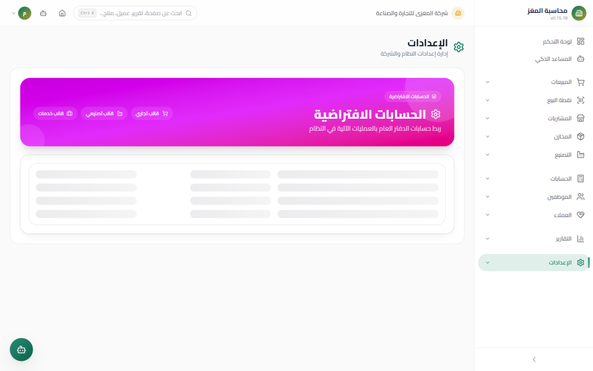

# Default Accounts — User Guide

> Link system behaviors (sales, purchases, cash, inventory, payroll, ...) to accounts from the Chart of Accounts that the automatic posting engine uses.

## Overview

When you post a sales invoice or close a shift, the system does not ask you "which account do we post to?" every time. Instead it reads the **Default Accounts**: a mapping table between every behavior in the system (selling, buying, discount, payroll, ...) and a GL account from the Chart of Accounts. This page is the intersection of the Chart of Accounts × the automatic posting engine.

- **Access:** Sidebar ← Settings ← Default Accounts
- **Route:** `/settings/default-accounts`

## Why Does This Table Matter?

**The automatic posting engine uses these accounts exclusively.** Example: when posting a sales invoice of 11,500 YER (of which 1,500 is tax):

| Account | Source | Debit | Credit |
|---|---|---|---|
| Accounts Receivable / Cash Box | From the collection behavior | 11,500 | |
| Sales | `default_sales` | | 10,000 |
| Sales tax payable | `default_vat_output` | | 1,500 |

If `default_sales` is linked to the wrong account, all of your revenue — for as long as it stays wrong — goes to the wrong account. That is why this page is configured before activity starts, not after.

## Access & Permissions

| Action | Permission |
|---|---|
| View the table | `settings.view` |
| Change a linked account / apply a template | `settings.edit` |

Every edit or template application is recorded in the Audit Log.

## Screen: The Behaviors Table

- **Access:** Sidebar ← Settings ← Default Accounts
- **Purpose:** Display all system behaviors in one table with the link status and the current account.

### Table Columns

| Column | Description |
|---|---|
| Function | The behavior's name in Arabic, with an icon: a red circle = **required**, gray = optional |
| Status | A colored badge: "Linked" (green) if an account is chosen, "Required" (red) if empty and required, "Optional" (gray) if empty and not required |
| Linked account | A smart selection list from the Chart of Accounts — **changing the selection saves the link immediately** |
| Current account | The code and name of the currently linked account, or "—" |

### Buttons: Readiness Templates

At the top of the page there are three buttons that **apply a complete template** with one click and save the link for every function the template covers:

| Button | Template | Suits |
|---|---|---|
| **Trading Template** | `trading` | An organization that buys and sells without transformation |
| **Manufacturing Template** | `manufacturing` | An organization that produces — it links Work In Progress, Finished Goods, production labor, ... accounts |
| **Services Template** | `services` | A services organization with no inventory |

## The Key Behaviors to Link

| Function | Key | Required? | Typical account |
|---|---|---|---|
| Default cash box | `default_cash` | Required | Cash on Hand |
| Sales | `default_sales` | Required | The sales account (revenue) |
| Cost of Goods Sold | `default_cogs` | Required | Cost of Sales (expense) |
| Inventory | `default_inventory` | Required | Inventory (asset) |
| Customers (AR) | `default_debtors` | Required | Accounts Receivable |
| Suppliers (AP) | `default_creditors` | Required | Accounts Payable |
| Sales tax | `default_vat_output` | Required | VAT Payable |
| Purchase tax | `default_vat_input` | Required | VAT Input |
| Payroll | `default_salaries` | Required | Salaries expense |
| Sales returns / purchase returns | `default_sales_returns` / `default_purchase_returns` | Required | The returns accounts |
| Salaries payable / deductions | `default_salaries_payable` / `default_payroll_deductions` | Optional | Payroll liabilities |
| End of service (expense/liability) | `default_eos_expense` / `default_eos_payable` | Optional | End-of-service accounts |
| Discount allowed / received | `default_discount_allowed` / `default_discount_received` | Optional | Discount accounts |
| Work In Progress (WIP) | `default_wip` | Optional | The WIP inventory account |
| Finished goods, production labor, overhead, packaging, ... | `default_finished_goods` / `default_production_*` | Optional | Manufacturing accounts |
| Opening balances, freight & shipping, rent, miscellaneous | `default_opening_balance` / `default_shipping` / `default_rent` / `default_misc_expense` | Optional | General accounts |

## Step-by-Step Workflow

1. Make sure the Chart of Accounts is ready (see the Accounting guide) — you cannot link a behavior to an account that does not exist.
2. Go to: Sidebar ← Settings ← Default Accounts.
3. Click the template that fits your business (e.g. the "Trading Template") — it fills the basic links immediately with a success message.
4. Review every row in the table: any row with a "Required" (red) status must be linked to a suitable account from the "Linked account" list.
5. Adjust any link that does not fit your chart of accounts (choose from the smart list — search by name or code).
6. Check the "Current account" column: no required row should still show "—".
7. Try posting a test sales invoice and inspect the resulting journal entry: every line must land on an account from this table.

## Important Rules

- **Changes are forward-looking only:** editing a default account affects new documents posted from now on; previously posted journal entries are not rewritten.
- **Required functions are posting blockers:** leave one empty and the automatic posting may fail, or post to an imprecise account depending on the behavior — never skip a red row.
- **Templates do not clear fields:** applying a template fills the links and does not delete your manual edits on functions outside the template, but it **replaces** the links of the functions it covers — review after applying.
- **Default accounts do not replace the tax type:** the tax account on the invoice comes from the VAT type itself (see `03-vat.md`), and `default_vat_output`/`default_vat_input` is the general fallback.
- Every save and every template application is recorded in the Audit Log.

## Common Errors & Fixes

| Message/Behavior | Cause | Solution |
|---|---|---|
| A red "Required" badge stays on a row | The function is required and no account is linked | Choose an account from the "Linked account" list |
| The posted entry lands on a strange account | A wrong default link (e.g. sales on an inventory account) | Correct the link, then settle the old entries with adjustment entries |
| The smart list does not show a specific account | The account is a Group Account or belongs to another company | Choose a leaf account (not a group) from your company's chart |
| Applying the template changed links I had added manually | The template replaces the links of the functions it covers | Re-adjust the affected links after applying |
| The template buttons are not visible | You lack `settings.edit` | Ask the system administrator for the permission |

## Tips

- Apply the template first, then adjust — faster and less error-prone than manual linking from scratch.
- Link the end-of-service and salaries payable accounts before the first payroll run; the payroll entries are built on them automatically.
- Keep a screenshot of the table once you have settled on it — a quick reference when reviewing any journal entry.
- After any bulk edit, open the Audit Log to confirm the changes were made by your account only.
