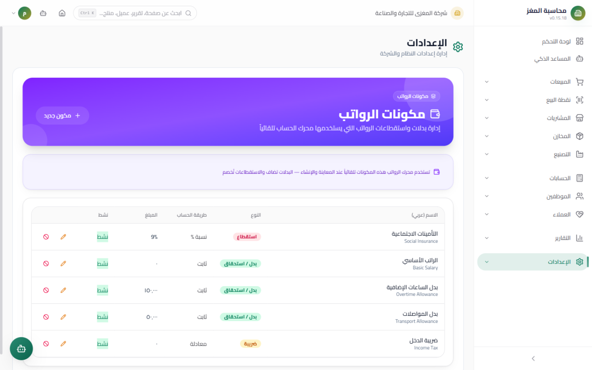

# HR Settings — User Guide

> The digital HR policies (leaves, work, end of service) and the payroll components the payroll engine reads.

## Overview

Two pages configure the entire behavior of the HR module:

1. **HR Policies** (`/settings/hr-policies`): numeric values that govern leave, overtime, and end-of-service calculations.
2. **Payroll Components** (`/settings/payroll-components`): earning and deduction items that appear automatically on the payroll run.

Every change on both pages is recorded in the Audit Log, and both fall under the `settings.*` permissions.

---

## Section One: HR Policies


### The Screen

- **Access:** Sidebar ← Settings ← HR Policies
- **Purpose:** Edit the numeric values the payroll and HR engine uses in its calculations.
- **Permissions:** View `settings.view`, Save `settings.edit`

The screen is divided into three cards: Leaves, Work & Overtime, and End of Service.

### Fields and Default Values

| Card | Field | Default | Description |
|---|---|---|---|
| Leaves | Annual leave (days) | **21** days | Each employee's annual leave balance per year |
| Leaves | Sick leave (days) | **30** days | The sick leave balance |
| Leaves | Emergency leave (days) | **30** days | The emergency leave balance |
| Work | Standard work hours per day | **8** hours | The basis for calculating shortfalls and overtime (must be greater than zero) |
| Work | Late grace period (minutes) | **15** minutes | Lateness within this window is not counted as a shortfall |
| Work | Overtime multiplier | **1.5** × | Overtime hour pay = the hourly rate × this multiplier |
| End of service | Multiplier for the first 5 years | **0.5** | One month's salary per year × 0.5 for the first five years |
| End of service | Multiplier after 5 years | **1.0** | One month's salary per year × 1.0 for every year beyond five |

> **Unpaid leave** has no balance cap — it is recorded without a ceiling.

### Validation Rules on Save

- All values must be **non-negative** numbers — any non-numeric or negative input blocks the save with an error message.
- Standard work hours must be **greater than zero**.
- Saving writes all eight values in one batch (even if you changed only one), as a single Audit Log entry.

### End-of-Service Preview

Under the two multiplier fields a live formula shows how they apply:

```
End-of-service benefit = (0.5 × 5) + (1.0 × (n − 5)) months' salary
```

**Example:** an employee with a monthly salary of 100,000 YER who worked 8 years:

| Part | Calculation | Benefit |
|---|---|---|
| First 5 years | 0.5 × 5 years = 2.5 months | 250,000 YER |
| After 5 years | 1.0 × 3 years = 3 months | 300,000 YER |
| **Total** | 5.5 months | **550,000 YER** |

---

## Section Two: Payroll Components



### The Screen

- **Access:** Sidebar ← Settings ← Payroll Components
- **Purpose:** Define fixed salary items that load automatically into every payroll run (transport allowance, loan deduction, insurance, ...).

### Fields

| Field | Description | Required/Optional |
|---|---|---|
| Arabic name | The component's name as it appears on the run | Required |
| English name | The name in English | Optional |
| Code | A short code for the component | Optional |
| Type | **Earning**, **deduction**, **tax**, **insurance**, or **net** | Required |
| Calculation method | **Fixed amount**, **percentage of base**, or **formula** | Required |
| Default amount | The component's value: an amount in the currency if "fixed", or a percentage with decimal step if "percentage" | Defaults to 0 |
| Active | An active component enters the run | Defaults to active |

### Component Types

| Type | Color | Behavior on the run |
|---|---|---|
| Earning | Green | Added to the salary |
| Deduction | Red | Subtracted from the salary |
| Tax | Amber | Subtracted (a tax item) |
| Insurance | Blue | Subtracted (an insurance contribution) |
| Net | Gray | **Display only** — it never enters the addition or subtraction; it reflects the net salary |

### Calculation Methods

| Method | Example |
|---|---|
| Fixed | Transport allowance = 30,000 YER per run |
| Percentage of base | Housing allowance = 25% of the base salary |
| Formula | An item calculated by a built-in formula |

### Delete = Disable, Not a Real Delete

> Defined components are **never permanently deleted**. The "Disable" button (a red ban icon) asks for **confirmation** and then sets the component to "inactive": it disappears from new payroll runs, but stays saved with its name and values so that old runs remain understandable and reviewable.

## Step-by-Step Workflow

1. Go to: Sidebar ← Settings ← HR Policies.
2. Edit the values according to your organization's policy (defaults: annual leave 21, sick 30, emergency 30, overtime 1.5×, grace period 15 minutes) and click "Save".
3. Move to: Settings ← Payroll Components.
4. Add a "Housing Allowance" component: Type = Earning, Method = percentage of base, Amount = 25.
5. Add an "Insurance Deduction" component: Type = insurance, Method = percentage, Amount = 5.
6. Click "Save" on each component.
7. Create a test payroll run from the HR module and verify: the allowance and deduction appear automatically and the calculations match.

## Important Rules

- **Changing the policies does not recalculate old runs:** a closed payroll run keeps its values as of its creation date; edits apply to new runs and calculations only.
- **End-of-service multipliers are tied to years:** the first 5 years use one multiplier and every year after that uses the second — applied automatically in the end-of-service calculations.
- **The net type is display only:** do not use it for a component that should be added or subtracted — it will not affect the net.
- **Percentage components are calculated from the base salary**, not from the total earnings.
- Every save/add/edit/disable is recorded in the Audit Log.

## Common Errors & Fixes

| Message/Behavior | Cause | Solution |
|---|---|---|
| "Invalid numeric value" when saving the policies | Textual or negative input in one of the fields | Enter positive numbers only (work hours > 0) |
| The component does not appear on the run | It is inactive | Re-enable it from the components list |
| The percentage amount is calculated wrongly | You entered the absolute amount in the percentage field (e.g. 30000 instead of 30) | Edit the component and enter the percentage (30) |
| I want to remove a component entirely | There is no delete button | Use "Disable" — permanent deletion is intentionally unavailable |
| The Save/Disable button is not visible | You lack `settings.edit` | Ask the system administrator for the permission |

## Tips

- Copy your labor policy's rules verbatim into this page — the payroll engine follows them exactly.
- Name the components clearly ("Housing Allowance 25%") because they appear as-is on the payslip.
- When changing the overtime multiplier, review the late grace period with it — both affect the same month's pay.
- Review your "inactive" components periodically; re-enabling an old one is cheaper than creating a duplicate component under a new name.
