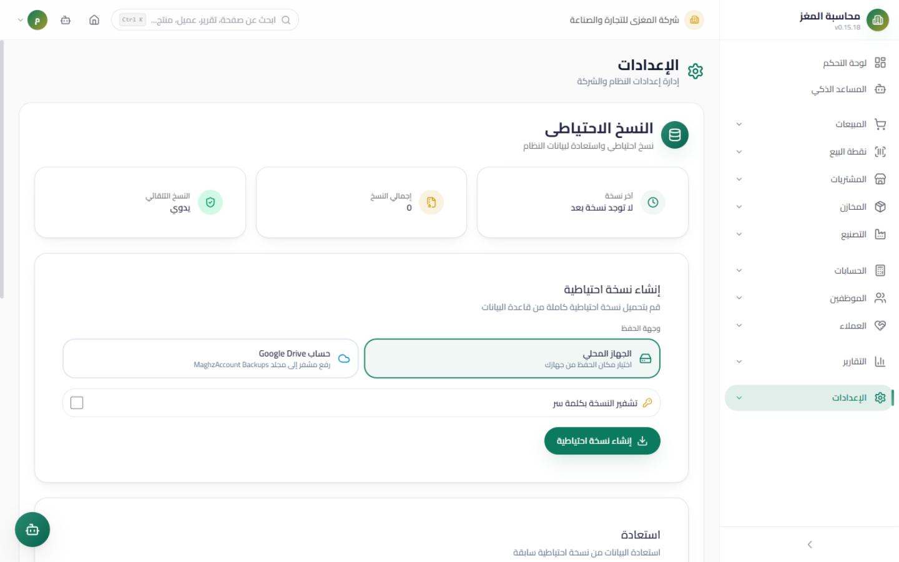
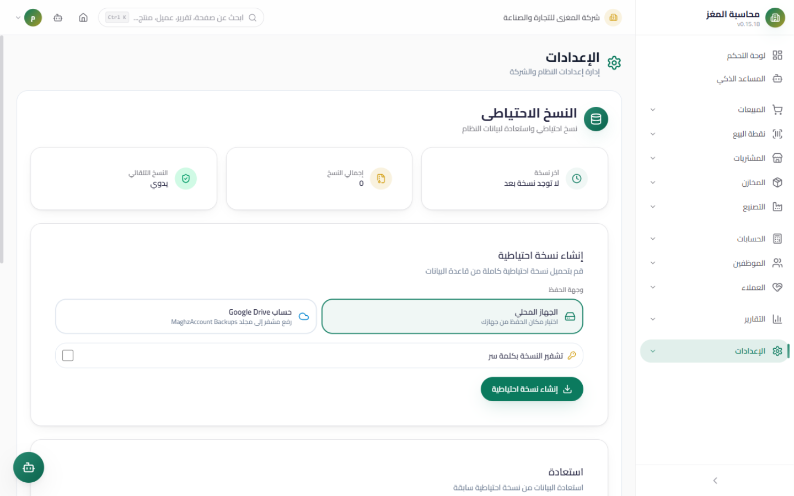

# Backup, Database & Reset Setup — User Guide

> Protect your data: backup and restore, data source configuration (PostgreSQL), and re-running the initial setup.

## Overview

Three pages protect your data and manage the storage layer:

| Page | Route | Purpose |
|---|---|---|
| **Backup** | `/settings/backup` | Create a complete copy of the company data and restore it (locally or Google Drive) |
| **Database** | `/settings/database` | Choose the data source and configure the PostgreSQL connection |
| **Reset Setup** | `/settings/reset` | Re-run the initial setup wizard from scratch |

Every sensitive operation is recorded in the Audit Log.

---

## 1. Backup

### Access & Permissions

| Action | Permission |
|---|---|
| Create a backup | `settings.create` |
| Restore a backup | `settings.edit` |

### Screen: Backup

- **Access:** Sidebar ← Settings ← Backup
- **Purpose:** Export all company data into a backup file, and be able to restore it later.

#### Status Cards (top of the page)

| Card | Content |
|---|---|
| Last backup | The date and time of the last backup, or "No backups yet" |
| Total backups | The number of backups in the history |
| Automatic backup | "Automatic" or "Manual" according to the toggle |

#### Creating a Backup

1. **Choose the destination:**
   - **Local:** download the file to your device (or save it inside the app's OPFS storage if downloading is not supported).
   - **Google Drive:** upload the backup to Drive after connecting (see below).
2. **Encryption (optional):** enable "Encrypt" and enter a password and its confirmation — an encrypted backup can only be restored with the same password. The password is mandatory with encryption and both fields must match.
3. Click **Create Backup** — the system reads all of the company's tables, builds a file with a unified name carrying the company name and date, and shows a success message with the number of tables (and the number of warnings, if any).

#### Restore

1. Click **From File** and choose the backup file, or pick a backup stored internally (OPFS) or on Drive.
2. The system shows a **verification summary**: the company name, the backup date, the number of tables and rows, and the encryption status.
3. If the backup is encrypted, enter the password.
4. Click **Restore**, then **confirm** in the dialog — the restore replaces the current company data, then the app reloads.

> **Extra safeguard:** a backup created for a different company is **rejected** with the message "This backup does not belong to this company".

#### Automatic Backups (OPFS)

A toggle that saves periodic backups internally in the browser/app, with the timestamp of the last run. The internal backups appear in a list with buttons: **Restore / Download / Delete**.

#### Google Drive

1. Enter the **Client ID** from your own Google Cloud account and save it.
2. Click **Connect** and sign in with your account — your Drive backups then appear in a list with buttons: Restore / Download / Delete.

#### Backup History

A list of previous backups with the name, date, size, type (manual/automatic), destinations (Local · OPFS · Drive), and an "Encrypted" badge, with a delete button per record (with confirmation).

---

## 2. Database

### Screen: Database Settings

- **Access:** Sidebar ← Settings ← Database
- **Purpose:** Choose the data source the system runs on.
- **Permission:** `settings.edit` to save

### The Two Options

| Option | Description | Available to |
|---|---|---|
| **PGlite (embedded)** | PostgreSQL running internally with no installation; it stores its data inside the browser/app itself | Everyone |
| **PostgreSQL server** | Connecting to a real PostgreSQL server — suitable for sharing data across multiple devices | **Desktop only** — in the browser/web the option appears disabled with the label "Desktop only" |

### Configuring the PG Connection (on Desktop)

| Field | Default |
|---|---|
| Host | `localhost` |
| Port | `5432` |
| Database name | `MaghzAccountFlash35` |
| Username | `maghz` |
| Password | Empty |

### Buttons

| Button | Function |
|---|---|
| **Test Connection** | Tries connecting to the chosen source and shows success (with the database name) or an error with the reason |
| **Save** | Saves the choice and the connection settings, then the app reloads automatically to activate the new source |

> When saving with a PG option, the settings are passed to the desktop process (Electron) to be stored and used in all future runs.

---

## 3. Reset Setup

### Screen: Reset the Initial Setup Wizard

- **Access:** Sidebar ← Settings ← Reset Setup (`/settings/reset`)
- **Purpose:** Restart the initial Onboarding wizard from scratch — useful when handing a device to a new organization or fixing a wrong setup in the connection.

### Who Is Allowed?

The page is **for administrators only**: `admin` and `super_admin`. Any other role sees an "Unauthorized" screen.

### The Steps

1. A **yellow warning card** appears explaining the effect of the reset.
2. Check the **explicit confirmation checkbox** ("I understand the setup will be reset") — the button stays disabled until you check it.
3. Click **Reset Now** (requires the `settings.delete` permission).
4. A success screen appears, then the app reloads and the initial setup wizard starts again.

## Step-by-Step Workflow (A Safe Backup Routine)

1. Sidebar ← Settings ← Backup.
2. Enable "Encrypt", enter a strong password, and store it somewhere safe off the device.
3. Click "Create Backup" regularly (at least at the end of every workday).
4. Once a week: try restoring the latest backup on a demo company, or at least check the verification summary.
5. After any major setup (currencies, default accounts, chart of accounts): take an immediate backup — that is your "safe point".

## Important Rules

- **A restore fully replaces the current company data** — no merging and no undo after confirmation.
- A backup tied to a different company ID cannot be restored onto another company.
- An encrypted backup's password is unrecoverable: an encrypted backup without its password is worthless.
- Switching the data source (PGlite ↔ PG) **does not move data automatically** between the two — use backup and restore to migrate.
- The PostgreSQL server option is never available in the browser version — this is a security design, not a defect.

## Common Errors & Fixes

| Message/Behavior | Cause | Solution |
|---|---|---|
| "Password is required" when creating a backup | You enabled encryption without a password | Enter a password and its confirmation |
| "Passwords do not match" | The two fields differ | Re-enter the password and its confirmation |
| "This backup does not belong to this company" | A backup file from another company | Restore it only from within the original company |
| "Password is required/wrong" during restore | An encrypted backup without the password, or a wrong one | Enter the original backup's password |
| "Could not connect" in the connection test | The server is down or the connection details are wrong | Check the host/port/user and make sure the PostgreSQL service is running |
| The PostgreSQL server option is gray | You are using the browser version | Use the desktop version (Electron) for an external server |
| The "Reset Now" button is disabled | The confirmation checkbox is unchecked, or the role is not an administrator | Check the confirmation box; the role must be `admin` or `super_admin` |
| A Drive backup is not uploaded | You did not enter the Client ID or did not connect | Enter the Client ID, save it, then click "Connect" |

## Tips

- Take a backup **before** any major operation: a data import, a reset, or a version upgrade.
- Keep copies off the device (Drive or a file on external media) — internal OPFS backups die with the device.
- Do not share your Drive Client ID with anyone; it is the access key to your backup space.
- Change the data source only when you are confident; a wrong configuration may leave you working on an empty database while assuming data loss — return to this page and test the connection to verify.
