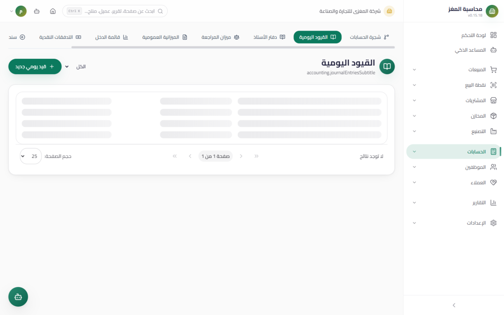
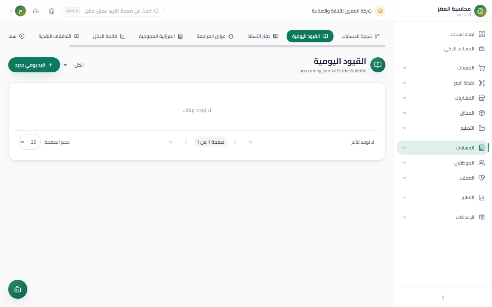

# Journal Entries — User Guide

> The manual entry editor with full double-entry accounting: balanced debit and credit lines, a live balance check, and safe atomic posting.

## Overview

Journal Entries are the record of manual accounting transactions — anything the invoices and vouchers do not generate automatically is recorded here: recording depreciation, a bank reconciliation, a reversing entry, an error correction. Find them at: **Sidebar ← Accounting ← Journal Entries** (`/accounting/journal`).

Every entry starts as a **Draft** and is then **Posted** to reflect its effect on the balances and the reports. The entry's reference number is generated automatically from the document sequences at save time.

## Access & Permissions

| Action | Permission |
|---|---|
| View the list, the details, and print | `accounting.view` |
| Create an entry (draft) | `accounting.create` |
| Edit/delete an entry | `accounting.edit` / `accounting.delete` — **drafts only** |
| Post an entry | `accounting.post` |

## The List

The entries table shows: the date, the reference (the automatic entry number), the description, the amount, the **status** (badge: Draft/Posted), the creating user, and the action buttons.

- **Status filter:** choose Draft, Posted, or All, with search by description and reference.
- **Details view:** opens a modal showing the entry's lines in full (account, debit, credit, note).
- **Print:** a ready entry document with the logo and the company details.

## Details View and Printing

- **Details view:** a modal showing the entry header (reference, date, description, status, creator) and the full lines table: account, debit, credit, note — with the totals underneath.
- **Printing:** a ready entry document that includes the company logo and details (name, tax number, address, phone), the currency symbol, the account names with their notes, and the total amount. If the entry's lines are not loaded in memory, the system fetches them automatically before printing.
- The **"Created by"** column in the list shows the user who created the entry — useful for review and for filtering to "my documents only" for holders of `accounting.own`.

## The New Entry Screen

Click **New Entry (قيد جديد)**. You will find:

| Field | Description |
|---|---|
| Date | Pre-filled with today's date |
| Description | A general description of the entry |
| **Lines** | A multi-line grid: **Account, Debit, Credit, Note** — the editor starts with **two** empty lines |

**Live totals under the grid:** the total debit, the total credit, and the balance status.

### The Balance Check — The Governing Rule

- **Saving as "Posted" is blocked** unless: **total debit = total credit** **and** the amount is greater than zero.
- If either condition fails, the "Save and Post" button is disabled and an alert shows the difference: "Unbalanced entry: difference = 5,000 YER".
- An unbalanced entry can be saved **as a Draft** only — complete the lines and post it later.

## The Document Lifecycle

| Status | Meaning | What you can do in it |
|---|---|---|
| **Draft** | Not posted — it affects no balances and no reports | Edit, delete, **post**, print |
| **Posted** | Financially effective — included in every report | **Read and print only** — edit and delete are disabled |

> **Posted entries are immutable.** The edit and delete buttons are disabled on any posted entry. Correction is done with a **new or reversing entry** that mirrors the lines (debits become credits and vice versa), which is then posted.

## The Duplicate Guard

Before saving, the system compares the new entry against the existing entries:

| Situation | Behavior |
|---|---|
| **An exactly identical entry** (same date, description, and lines with their amounts) | **Full block** — a modal shows the duplicate entry (its reference, date, and amount), and nothing is saved |
| **A close match** (high similarity but not an exact match) | **Warning** — it shows the suspected entries with a similarity percentage, and you can confirm and continue if the entry is intentional |

If the duplicate check fails for a technical reason, saving is not blocked — the guard is a safety cushion, not an obstacle.

## Posting Rules

When you click "Post", the system runs a tight sequence:

1. **Balance validation:** total debit = total credit within a **0.01** tolerance (rounding differences don't matter), and the amount is not zero.
2. **Atomic execution:** updating the entry status and writing its lines happen inside a single transaction — either all succeed or everything rolls back.
3. **Retry on deadlock:** if the transaction fails due to a concurrency conflict (deadlock), it is retried automatically.
4. **Post-posting consistency check:** after execution the system verifies that what was actually saved is balanced (the saved total debit = the saved total credit); any deviation returns an explicit error.
5. **Audit logging:** every post is recorded in the Audit Log (a "post" action) with the user and the time.

## Step-by-Step Workflow — A Complete Numeric Example

Recording rent expense of 150,000 YER paid in cash for June:

1. Sidebar ← Accounting ← Journal Entries ← **New Entry**.
2. Date: `2026-06-30`. Description: "June rent — Main Cash Box".
3. **Line one:** Account = "Rent Expense" (`51101`), **Debit = 150,000**, Credit empty, Note: "June rent".
4. **Line two:** Account = "Cash Box" (`11101`), Debit empty, **Credit = 150,000**.
5. Watch the live totals: debit 150,000 = credit 150,000 — **balanced** ✓
6. Click **Save and Post (حفظ ومُرحّلة)** (without the balance, the button would be disabled and you would save a draft).
7. An automatic reference number is generated (e.g. `JV-000123`), and the entry's effect appears immediately in the two accounts' ledgers and in the Trial Balance.

| Account | Debit (YER) | Credit (YER) |
|---|---:|---:|
| Rent Expense `51101` | 150,000 | |
| Cash Box `11101` | | 150,000 |
| **Total** | **150,000** | **150,000** |

### A Three-Line Entry Example (settling a receipt across cash and bank)

You received a payment of 200,000: 120,000 in cash to the Cash Box and 80,000 the customer transferred directly to the bank account — one entry with three lines:

| Account | Debit (YER) | Credit (YER) |
|---|---:|---:|
| Cash Box `11101` | 120,000 | |
| Ahli Bank `11102` | 80,000 | |
| Customer — Al-Noor Est. `12..` | | 200,000 |
| **Total** | **200,000** | **200,000** |

The live totals show the balance as you type, and the "Save and Post" button stays available because both conditions hold (balance + amount greater than zero).

### A Reversing Entry Example (correcting a posted entry)

You discover the rent was 105,000, not 150,000. The original entry is posted and uneditable, so create a reversing entry for the difference (or a full reversal followed by a correct entry):

| Account | Debit (YER) | Credit (YER) |
|---|---:|---:|
| Cash Box `11101` | 45,000 | |
| Rent Expense `51101` | | 45,000 |

## Important Rules — Quick Summary

| Rule | Details |
|---|---|
| Balance is a posting requirement | Debit = Credit **and** amount > 0, otherwise draft only |
| Rounding tolerance | A difference up to 0.01 is accepted in the atomic posting check |
| Posted is protected territory | No editing, no deleting, not even changing its lines |
| The reference number belongs to the system | It is generated from the document sequences — do not type it manually |
| Every action is audited | Create, edit, delete, and post all appear in the Audit Log |
| Empty lines are ignored | No line without a selected account is saved |

## Common Errors & Fixes

| Message | Cause | Solution |
|---|---|---|
| "Unbalanced entry: difference = ..." | Debit ≠ Credit | Adjust the lines until the two totals match |
| The "Save and Post" button is disabled | The entry is unbalanced or the amount is zero | Fix the lines, or save a draft and complete it later |
| A "duplicate entry" modal blocked the save | An exactly identical entry exists | Review it first — if it is the same entry, don't duplicate it |
| The edit/delete buttons are disabled on an entry | The entry is posted | Create a reversing entry to correct it |
| Posting failed with an error message | A concurrency conflict or a connection problem | Retry — the system retries automatically on deadlock |

## Tips

- Review the "Draft" filter at the end of each day and post what is complete — drafts appear in no financial report.
- Use the "Note" field on every line; it is what makes an entry understandable months later.
- Don't duplicate what the modules generate automatically: a posted sales invoice already created its entry — don't enter it manually.
- Adopt the habit: any correction = a new reversing entry + a cross-reference in both entries' descriptions.
- In a multi-line entry, complete all the debit lines first, then the credit lines; it reduces direction mistakes that the balance check catches immediately.
- Mind the account's nature before choosing the direction: asset/expense accounts increase with a **debit**, and liability/equity/revenue accounts increase with a **credit**.
