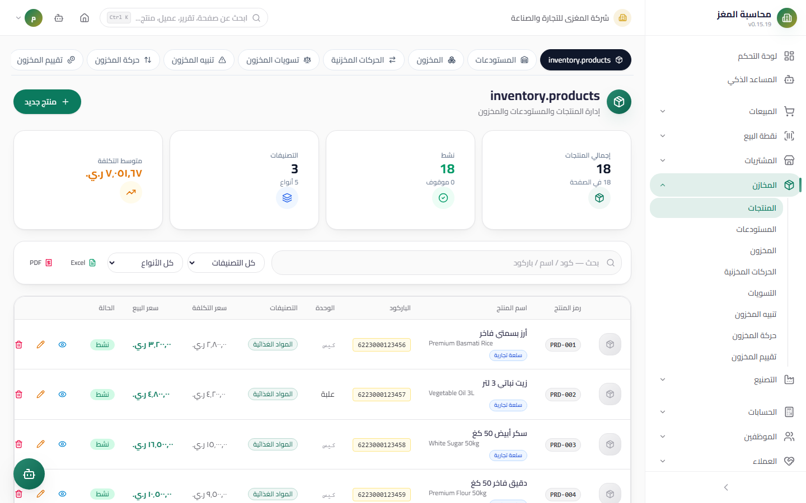

# Products — User Guide

> The complete product card: barcode and SKU, multi-units with conversion factors, prices, stock limits, and the opening balance.

## Overview

The product is the core element around which all inventory, sales, and purchase movements revolve. Access the screen from: **Sidebar ← Inventory ← Products** (`/inventory/products`).

## Access & Permissions

| Action | Permission |
|---|---|
| View the list and product details | `inventory.view` |
| Add/edit a product | `inventory.create` / `inventory.edit` |
| Delete a product | `inventory.delete` — blocked if the product has movements |

## Products List

A table showing: code, Arabic name, barcode, unit, cost price, sale price, categories, active status, and action buttons.

- **Smart search:** searches the Arabic and English names, code, barcode, and SKU together.
- **Filters:** category, product type, active status.
- **Server-side pagination** — the list handles thousands of products.
- **Export:** the **Excel** and **PDF** buttons export the displayed list (after filtering).

## New Product Screen

- **Access:** Sidebar ← Inventory ← Products ← the **New Product (منتج جديد)** button
- **Purpose:** Create a complete product card

### Fields

| Field | Description | Required |
|---|---|---|
| **Code** | Generated automatically with the `PRD-` prefix from document sequences; you can disable auto-generation in the sequence settings and type it manually | Auto |
| **Arabic / English Name** | The product name in both languages — the Arabic name is what appears on invoices and reports | Arabic |
| **Barcode** | The identifier scanned at the POS; click the camera icon to **capture the barcode with the camera** or enter it manually | Optional |
| **SKU** | The internal Stock Keeping Unit for sorting and reference | Optional |
| **Base Unit** | The unit in which stock is stored (piece, kilo…) — all balances are stored in it | Yes |
| **Product Type** | From the product types defined in Settings | Optional |
| **Categories** | **Multiple** — select one or more product categories | Optional |
| **Cost Price** | The initial purchase cost — used by journal entries and stock valuation | Yes |
| **Sale Price** | The default selling price of the Base Unit | Yes |
| **Image** | **Upload an image file or capture with the camera** — shown on the card and at the POS | Optional |
| **Minimum Stock** | When the balance drops below it, the item appears in the Low Stock Alert | Optional |
| **Maximum Stock** | The desired storage ceiling | Optional |
| **Reorder Point** | The quantity at which it is advisable to issue a purchase order | Optional |
| **Active** | An inactive product does not appear on new invoices | Yes |

### Opening Balance

A dedicated section that appears only when **creating** the product:

| Field | Description |
|---|---|
| **Opening Balance (Quantity)** | The quantity on hand before you started using the system |
| **Opening Warehouse** | The warehouse where the quantity is placed |

**How it posts:** on save, a single **stock movement** is created with the quantity in the selected warehouse plus a **Journal Entry**: debit Inventory × quantity × cost price / credit the Opening Equity account. The field is then **locked** — a second opening balance cannot be entered from the same dialog (later corrections are made with a stock adjustment).

### Multi-Units per Product (important section)

Every product has its own units table; each unit is a separate row containing:

| Field | Description |
|---|---|
| **Unit** | From the units of measure defined in Settings (carton, dozen…) |
| **Conversion Factor** | How many base units it equals — example: 1 carton = 12 |
| **Custom Sale Price** | The sale price of this unit; suggested automatically = base sale price × factor, and editable |
| **Custom Purchase Price** | Same logic based on the cost price |
| **Custom Barcode** | Optional — some companies use a different barcode for the carton |
| **Base Unit** | The `is_base` flag — its factor is always 1 and it is linked to the card prices |
| **Default Sale Unit** | Selected automatically when selling the product |
| **Default Purchase Unit** | Selected automatically when purchasing |

**Governing rules:**

- **Stock is always stored in the Base Unit** — selling a carton (factor 12) deducts 12 base units.
- **Documents lock the factor at creation time:** when an invoice line is saved, `unit_factor` and `base_quantity` are stored with the line; changing the factor later does not change old documents.
- Every product always keeps at least one Base Unit — the only unit cannot be deleted.
- One Base Unit, one default sale unit, and one default purchase unit per product (selecting one automatically clears the flag from the others).
- Editing the cost or sale price on the card **synchronizes** the Base Unit automatically.

## Product Details Dialog

Click any product to open a tabbed dialog:

| Tab | Content |
|---|---|
| **Details** | All card fields + categories + image |
| **Units** | The multi-units table with factors, prices, and flags |
| **Stock by Warehouse** | The balance per warehouse, with status coloring: **critical** (below minimum) / **warning** (reached the reorder point) / normal |

## Product Lifecycle

| Status | Meaning | What you can do |
|---|---|---|
| **Active** | Appears in all documents and reports | Sell it, buy it, transfer it |
| **Inactive** | Hidden from new documents, remains in historical reports | Edit its data, reactivate it |
| **Deleted** | Permanently deleted — only possible if it has no movements | — |

## Step-by-Step Workflow — Numeric Example

Adding an "Orange Juice" product with multi-units:

1. Sidebar ← Inventory ← Products ← **New Product (منتج جديد)**.
2. Code: generated automatically as `PRD-00012`. Arabic name: «عصير برتقال». English name: `Orange Juice`.
3. Base Unit: "Piece". Type: "Beverages". Categories: "Beverages" + "Foodstuffs".
4. Cost price: `500` YER, sale price: `750` YER.
5. Barcode: capture it with the camera or enter `6201120001234`. SKU: `OJ-1L`.
6. Minimum: `24`, reorder point: `48`, maximum: `500`.
7. Opening balance: `240` pieces in the Main Warehouse.
8. In the **Units** section add a "Carton" row: factor `12`, suggested sale price `750 × 12 = 9,000` YER, suggested purchase price `500 × 12 = 6,000` YER. Mark it as the **default sale unit**.
9. Click **Save (حفظ)** — an opening movement is created: 240 pieces in the Main Warehouse, and a journal entry for `240 × 500 = 120,000` YER:

| Account | Debit (YER) | Credit (YER) |
|---|---:|---:|
| Inventory | 120,000 | |
| Opening Equity | | 120,000 |

10. When you later sell a single "Carton", exactly `12` base pieces are deducted from stock.

## Important Rules

| Rule | Details |
|---|---|
| Unique code | The product code does not repeat within the same company |
| Opening balance is one-time | It posts once, then the field locks — after that, only stock adjustments |
| The Base Unit is the reference for everything | Factors and custom prices are always measured relative to it |
| Factor locked in documents | `unit_factor` and `base_quantity` are stored with every line at save time |
| Deletion is protected | A product with movements cannot be deleted — deactivate it instead |

## Common Errors & Fixes

| Message | Cause | Solution |
|---|---|---|
| "Cannot delete the only unit of a product" | You tried to delete the product's only unit | Add another unit first; a Base Unit always remains |
| "Cannot delete customer/product with existing…" | The product has invoices or movements | Deactivate the product instead of deleting it |
| The opening balance is not accepted after creation | The field is locked after the first save | Use a stock adjustment or a manual movement |
| The barcode does not work at the POS | A mismatched barcode or an inactive product | Verify the barcode format and that the product is active |
| The carton price did not change when the piece price was edited | Custom prices are deliberately independent | Edit the unit's price manually from the Units tab |

## Tips

- Use a consistent SKU (`category-size` such as `OJ-1L`) — it makes sorting and exporting easier.
- Fill in the minimum and the reorder point from day one — the Low Stock Alert report depends on both.
- Make the default sale unit the most commonly sold one (often the carton for wholesale) to reduce cashier clicks.
- Check the "Stock by Warehouse" tab before creating any transfer between warehouses.
- Do not duplicate the name between Arabic and English in Latin letters — completing both languages improves search.
