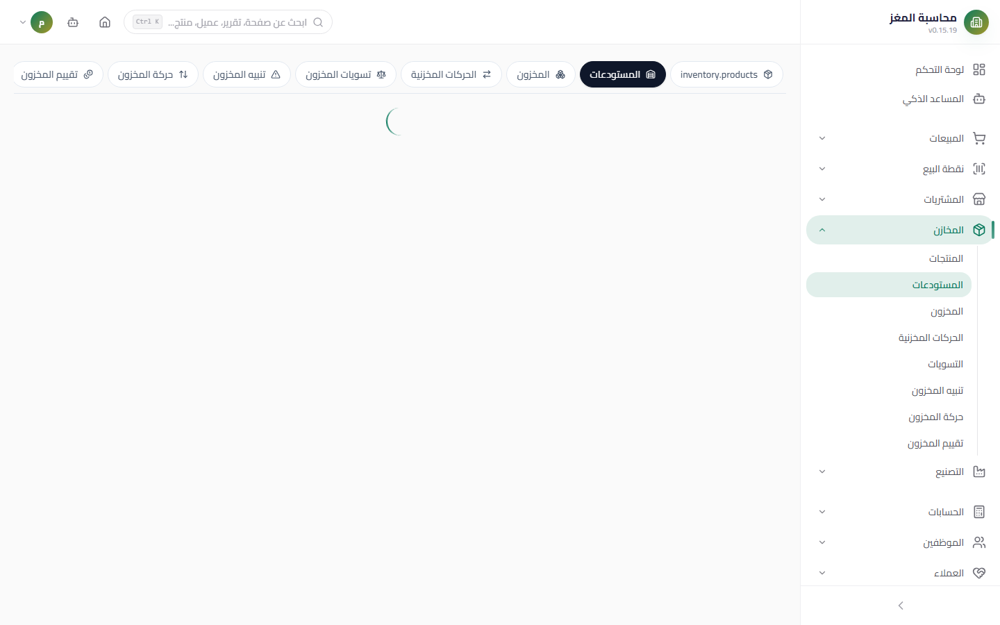
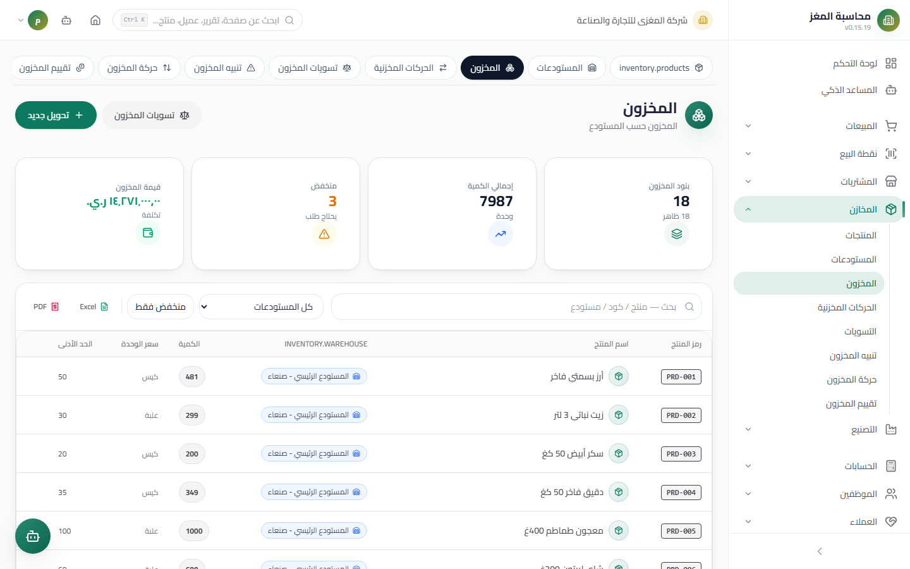

# Warehouses & Stock — User Guide

> Define warehouses and link them to branches, read balances in real time, and move goods between warehouses with fully tracked transfers.

## Overview

This file covers three related screens: **Warehouses** (defining locations), **Stock** (balances per product × warehouse), and **Transfers** (moving goods with a full record). Access them from: **Sidebar ← Inventory ← Warehouses** or **← Stock**.

## Access & Permissions

| Action | Permission |
|---|---|
| View warehouses, balances, and transfers | `inventory.view` |
| Add/edit a warehouse or transfer | `inventory.create` / `inventory.edit` |
| Delete a warehouse or a draft transfer | `inventory.delete` |
| Complete a transfer (moves stock) | `inventory.edit` |

## Warehouses Screen

- **Access:** Sidebar ← Inventory ← Warehouses (`/inventory/warehouses`)
- **Purpose:** Define storage locations and link them to branches

### Warehouse Fields

| Field | Description | Required |
|---|---|---|
| **Name** | The warehouse name shown in all lists | Yes |
| **Code** | A short code (such as `WH-MAIN`) | Optional |
| **Branch** | Link the warehouse to one of the company's branches | Optional |
| **Active** | An inactive warehouse disappears from new selection lists | Yes |

### Buttons & Actions

- **View Stock (عرض المخزون)** per warehouse: a dialog showing all items in that specific warehouse (product, quantity, unit, cost) with the total inventory value.
- Edit / Delete — deletion is blocked if the warehouse has balances or movements.
- **KPIs at the top of the screen:** total warehouses, active ones, the number of linked branches, and the total inventory value.

## Stock Screen (Balances)

- **Access:** Sidebar ← Inventory ← Stock (`/inventory/stock`)
- **Purpose:** Read live balances for each (product × warehouse)

### What It Shows

| Column | Description |
|---|---|
| Product | Name and code |
| Warehouse | Where the balance sits |
| Quantity | In the Base Unit |
| Unit | The Base Unit's name |
| Cost | Product cost price × quantity = line value |
| Alert | A warning icon if the balance dropped below the **minimum** (`min_stock_alert`) |

### Filters & KPIs

- **Search** by product name or code, a **warehouse filter**, and a **"show low stock only"** filter that displays items below the minimum.
- **KPIs:** number of balance rows, total quantities, the **number of low-stock items** (with a "needs ordering" badge), and the inventory value.
- **Excel/PDF export** of the displayed balances.

## Transfers Tab

Move goods from one warehouse to another without a sale or purchase.

### Creating a Transfer

- **Access:** Stock screen ← the **Transfers (التحويلات)** tab ← the **New Transfer (تحويل جديد)** button
- **Purpose:** Document a goods movement and execute it physically

| Field | Description | Required |
|---|---|---|
| **Transfer Number** | Auto-numbered with the `TRF-` prefix from document sequences (generation can be disabled) | Auto |
| **Product** | Select the product | Yes |
| **Unit** | The unit of the transferred quantity — converted internally to the Base Unit | Yes |
| **From Warehouse** | The source of the outbound | Yes |
| **To Warehouse** | The inbound destination — **the same warehouse is blocked** from the list | Yes |
| **Quantity** | The quantity to move | Yes |
| **Reference / Notes** | Optional documentation | Optional |

### Transfer Lifecycle

| Status | Meaning | What you can do |
|---|---|---|
| **Draft / Pending** | Documented only — **no stock has moved yet** | Edit, delete, **Complete** |
| **Completed** | Physically executed: out/in movements + balances updated | Read-only |
| **Cancelled** | Cancelled before execution | Read-only |

### The "Complete" Button — Atomic Execution

When you click **Complete (إكمال)**, the system executes a single database transaction that:

1. **Checks sufficiency at the database level:** if any line exceeds the source balance, everything fails — no partial movement and no half-executed transfer remains.
2. Creates an **out movement** from the source warehouse and an **in movement** to the destination warehouse (movement type `transfer`).
3. Deducts the quantity from the source balance and adds it to the destination balance (a balance row is created for the destination if none exists).
4. Flips the status to **Completed**.

- **Only drafts can be deleted** — a completed transfer is a fixed accounting record and cannot be deleted.

## Stock Movements Screen

- **Access:** Sidebar ← Inventory ← Movements (`/inventory/transactions`)
- **Purpose:** A mostly read-only log of everything that moved in stock

### What It Shows

| Column | Description |
|---|---|
| Date | Movement date/time |
| Type | A colored badge: `in` (green) / `out` (red) / `adjustment` (amber) / `transfer` (blue) |
| Product | Name and code |
| Warehouse | Where the movement occurred |
| Quantity | In the Base Unit |
| Reference Document | The invoice/transfer/adjustment number that generated the movement |

### Filters & KPIs

- **Type filter** (in/out/adjustment/transfer), **date**, **product**, **warehouse**, and a text search on the reference.
- **KPIs:** the number of movements per type (in, out, adjustment, transfer) + the total.
- **Excel/PDF export** of the displayed results.

### Manual Entry of Simple Movements

The **New Movement (حركة جديدة)** button opens a simplified form for small corrections and external inbound goods:

| Field | Description |
|---|---|
| Type | In (`in`), out (`out`), transfer, or adjustment |
| Product, warehouse, and quantity | The basis of the movement |
| Reference and notes | Free-form documentation |

- An inbound movement **increases** the balance and an outbound movement **decreases** it — executed atomically, creating the balance row if none exists.
- Manually recorded movements of type `transfer` record the log line only without moving balances — use the Transfers tab for an actual move.

## Step-by-Step Workflow — Numeric Example

Moving 5 cartons (factor 12) from the Main Warehouse to the Branch Warehouse:

1. Stock screen ← the **Transfers** tab ← **New Transfer (تحويل جديد)**.
2. The transfer number appears automatically: `TRF-00007`.
3. Product: "Orange Juice". Unit: **Carton**. Quantity: `5`.
4. From warehouse: **Main Warehouse** (balance 240 pieces). To warehouse: **Branch Warehouse**.
5. **Save (حفظ)** — the transfer is a draft; nothing has changed in balances yet.
6. Review the line, then click **Complete (إكمال)**.
7. The result is immediate:

| Warehouse | Before (base pieces) | After (base pieces) |
|---|---:|---:|
| Main Warehouse | 240 | 240 − 60 = **180** |
| Branch Warehouse | 0 | **60** |

8. Two movements appear in the movement log: a "transfer out" from Main and a "transfer in" to Branch, both referencing `TRF-00007`.

## Important Rules

| Rule | Details |
|---|---|
| The same warehouse is blocked | You cannot select the same warehouse in "From" and "To" |
| Sufficiency is checked at execution | An atomic check inside the transaction — no negative balances and no partial execution |
| A draft moves nothing | Balances change only at the moment of "Complete" |
| Movements are an accounting record | Invoice and document movements are generated automatically — do not enter them manually as duplicates |
| All movements are in the Base Unit | Selecting the carton is converted internally (5 × 12 = 60) |

## Common Errors & Fixes

| Message | Cause | Solution |
|---|---|---|
| "Transfer not found or not in draft status" | You clicked "Complete" on a completed transfer | The transfer was already executed — check the movement log |
| Completion failed due to insufficient balance | The source balance is lower than the quantity (competing concurrent transfers) | Reduce the quantity or record an inbound receipt first |
| "You must add at least one product" | Saving a transfer with no lines | Add a product and a quantity |
| The warehouse does not appear in the "To" list | It is the same as the source warehouse | Choose a different warehouse |
| A manual transfer movement did not change balances | A manual `transfer` type records the log only | Use the Transfers tab, then "Complete" |

## Tips

- Create a warehouse for each actual branch — balance and variance reports are built on it.
- Use the "View Stock" button on the warehouse card as a quick count before an actual count session.
- Make the movement log a daily review habit: an "out" filter with today's date reveals everything that left.
- Never pass goods between warehouses informally — a documented transfer protects you from phantom count differences.
- Export balances weekly to Excel for a quick external archive.
