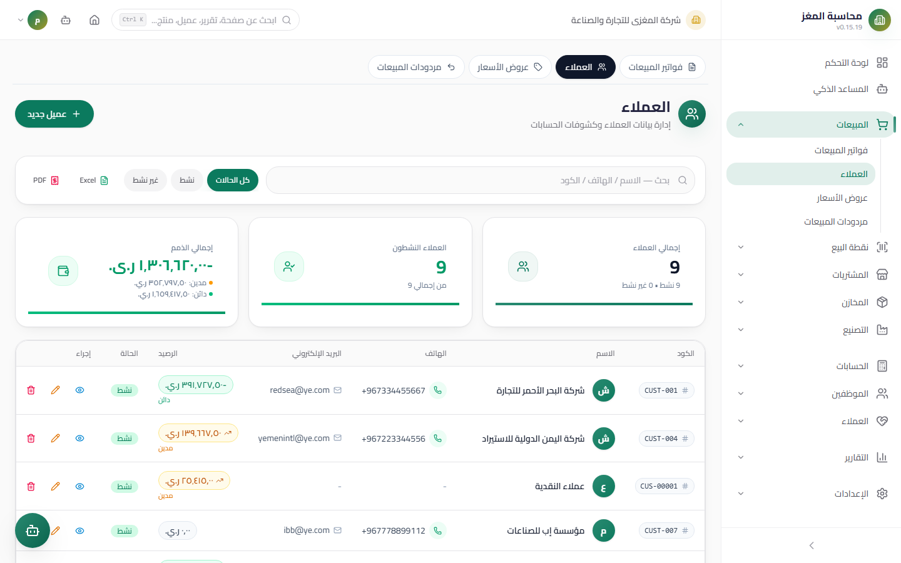

# Customers — User Guide

> The complete customer registry: data, credit limit, a one-time posting opening balance, and a customer card with three tabs (Details / Statement / Aging).

## Overview

The customer is the party on whom sales invoices and their receivables are built. Access the screen from: **Sidebar ← Sales ← Customers** (`/sales/customers`).

## Access & Permissions

| Action | Permission |
|---|---|
| View the list, the card, and the statements | `sales.view` |
| Add/edit a customer | `sales.create` / `sales.edit` |
| Delete a customer | `sales.delete` — blocked when invoices or returns exist |

## Customers List



A table showing: code, name, phone, **balance** (colored: amber for debit / green for credit), active status, and action buttons.

- **Search** by name, phone, and code + an **active filter** + **server-side pagination**.
- **KPIs:** total customers, active ones, total balances (debit and credit shown separately).
- **Add New Customer (إضافة عميل جديد)** is protected by the `sales.create` permission.

## New Customer Screen

- **Access:** Sidebar ← Sales ← Customers ← the **New Customer (عميل جديد)** button
- **Purpose:** Open a customer file

### Fields

| Field | Description | Required |
|---|---|---|
| **Code** | Generated automatically with the `CUS-` prefix from document sequences; can be typed manually | Auto |
| **Name** | The customer's or company's name | Yes |
| **Phone** | The primary contact number | Optional |
| **Email** | For e-invoicing and correspondence | Optional |
| **Address** | Appears in the printed invoice header | Optional |
| **Tax Number** | Appears on the official invoice and in VAT reports | Optional |
| **Credit Limit** | The permitted ceiling of receivables for this customer | Optional |
| **Active** | An inactive customer disappears from new invoice lists | Yes |

### Debit Opening Balance

| Field | Description |
|---|---|
| **Opening Balance** | The debit amount (what the customer owes you) before you started using the system |
| **Opening Date** | Orders the opening line in the statement and the Aging |

**How it posts:** on save, a **Journal Entry** is created once: debit Accounts Receivable × the amount / credit the Opening Equity account. The field then **locks** — the opening balance does not post a second time even if you edit the customer's data. An opening balance without a date is treated as the oldest debt (the 90+ bucket in Aging).

## Customer Card — Three Tabs

Click any customer to open the card:

### 1) Details

All card data + a balance and credit limit summary — the same add form in read/edit mode.

### 2) Statement

A complete **Account Ledger** with time-ordered lines and a **running balance**:

| Line type | Debit | Credit |
|---|---|---|
| **Opening balance** | The opening debit amount | (if credit) |
| **Invoice** (not cancelled) | The invoice total | |
| **Return** (posted) | | The return total |
| **Receipt Voucher** (posted) | | The collected amount |

- The running balance is computed line by line (debit increases it, credit decreases it).
- **Printable** — the print button produces an official statement with the company letterhead to send to the customer.

### 3) Aging

Splits the amount the customer owes into **0-30 / 31-60 / 61-90 / 90+ day buckets** by due date, with the number of invoices in each bucket and the total due. It is based on: unpaid posted invoices + the opening balance − payments − returns.

## Displayed Balance Formula

The balance in the list and on the card is computed **directly from the documents**:

```
Balance = Opening Balance
        + Σ posted sales invoices (excluding cancelled)
        − Σ posted Receipt Vouchers
        − Σ posted sales returns
```

- A positive balance = **Accounts Receivable** (the customer owes you) — colored amber.
- A negative balance = credit (an advance payment or a return without an invoice) — colored green.

## Step-by-Step Workflow — Numeric Example

Opening a new customer with an opening balance:

1. Sidebar ← Sales ← Customers ← **New Customer (عميل جديد)**.
2. The code appears automatically: `CUS-00014`. Name: "Al-Noor Trading Est."
3. Phone: `777123456`. Tax number: `3001234567`. Credit limit: `2,000,000` YER.
4. Opening balance: `350,000` YER, opening date: `2026-09-01`.
5. **Save (حفظ)** — the opening entry posts once:

| Account | Debit (YER) | Credit (YER) |
|---|---:|---:|
| Accounts Receivable (Customers) | 350,000 | |
| Opening Equity | | 350,000 |

6. Open the card ← the **Statement** tab: the first line is "Opening balance — debit 350,000 — running balance 350,000".
7. You then sell invoice `INV-00052` for 120,000 and post it: a new debit line of 120,000 → the balance is **470,000**.
8. You collect 200,000 with a Receipt Voucher: a credit line → the balance is **270,000** — reflected in the Aging tab by due dates.

## Important Rules

| Rule | Details |
|---|---|
| The opening balance is one-time | It posts at creation only, then the field locks |
| The statement shows posted documents only | Draft invoices, returns, and vouchers do not appear in the statement |
| Cancelled invoices are excluded | They enter neither the balance nor the statement |
| The credit limit is advisory | It appears on the card for review when selling on credit |
| Deletion is protected | A customer with invoices cannot be deleted — deactivate instead |

## Common Errors & Fixes

| Message | Cause | Solution |
|---|---|---|
| "Cannot delete customer with existing invoices…" | The customer has invoices, quotations, or returns | Deactivate the customer instead of deleting |
| The opening balance field is locked | The opening balance posted at creation | Correct with journal entries or an adjustment from the Accounting module |
| The balance does not include a new invoice | The invoice is still a draft | Post the invoice so it enters the balance and the statement |
| The opening line sits in the "90+" bucket | An opening balance with no date | Normal — a dated opening balance would appear in its own bucket |
| The customer does not appear in the invoice list | The customer is inactive | Activate them from their card |

## Tips

- Fill in the **Tax Number** from day one — the official invoice and VAT reports need it.
- Review the **Aging** tab weekly: anything over 90 days needs an immediate collection plan.
- Print the account statement and send it to the customer with every major collection — it prevents most disputes.
- Use the credit limit as a sales policy: review it before any large credit sale.
- Do not create a new customer for every cash invoice — use the default Walk-in Customer or POS.
