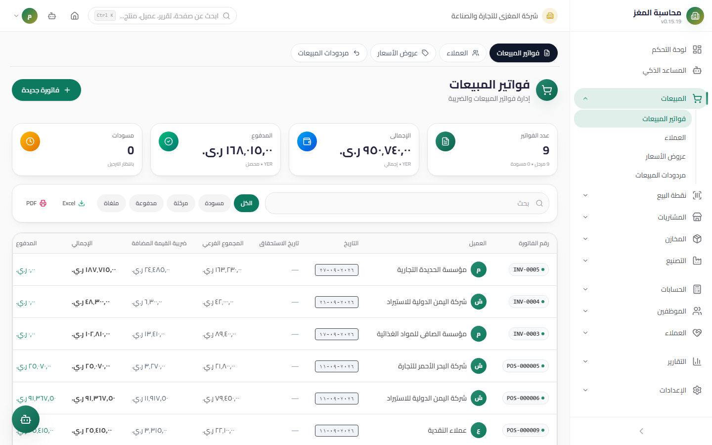

# Sales Invoices — User Guide

> The central document of the Sales module: create with multi-units, discounts, tax, and currencies; a duplicate guard; and an atomic post that journals, deducts stock, and increases receivables.

## Overview

A sales invoice documents the sale and generates all of its effects automatically on posting: a **Journal Entry** (Accounts Receivable or the cash box / Sales + Output VAT), **outbound stock movements**, and an **increase in the customer's balance** by the amount due. Access it from: **Sidebar ← Sales ← Invoices** (`/sales/invoices`).

## Access & Permissions

| Action | Permission |
|---|---|
| View the list, details, and print | `sales.view` (or `sales.own` for a rep — own documents only) |
| Create/edit a draft | `sales.create` / `sales.edit` |
| Delete a draft | `sales.delete` |
| Post an invoice | `sales.post` |

## The List

- **KPI cards:** **Total** (invoice count with posted and draft counts), **Total Value**, **Collected**, and **Drafts awaiting posting**.
- **Search** by invoice number and customer, a **status filter** (draft/posted/partially paid/paid/cancelled), a **customer filter**, **server-side pagination**, and **Excel/PDF export**.
- Per-row buttons: view details, edit (draft only), print, delete (draft only), post.

## Creation Form

Click **New Invoice (فاتورة جديدة)** — the form has three parts:

### Header

| Field | Description | Required |
|---|---|---|
| **Customer** | From the active customers list | Yes |
| **Date** | Pre-filled with today | Yes |
| **Due Date** | The Aging report builds its buckets on it | Optional |
| **Payment Type** | **Cash** (shows a **Cash Box** selector) or **Credit** | Yes |
| **Currency + Exchange Rate** | Yemeni Rial (YER) by default; when you pick another currency, enter the rate and the **Base Currency Amount** preview appears immediately | Yes |
| **Notes** | Appear in printing and the account statement | Optional |

### Lines

| Field | Description |
|---|---|
| **Product** | A selection list — shows the **available stock and barcode** next to each product |
| **Unit** | A **multi-unit selector**: a list of all the product's units (piece/carton…); **switching the unit fetches its sale price automatically** and shows the Base Unit equivalent |
| **Quantity** | In the selected line unit |
| **Unit Price** | From the selected unit's price — editable |
| **Line Discount %** | A percentage discount on the line |

### Discount, Tax, and Attachments

| Item | Rule |
|---|---|
| **Overall invoice discount** | A fixed amount **or a percentage** — always capped at the subtotal (it cannot zero out the invoice) |
| **Value Added Tax (VAT)** | At the invoice level using the company's rate (default **15%**); tax can be **hidden** from the tax settings |
| **Attachments** | Attach files (a receipt photo, a contract…) — **the limit is 2MB per file** |

Live totals at the bottom of the form: Subtotal − Discount + VAT = Total.

### Saving

- **Save (حفظ)** creates the invoice as a **Draft** with an automatic number carrying the `INV-` prefix from document sequences.

## Duplicate Guard

Before saving, a **fingerprint** of the invoice is computed and compared against existing invoices:

| Case | Behavior |
|---|---|
| **Exact match blocked** (same customer, date, lines, and amounts) | **Hard block** — a dialog shows the duplicate document and nothing is saved |
| **Similar** (high similarity but not an exact match) | A **warning** with the similarity percentage — you can confirm and continue if intentional |

The guard is a safety cushion: a technical failure of the duplicate check does not block saving.

## Document Lifecycle

| Status | Meaning | What you can do in it |
|---|---|---|
| **Draft** | Has affected nothing | Edit, delete, **Post**, print |
| **Posted** | The journal entry was issued, goods left, and the customer balance increased | Collect (a Receipt Voucher), **print and read-only** |
| **Partially Paid** | A partial collection via a Receipt Voucher | Continue collecting until complete |
| **Paid** | Settled in full | Read and print |
| **Cancelled** | Cancelled according to your policy | Excluded from balances and reports |

**Editing and deletion are for drafts only.** Posted invoices are corrected with a sales return.

## Posting Effects (Atomic)

The **Post (ترحيل)** button executes a **single transaction** — all succeed or everything rolls back:

1. **Journal Entry:** debit **Accounts Receivable** with the total — or the **selected Cash Box account** if cash / credit **Sales** with the subtotal + credit **Output VAT** with the VAT.
2. **Outbound stock movements** for each line (type `out` referencing the invoice number) + the quantity is **deducted from the warehouse with the highest balance** for this product (otherwise the first warehouse) — in the **Base** quantity for multi-units (a carton with factor 12 → 12 go out).
3. **The customer balance increases by the amount due** (total − paid) — credit invoices only.

**A cash invoice is marked paid automatically** at the moment of posting (the sale itself is the collection) — **no effect on the customer balance** whatsoever.

## Printing & Detail View

- **Printing:** an official **A4** document with the company identity (logo, name, address, **tax number**), customer data, a line table with units, discounts and tax, a **status badge** (draft/posted/paid…), and an **overdue indicator** if past the due date.
- **Detail View:** a dialog with the full header and lines, including units with their factors, base quantities, and attachments.

## Step-by-Step Workflow — Full Numeric Example

A credit sale to Al-Noor Est.: 2 cartons of juice (factor 12) + discount:

1. Sidebar ← Sales ← Invoices ← **New Invoice (فاتورة جديدة)**.
2. Customer: "Al-Noor Trading Est." Date: `2026-09-12`. Due date: `2026-10-12`. Payment type: **Credit**. Currency: YER.
3. **Line:** product "Orange Juice" (stock 180 and the barcode appear). Unit: **Carton** — fetches its price `9,000` and shows the equivalent: 1 carton = 12 pieces. Quantity: `2`. Unit price: `9,000`. Line discount: `0%`.
4. Subtotal = `18,000`. Invoice discount: `5%` = `900`. VAT 15% on `17,100` = `2,565`.
5. **Save (حفظ)** → draft `INV-00052` (the journal entry and stock movements come later).
6. A similarity warning appeared? Review the suspect list — if it is a previous invoice, do not continue.
7. Click **Post (ترحيل)** — the atomic effect:

| Effect | Details |
|---|---|
| Stock movement | `2 × 12 = 24` base pieces go out from the highest-balance warehouse, reference `INV-00052` |
| Customer balance | 470,000 + 17,100 = **487,100** YER |

The resulting journal entry:

| Account | Debit (YER) | Credit (YER) |
|---|---:|---:|
| Accounts Receivable — Al-Noor Est. | 19,665 | |
| Sales | | 17,100 |
| Output VAT | | 2,565 |
| **Total** | **19,665** | **19,665** |

*If it had been cash through the Main Cash Box: debit the cash box 19,665, and the invoice is marked **Paid** automatically with no effect on the customer balance.*

8. Print the invoice and ship; later you collect 10,000 with a Receipt Voucher → the status becomes **Partially Paid** and the balance 477,100.

## Important Rules

| Rule | Details |
|---|---|
| Numbering from the system | The `INV-` prefix comes from document sequences — do not type it manually |
| No sale without a draft | Save a draft first, then post — saving and posting are two steps |
| Stock is in the Base Unit | The factor is locked with the line at save time (`unit_factor` / `base_quantity`) |
| The warehouse is chosen automatically | The one with the highest balance for the product, otherwise the first warehouse created |
| Paid cannot exceed the total | A paid amount greater than the total is rejected |
| Positive price | The exchange rate must be greater than zero |
| Cancelled is transparent | Excluded from the balance, statements, and reports |

## Common Errors & Fixes

| Message | Cause | Solution |
|---|---|---|
| "Invoice not found or not in draft status" | Posting an already posted invoice | Check its status from the list |
| "Cannot delete posted invoice. Cancel it first." | Deleting a non-draft invoice | Correct with a sales return |
| "Cannot modify lines of posted invoice…" | Editing a posted invoice's lines | Create a new invoice or a return |
| "Cannot delete invoice with payments…" | Deleting a draft that has collections | Reverse the voucher first, then delete |
| "Paid amount cannot exceed total amount" | Paid greater than the total | Adjust the paid amount |
| "Exchange rate must be positive" | A zero or negative exchange rate | Enter a positive rate |
| A "duplicate document" dialog | An exact match with an existing invoice | Review it — do not save twice |
| "sales.invoice.attachmentTooLarge" | An attachment larger than 2MB | Compress the image or attach a smaller file |

## Tips

- Always fill in the **Due Date** on credit sales — it is the basis of Aging and of the overdue indicator in printing.
- For cash, choose the correct **Cash Box** — it is what the journal entry debits and what appears in the Cash Flow report.
- Watch the **"Drafts"** card daily: a forgotten draft = unrecognized revenue and undeducted goods.
- Selling in a currency? Check the **Base Currency Amount preview** before saving — the equivalents are stored with the invoice.
- Use the line discount for negotiated discounts on specific items, and the invoice discount for a general discount on everything.
- Do not experiment with numbering manually — let `INV-` be generated from document sequences to guarantee ordering.
