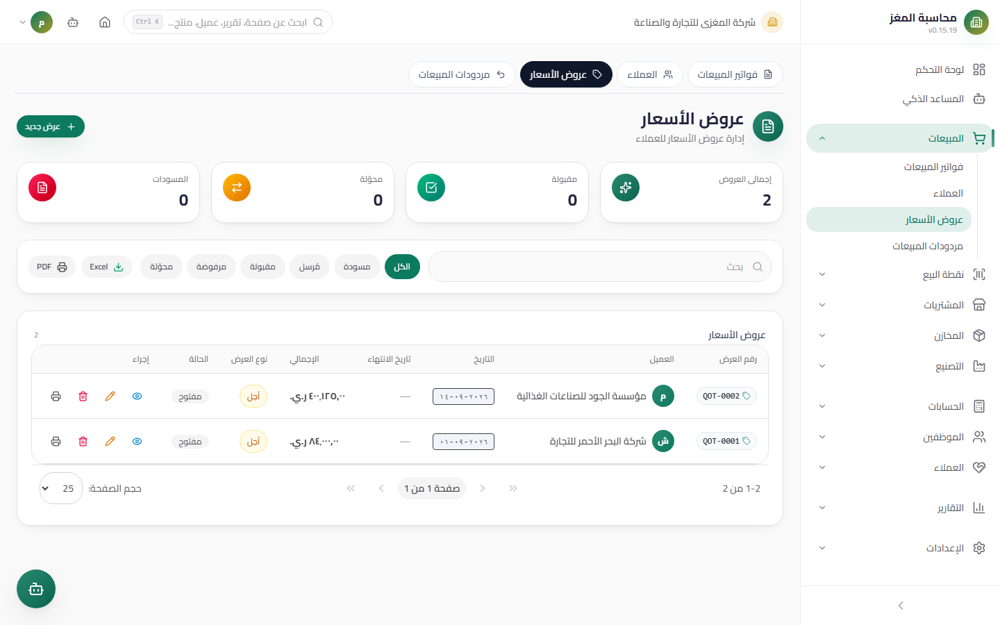

# Quotations — User Guide

> A pre-sale negotiation document: lines with proposed prices and no tax, converting into a ready sales invoice with one click.

## Overview

A quotation is a non-binding document presented to a customer with proposed prices and terms. It affects neither stock, nor accounts, nor balances — it is a negotiation step only. Access it from: **Sidebar ← Sales ← Quotations** (`/sales/quotations`).

## Access & Permissions

| Action | Permission |
|---|---|
| View the list and details | `sales.view` |
| Create/edit a quotation | `sales.create` / `sales.edit` |
| Delete a quotation | `sales.delete` — drafts only |
| Convert to an invoice | `sales.create` |

## The List

A table showing: quotation number, customer, date, **expiry date**, total, **status** (a colored badge), and action buttons.

- **Search** by quotation number and customer name + a **status filter** + a **customer filter** + **server-side pagination**.
- **Excel/PDF export** and **printing** of the quotation as an official document.

## New Quotation Screen

- **Access:** Sidebar ← Sales ← Quotations ← the **New Quotation (عرض جديد)** button
- **Purpose:** Prepare a price quotation for a customer

### Fields

| Field | Description | Required |
|---|---|---|
| **Quotation Number** | Generated automatically with the `QOT-` prefix from document sequences | Auto |
| **Customer** | From the active customers list | Yes |
| **Date** | Pre-filled with today | Yes |
| **Expiry Date** | The date after which the quotation is no longer binding — an essential quotation feature | Recommended |
| **Proposed Payment Type** | Cash / credit (inherited by the invoice on conversion) | Optional |
| **Notes** | Terms and negotiation — the invoice references them on conversion | Optional |

### Lines

| Field | Description |
|---|---|
| **Product** | From the active products list |
| **Unit** | A **multi-unit selector** — selecting the carton fetches its custom sale price |
| **Quantity / Unit Price** | Freely editable — negotiation prices |
| **Line Discount %** | A discount on the line |

**No tax lines:** the quotation contains no VAT — the calculation = subtotal − line discounts only. Tax is computed on the **invoice** at conversion, using the company's rate.

## Document Lifecycle

| Status | Meaning | What you can do in it |
|---|---|---|
| **Draft** | Created and not yet sent | Edit, delete, **Send**, **Convert to Invoice**, print |
| **Sent** | Reached the customer, awaiting a reply | Edit, **Accept / Reject**, convert, print |
| **Accepted** | The customer agreed to the quotation | Read and print — convert it to an invoice |
| **Rejected** | The customer declined the quotation | Read-only — archive |
| **Converted** | It became a sales invoice | Read-only — linked to the invoice |

## The "Convert to Invoice" Button

Appears on the quotation (especially the draft) and performs the following:

1. Creates a **new sales invoice** from the quotation's lines as they are (products, units with their locked factors, quantities, prices, line discounts) with the same customer and payment type.
2. **The notes reference the quotation** — a reference to the original quotation number is appended for traceability.
3. Flips the quotation's status to **Converted**, closing it to editing.
4. The new invoice starts as a **draft** — review it, add tax and the overall discount, then post it like any invoice.

## Step-by-Step Workflow — Numeric Example

A quotation for Al-Noor Est., then converting it to an invoice:

1. Sidebar ← Sales ← Quotations ← **New Quotation (عرض جديد)**.
2. The number appears automatically: `QOT-00009`. Customer: "Al-Noor Trading Est.".
3. Expiry date: `2026-09-30`. Payment type: **Credit**.
4. **Line:** "Orange Juice" — unit: **Carton**, quantity: `5`, unit price: `9,000`, line discount: `5%` → the line value is `42,750`.
5. Notes: "The quotation is valid for 30 days — delivery from the Main Warehouse".
6. **Save (حفظ)** → draft `QOT-00009` (no journal entry and no stock movement — normal).
7. **Send it (إرسال)** to the customer, then update the status to **Sent** after the agreement.
8. The customer agrees → mark it **Accepted** (or convert directly), then click **Convert to Invoice (تحويل إلى فاتورة)**.
9. The result: a draft invoice `INV-…` with the quotation's carton lines (the same line values), its notes carry the `QOT-00009` reference, and the quotation's status is **Converted**.
10. Complete the invoice: an overall discount if any + VAT 15%, then **post it** — only then does stock move and the customer balance increase.

## Printing & Export

- **Printing:** an official quotation document with the company letterhead (logo, name, address, tax number), customer data, a line table with units, the expiry date, and a status badge — ready to send to the customer as is.
- **Export:** the **Excel** and **PDF** buttons export the displayed list after filtering — useful for tracking pending quotations monthly.

## Important Rules

| Rule | Details |
|---|---|
| The quotation affects nothing | No stock, no journal entry, and no customer balance in any state |
| No tax | Line discounts only — VAT is computed on the invoice |
| The factor is locked at conversion | The line's unit and its factor are inherited by the invoice as they are |
| Converted and accepted are protected | No deleting a quotation with `accepted` or `converted` status |
| The invoice starts as a draft | Conversion does not post the invoice automatically — human review first |
| Multi-units are supported | Selecting the carton in the quotation fetches its custom sale price, as in invoices |
| Numbering from the system | The `QOT-` prefix comes from document sequences — do not type it manually |
| Free editing while a draft | Lines, prices, customer — all editable before sending or converting |

## Common Errors & Fixes

| Message | Cause | Solution |
|---|---|---|
| "Cannot delete accepted quotation" | Deleting an accepted or converted quotation | It is a reference document — keep it archived |
| The convert button created an invoice without tax | The quotation structurally has **no tax lines** | Add VAT from the invoice screen before posting |
| The quotation does not appear in the customer's list | The customer is inactive or a status filter is active | Activate the customer or adjust the filter |
| The price on the invoice differs from the quotation | The line's unit price was edited after conversion? No — the price is inherited as saved | Review the invoice's lines before posting and adjust as needed |
| The sent quotation expired | The expiry date passed without acceptance | Create a new quotation with updated prices |

## Tips

- Always set the **Expiry Date** — it protects you from executing old prices after market swings.
- Use the notes to document delivery and payment terms — they travel with the invoice after conversion.
- Review the "Sent" filter weekly: an unanswered quotation = a sales follow-up opportunity.
- An accepted quotation sitting idle? Convert it to an invoice immediately — delay risks price or stock changes.
- Print the quotation with the company logo — an official document raises customer confidence before any negotiation.
