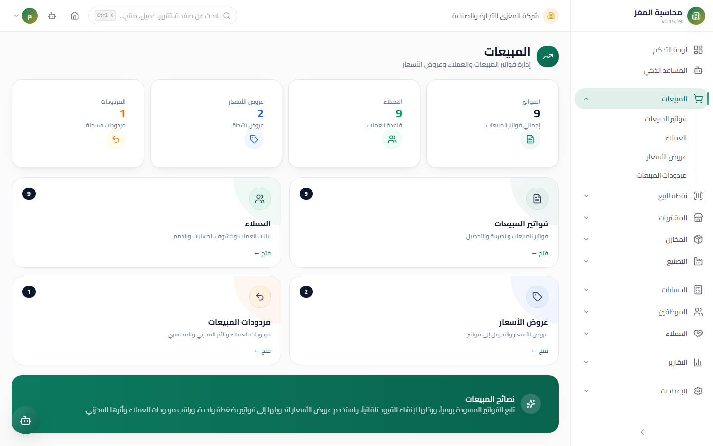

# Sales — User Guide

> The complete selling cycle: from the customer and the quotation to the posted invoice and returns — with atomic accounting and inventory effects.

## Overview

The Sales module manages your relationship with customers and all selling documents: invoices with VAT and multi-currency, quotations that convert to invoices with one click, and returns that restore stock and reduce receivables. Every posting executes **atomically**: journal entry + stock movement + customer balance in a single transaction.

Access the module from: **Sidebar ← Sales** (`/sales`). The hub page shows navigation cards with live counters.

## Access & Permissions

| Action | Permission |
|---|---|
| View customers, invoices, quotations, and returns | `sales.view` |
| Add/edit a document | `sales.create` / `sales.edit` |
| Delete a draft | `sales.delete` |
| Post an invoice or a return | `sales.post` |
| See only your own documents | `sales.own` |

**Important note about the `sales_rep` (Sales Representative) role:** it does not have full `sales.view`, but rather `sales.own` + `sales.create` — the rep sees the Sales section in the sidebar and can create documents, but **sees only their own documents** (filtering happens at the query level via `created_by`). The `accountant`, by contrast, sees all invoices in order to post and collect them.

## Sales Hub Page



When you open `/sales` you find navigation cards with live counters:

| Card | Path | Live counter | Description |
|---|---|---|---|
| **Invoices** | `/sales/invoices` | Number of invoices | Sales invoices, tax, and collection |
| **Customers** | `/sales/customers` | Number of customers | Customer data, statements, and receivables |
| **Quotations** | `/sales/quotations` | Number of quotations | Quotations and conversion to invoices |
| **Returns** | `/sales/returns` | Number of returns | Customer returns and their inventory and accounting effect |

## Module Structure

```
Sales
├── Customers           ← Customer card + statement + aging (CUS-)
├── Sales Invoices      ← The central document: draft → post → collect (INV-)
├── Quotations          ← A quotation that converts to an invoice in one click (QOT-)
└── Sales Returns       ← Returns against an original invoice (SR-)
```

## Typical Workflow

1. **Register the customer** (or use an existing one) — an automatic `CUS-` code.
2. *(Optional)* **Issue a quotation** `QOT-` and send it; on acceptance, click **Convert to Invoice (تحويل إلى فاتورة)**.
3. **Create the invoice** `INV-` as a draft: multi-unit lines, discounts, VAT, currency.
4. **Review the duplicate guard** if it appears, then **post** the invoice — the journal entry is issued, goods are deducted, and the customer balance increases.
5. **Collect** via a **Receipt Voucher** from the Accounting module — it reduces the customer balance and flips the invoice status (partially paid / paid).
6. When goods come back: a **sales return** `SR-` against the original invoice; posting it restores stock and reduces the balance.

## Important Rules

| Rule | Details |
|---|---|
| A draft has no effect | No journal entry, no stock movement, and no balance before **posting** |
| Posting is atomic | The journal entry + inventory + customer balance all succeed together or everything rolls back |
| Cash invoice | Marked **paid automatically** on posting and does not affect the customer balance |
| Stock is in the Base Unit | A carton line deducts the base quantity = quantity × the locked Conversion Factor |
| Posted documents are protected | Editing and deletion are for drafts only; posted documents are corrected with a return |
| Receivables are live | Customer balance = posted invoices − payments − posted returns |

## Common Errors & Fixes

| Message/Observation | Cause | Solution |
|---|---|---|
| "Cannot delete posted invoice. Cancel it first." | You tried to delete a posted invoice | Correct with a sales return, or cancel according to your policy |
| "Cannot modify lines of posted invoice…" | Editing the lines of a posted invoice | Create a new invoice or a return |
| A "duplicate document" dialog blocked the save | The duplicate guard detected an exact match | Review the similar invoices — do not save twice |
| The customer balance did not move after saving | The invoice is a draft | Post the invoice |
| The rep does not see colleagues' invoices | The `sales_rep` role sees only its own documents | Normal — for full review use an accountant or manager role |

## Tips

- Make the quotation the first step with a new customer — converting it to an invoice inherits the lines and prices without retyping.
- Review the "Drafts" card on the invoices page daily — a forgotten unposted invoice means unrecognized revenue and undeducted goods.
- Use the due date precisely — the **Aging** report builds its aging buckets on it.
- For fast cash sales in a small shop, consider **POS** instead of a full invoice.
- Add a meaningful note to every invoice — it appears in printing and the account statement.
