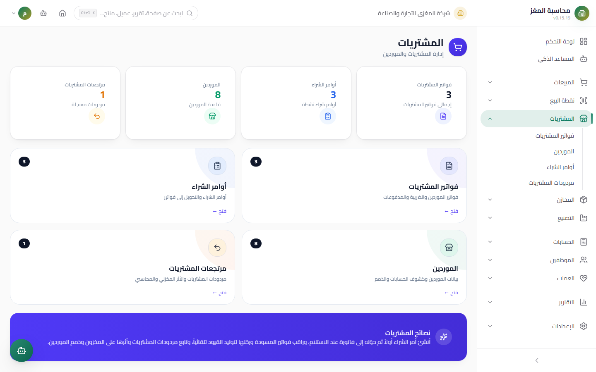
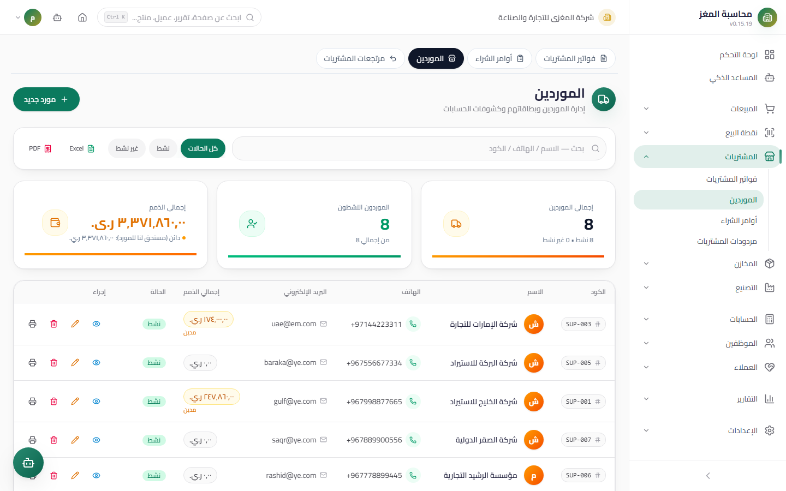

# Suppliers — User Guide

> The complete supplier registry: data, a one-time posting credit opening balance, and a supplier card with two tabs (Statement and Accounts Payable Aging).

## Overview

The supplier is the party you buy from, and their balance is **Accounts Payable (AP)**: what you owe them. Access the screen from: **Sidebar ← Purchases ← Suppliers** (`/purchases/suppliers`).

## Access & Permissions

| Action | Permission |
|---|---|
| View the list, the card, and the statements | `purchases.view` |
| Add/edit a supplier | `purchases.create` / `purchases.edit` |
| Delete a supplier | `purchases.delete` — blocked when invoices or returns exist |

## Suppliers List

A table showing: code, name, phone, **balance** (credit = what you owe), active status, and action buttons.

- **Search** by name, phone, and code + an **active filter** + **server-side pagination**.
- **Export** the displayed list.
- **Add New Supplier (إضافة مورد جديد)** is protected by the `purchases.create` permission.

## New Supplier Screen

- **Access:** Sidebar ← Purchases ← Suppliers ← the **New Supplier (مورد جديد)** button
- **Purpose:** Open a supplier file

### Fields

| Field | Description | Required |
|---|---|---|
| **Code** | Generated automatically from document sequences | Auto |
| **Name** | The supplier's or company's name | Yes |
| **Phone / Email** | Contact details | Optional |
| **Address** | Appears in purchase documents | Optional |
| **Tax Number** | For input VAT reports | Optional |
| **Active** | An inactive supplier disappears from new invoice lists | Yes |

### Credit Opening Balance

| Field | Description |
|---|---|
| **Opening Balance** | The **credit** amount (what you owe the supplier) before you started using the system |
| **Opening Date** | Orders the opening line in the statement and the AP Aging |

**How it posts:** on save, a **Journal Entry** is created once: debit the Opening Equity account / credit Accounts Payable (Suppliers) × the amount. The field then **locks** — the opening balance does not post a second time even if you edit the supplier's data.

## Supplier Card — Tabs

### 1) Details

All card data + a balance summary — a form similar to the customer card, but the effect is **credit**.

### 2) Statement

A full **Account Ledger** of your dealings with the supplier, with a running balance:

| Line type | Debit | Credit |
|---|---|---|
| **Opening balance** | | The credit opening amount |
| **Purchase invoice** (posted) | | The invoice total — increases what you owe |
| **Payment Voucher** (posted) | The payment amount — decreases what you owe | |
| **Purchase return** (posted) | The return total — decreases what you owe | |

- **The displayed balance formula:** `Balance = purchase invoices − payment vouchers − posted purchase returns` (+ the opening balance).
- A positive balance = **Accounts Payable** (you owe the supplier).
- **Printable** — an official statement with the company header to send to the supplier.

### 3) Accounts Payable Aging

Splits what you owe the supplier into **0–30 / 31–60 / 61–90 / 90+ day buckets** by due date — the basis for payment planning and prioritization.

## Paying Suppliers

Payments are not made from the supplier screen; they go through **Payment Vouchers** in the **Accounting** module: create a payment voucher for the supplier linked to the posted invoices being settled — the voucher posts a Journal Entry (debit Accounts Payable / credit the Cash Box or bank), **decreases the supplier balance**, and flips the settled invoices to **Partially Paid or Paid**.

## Step-by-Step Workflow — Numeric Example

Opening a new supplier with an opening balance:

1. Sidebar ← Purchases ← Suppliers ← **New Supplier (مورد جديد)**.
2. The code appears automatically. Name: "Al-Khair Distribution Warehouses". Phone: `712345678`.
3. Opening balance: `500,000` YER (you owe it), opening date: `2026-09-01`.
4. **Save** — the opening Journal Entry posts once:

| Account | Debit (YER) | Credit (YER) |
|---|---:|---:|
| Opening Equity | 500,000 | |
| Accounts Payable (Suppliers) | | 500,000 |

5. Open the card ← the **Statement** tab: the first line reads "Opening balance — credit 500,000 — running balance 500,000".
6. You then received purchase invoice `PINV-00030` for 900,000 and posted it: a credit line → the balance becomes **1,400,000**.
7. You paid 600,000 with a payment voucher linked to the invoice: a debit line → the balance becomes **800,000**, and `PINV-00030` flips to **Partially Paid** — and the aging is reflected in the AP Aging tab.

## Important Rules

| Rule | Details |
|---|---|
| The opening balance is credit and one-time only | It posts at creation only, then the field locks |
| The statement shows posted documents only | Drafts never enter the statement or the balance |
| Payments via Payment Vouchers | No "Pay" button on the supplier screen — all payments come from Accounting |
| A cancelled invoice is excluded | It enters neither the balance nor the statement |
| Deletion is protected | A supplier with invoices cannot be deleted — deactivate them instead |

## Common Errors & Fixes

| Message as shown in the system | Cause | Solution |
|---|---|---|
| "Cannot delete supplier with existing…" | The supplier has invoices or returns | Deactivate the supplier instead of deleting |
| The opening balance field is locked | The opening balance posted at creation | Correct it with Journal Entries from the Accounting module |
| The balance does not reflect a new invoice | The invoice is still a Draft | Post the invoice so it enters the balance and statement |
| The invoice did not flip to "Paid" after payment | The Payment Voucher is not posted or not linked to invoices | Post the voucher and make sure the settled invoices are linked |
| The supplier does not appear in the invoice list | They are inactive | Activate them from their card |

## Tips

- Check the **Accounts Payable Aging** tab before any payment — pay the oldest first to keep the supplier's trust.
- Print the statement and send it with every large payment — it prevents most supplier disputes.
- Fill in the supplier's **Tax Number** — input VAT reports need it for reconciliation.
- Use the active filter to hide dormant suppliers without losing their accounting history.
- Do not create a new supplier for every one-off invoice from the same party — consolidation makes the statement and aging meaningful.
