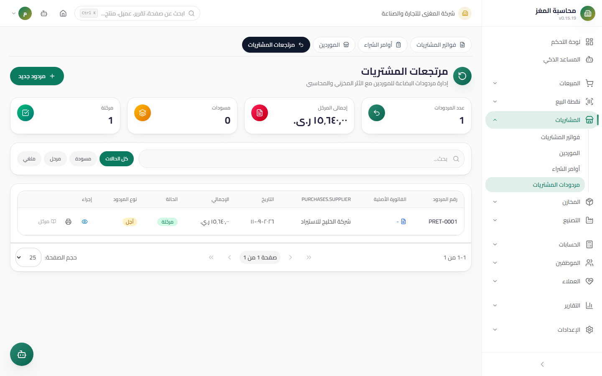

# Purchase Returns — User Guide

> Returning goods to the supplier: stock goes out, the supplier balance decreases, and a purchase-return Journal Entry is issued — atomically, upon posting.

## Overview

A Purchase Return documents returning purchased goods to the supplier: damaged goods, non-conforming goods, or surplus stock. Access it from: **Sidebar ← Purchases ← Returns** (`/purchases/returns`).

## Access & Permissions

| Action | Permission |
|---|---|
| View the list and details | `purchases.view` |
| Create/edit a return | `purchases.create` / `purchases.edit` |
| Delete a Draft | `purchases.delete` |
| Post a return | `purchases.post` |

## List

A table showing: return number, supplier, **linked purchase invoice** (if any), date, total, **reason**, status, and action buttons.

- **Search** by return number and supplier name + a **status filter** + a **supplier filter** + **server-side pagination**.
- **Excel/PDF export** of the displayed results.

## New Return Screen

- **Access:** Sidebar ← Purchases ← Returns ← the **New Return (مرتجع جديد)** button
- **Purpose:** Document returning goods to a supplier

### Fields

| Field | Description | Required |
|---|---|---|
| **Return number** | Generated automatically with the `PR-` prefix from document sequences | Auto |
| **Supplier** | The party the goods are returned to | Yes |
| **Purchase invoice** | An **optional link** to a purchase invoice — when selected, its lines load to help you | Optional |
| **Date** | The date the goods were returned | Yes |
| **Lines** | Product, unit with its Conversion Factor, returned quantity, unit price | Yes |
| **Reason** | Damage, non-conformance, surplus… appears in the Journal Entry and the list | Recommended |

A note on the difference from the sales return: linking to the purchase invoice is **optional** here (not mandatory), because some returns happen later or under a general agreement with the supplier — but linking the invoice produces a more accurate statement.

## Document Lifecycle

| Status | Meaning | What you can do in it |
|---|---|---|
| **Draft** | Has affected nothing | Edit, delete, **Post** |
| **Posted** | Stock went out, the supplier balance decreased, and the Journal Entry was issued | Read and print only |
| **Cancelled** | Cancelled before posting | Read only |

**Editing and deleting apply to the Draft only** — a Posted return is a fixed accounting record.

## Posting Effects (Atomic)

The **Post (ترحيل)** button executes **one transaction** that succeeds entirely or rolls back entirely:

| Effect | Details |
|---|---|
| **Purchase-return Journal Entry** | Debit **Accounts Payable (Supplier)** with the total / credit **Purchase Returns** — the reverse direction of the invoice |
| **Stock out** | Movements of type `out` referencing the return number + a **quantity decrease** in the Base Unit |
| **Supplier balance decreases** | The supplier balance drops by the return total — what you owe them shrinks |
| **Status** | Flips to **Posted** within the same transaction |

After posting: a later Payment Voucher settles the remaining outstanding amount (posted return invoices are netted from the supplier balance via the statement and the aging).

## Step-by-Step Workflow — Numeric Example

You returned 2 damaged juice cartons to Al-Khair from invoice `PINV-00030`:

1. Sidebar ← Purchases ← Returns ← **New Return (مرتجع جديد)**.
2. The number appears automatically: `PR-00004`.
3. Supplier: "Al-Khair Distribution Warehouses". **Purchase invoice:** select `PINV-00030` — its lines load (cartons at a purchase price of 6,000).
4. Returned quantity: `2` cartons. Reason: "Cooling damage — 2 cartons from the 2026-09-12 batch".
5. Total = `12,000`. **Save** → Draft `PR-00004` (nothing has changed yet).
6. Once you agree on the return with the supplier, click **Post (ترحيل)** — the atomic effect:

| Effect | Details |
|---|---|
| Inventory | Out `2 × 12 = 24` base units, an `out` movement referencing `PR-00004` |
| Supplier balance | 635,240 − 12,000 = **623,240** YER |

The resulting Journal Entry:

| Account | Debit (YER) | Credit (YER) |
|---|---:|---:|
| Accounts Payable — Al-Khair | 12,000 | |
| Purchase Returns | | 12,000 |

7. Open the supplier's statement: you will find the return line as a debit decreasing the running balance, and the AP Aging tab updated with the new outstanding amount.

## Important Rules

| Rule | Details |
|---|---|
| Reverse direction of the purchase | A reversing entry + stock going out + a supplier balance decrease |
| Linking to the invoice is optional | But linking gives a more accurate statement and aging |
| Out in the Base Unit | A returned carton = 12 base units leaving stock |
| Posted is immutable | Correct with a new counter-return or a management decision |
| The reason is documented | The reason appears in the Journal Entry and the list — keep it clear and reviewable |
| Posting is atomic | The Journal Entry + stock + balance succeed together or everything rolls back |

## Common Errors & Fixes

| Message as shown in the system | Cause | Solution |
|---|---|---|
| "Return not found or not in draft status" | Posting an already-posted return | Check its status from the list |
| "Cannot modify lines of a posted return." | Editing lines of a posted return | Create a counter-return |
| "Cannot delete posted return…" | Deleting a non-Draft return | Only Drafts can be deleted |
| The balance did not decrease after saving | The return is a Draft | Post it |
| Stock left an unexpected warehouse | Posting works on the default warehouse | Move the effect with a stock transfer, or adopt this warehouse as your main one |
| The return exceeds the supplier balance | You returned more than you actually bought | Review the quantities — the balance may become negative in meaning (an advance payment) |

## Tips

- Link the return to a **purchase invoice** whenever possible — the supplier statement stays consistent with their invoices.
- Document the reason precisely, with the batch and date — it protects you in a supplier dispute weeks later.
- Goods not handed over yet? Leave the return as a Draft until they actually leave — stock is deducted the moment you post.
- Review the "Draft" filter weekly — a forgotten return means inflated stock and a supplier balance higher than reality.
- Reconcile your returns with the supplier's credit notes monthly — a gap is caught early, not at year-end.
