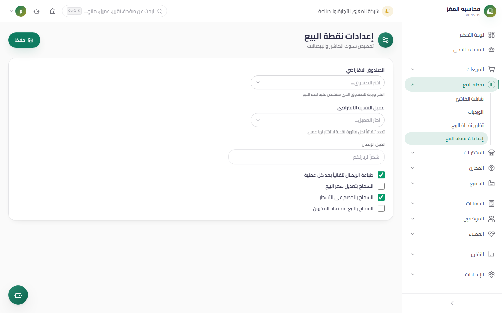
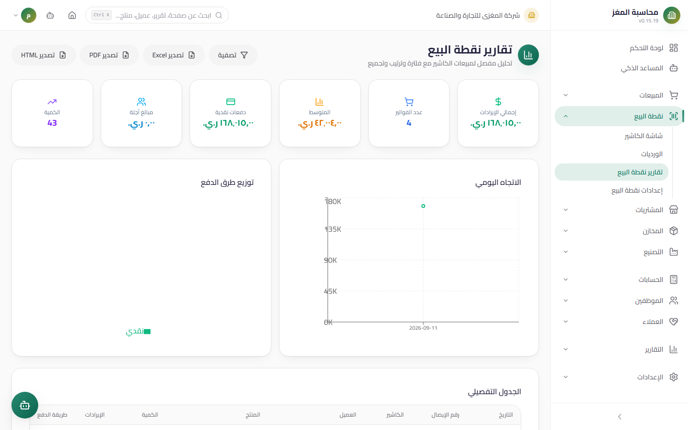

# POS Settings & Reports — User Guide

> Configuring the cashier screen's behavior (the `pos.*` keys) and analyzing POS sales with filters, grouping, and export.

## Overview

Two files in the POS module:

1. **POS Settings** (`/pos/settings`) — per-company settings stored in the general settings table under keys starting with `pos.`.
2. **POS Reports** (`/pos/reports`) — analysis of sales operations with ready periods, filters, grouping, and export.

---

## POS Settings

- **Access:** Sidebar ← Point of Sale ← Settings.
- **Permission:** settings management falls under `settings.*` / `pos.*`.

### Fields and Keys

| Key | Setting | Description |
|---|---|---|
| `pos.defaultCashBoxId` | **Default Cash Box (صندوق النقد الافتراضي)** | Pre-selected in the "Open Shift" dialog — saves the cashier picking it every morning |
| `pos.defaultWalkInCustomerId` | **Walk-in Customer (العميل النقدي الافتراضي)** | Used for pure cash sales without selecting a customer — its name shows in the customer bar by default |
| `pos.receiptFooter` | **Receipt footer text (نص تذييل الإيصال)** | A free line printed at the bottom of every 80mm receipt (example: "Thank you for your visit — no exchange after 14 days") |
| `pos.autoPrint` | Auto-print | Prints the receipt the moment payment succeeds, with no extra click |
| `pos.allowPriceEdit` | Allow price editing | Enables editing the unit price in the cart — **disabled by default** (register safety) |
| `pos.allowDiscount` | Allow discount | Allows entering a discount percentage on a cart line — enabled by default |
| `pos.allowNegativeStock` | Allow negative stock | Allows selling a product with zero stock (scanning works and the tile becomes tappable) — **disabled by default** |

> **Note:** values are stored as text in the `settings` table (boolean keys as `true`/`false`), and take effect on every cashier screen of the company the moment they are saved.

### Each Key's Effect on Cashier Behavior

| Key | Enabled | Disabled |
|---|---|---|
| Auto-print | The print window opens by itself after every successful payment | The cashier prints manually from "Reprint last receipt (إعادة طباعة آخر إيصال)" |
| Price editing | The cashier edits the unit price on a cart line | The price field is locked to the selling price from the product catalog |
| Allow discount | Entering a discount percentage per line | The discount field is hidden and the price cannot be reduced |
| Negative stock | Scanning works, zero-stock tiles are tappable, and the sale deducts below zero | The tile is grayed out and scanning rejects the product |

### Configuration Recommendations

| Environment | Suggested setup |
|---|---|
| High-turnover pharmacy/grocery | Auto-print ✓, price edit ✗, discount ✗, negative stock ✗ |
| Clothing store | Auto-print ✓, price edit ✗, discount ✓ (only a manager edits prices), negative stock ✗ |
| Restaurant/cafeteria | Negative stock ✓ (stock count later), discount ✓ |

---

## POS Reports

- **Access:** Sidebar ← Point of Sale ← Reports.
- **Permission:** `reports.view` to view, `reports.export` to export — the export button appears only for holders of the export permission.

### Ready Periods

Choose from the period bar at the top of the report: **Today / This Week / This Month / This Year / All** — the report reloads on every change.

### Filters

| Filter | Matches |
|---|---|
| Payment method | Cash / Credit |
| Cashier | By name (text search) |
| Product | By product name in the invoice lines |
| Customer | By customer name (cash sales appear under the Walk-in Customer's name) |

### Group By

The **"Group by (تجميع حسب)"** option reshapes the report entirely:

| Grouping | What the user sees |
|---|---|
| None (detailed) | Every receipt as its own row with its number, date, and cashier |
| Day | Total sales per day |
| Shift | Each Shift as its own row (invoice count, cash, credit) |
| Cashier | Each cashier's performance in the period |
| Product | Sales by quantity and value per product (line-level detail) |
| Payment method | The cash/credit split |

### Sorting and Export

- **Sorting:** by date (default), total, or cashier, ascending/descending.
- **Export:** Excel, PDF, and HTML — with the same displayed data after filters and grouping, with the company identity header (logo and company name from the report settings).

### Detailed Report Columns

| Column | Description |
|---|---|
| Receipt number | `POS-000123` |
| Date/time | The moment of the sale |
| Cashier | The Shift's owner |
| Customer | Or "Walk-in Customer (عميل نقدي)" |
| Products | The line names |
| Cash / Credit | The payment split |
| Total | The invoice total |

## Usage Example

You want to know this month's best products and who sells them:

1. Open Reports ← period: **This Month**.
2. "Group by": **Product** — sort descending by total.
3. Export to Excel and send it to Purchasing for order planning.

To spot a short-changing cashier: "Group by": **Cashier**, sort by cashier, and compare cash collected with the Shifts screen (each Shift's difference).

## Important Rules

- The reports read from the **real sales invoices** flagged POS — any general sales report will match the POS report for the same period.
- **Cancelled invoices are excluded** from all aggregations.
- The "Product" filter aggregates at the invoice **line** level, so a receipt is counted once when aggregating invoices instead of being doubled.
- Export is gated by the `reports.export` permission — no export button for anyone without it.

## Common Errors & Fixes

| Problem | Cause | Solution |
|---|---|---|
| The report is empty | No POS sales in the selected period | Widen the period to "All" to verify |
| The export button does not appear | The `reports.export` permission was not granted | Review the user's role in Roles Management |
| Cashier names show "غير معروف" (Unknown) | An invoice row with no linked user (old data) | Ignore it for old periods — new Shifts are always linked |
| Settings do not apply on another device | Settings are per company, not per device — the device was opened before saving | Refresh the cashier screen (F5) after saving |

## Tips

- Review the "Payment method" report weekly and make sure the credit share is under control.
- When opening a new branch: set the default Cash Box, the default Walk-in Customer, and the receipt footer before the first Shift.
- Export the "Shift" report at month-end and attach it to the accountant's month-closing file.
