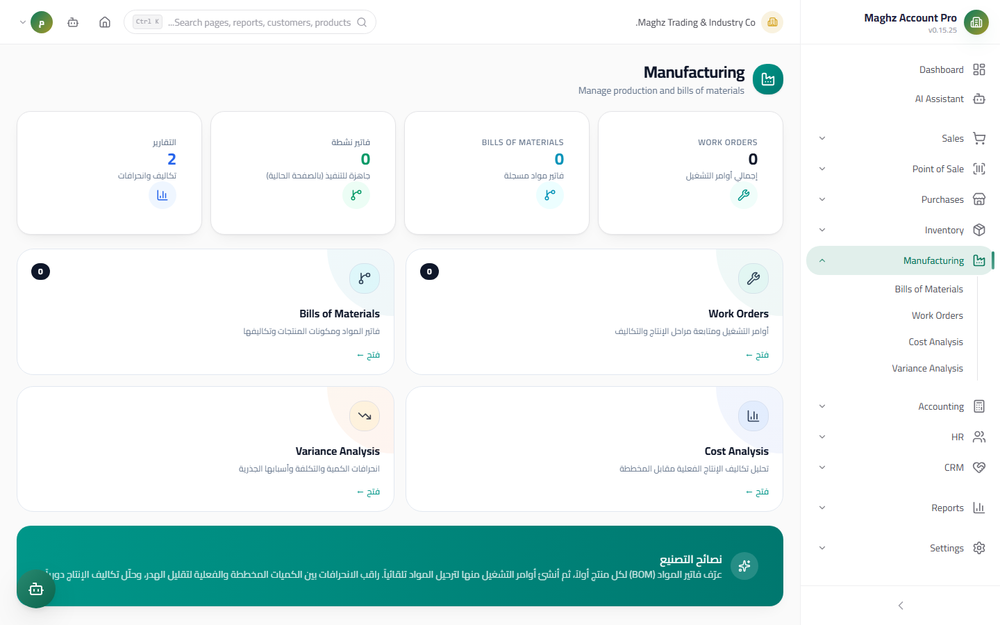
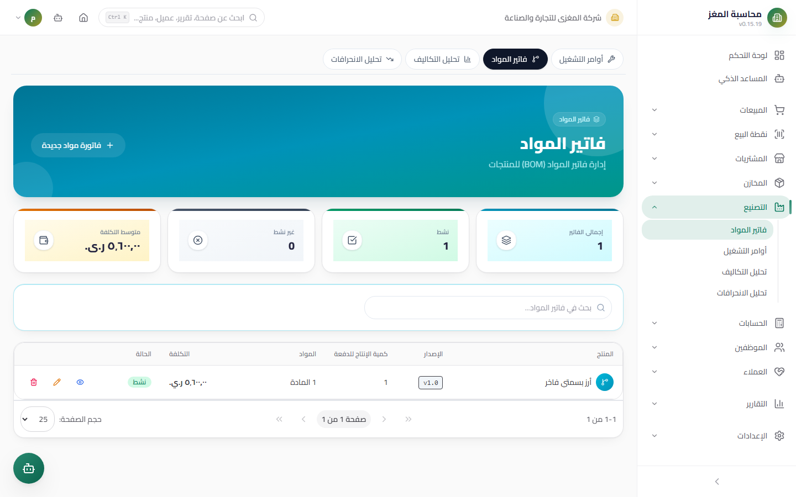
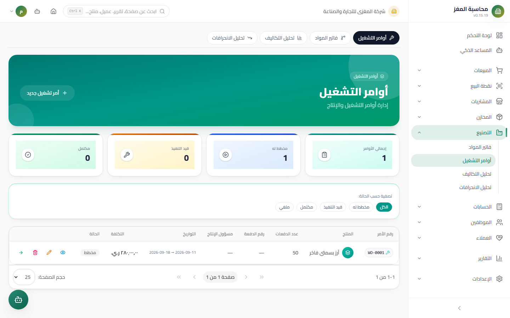
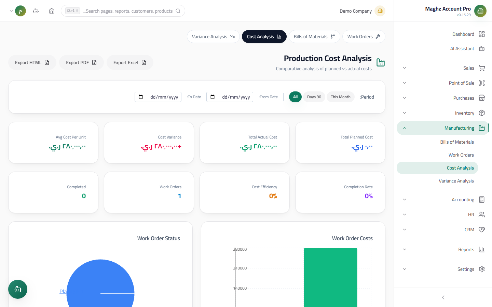
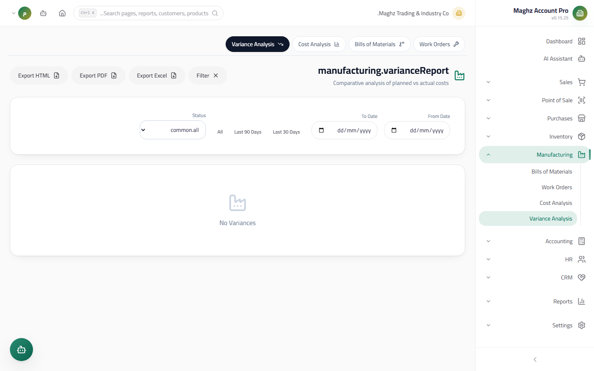

# Manufacturing — User Guide

> From the Bill of Materials (BOM) to delivering the finished product: Work Orders with a strict state machine, Work In Progress (WIP) accounting, and Moving Weighted Average costing.

## Overview



The Manufacturing module converts raw materials into finished products through three screens: the BOM (Bill of Materials), Work Orders, and the Cost and Variance reports. Every operational step has a matching automatic journal entry and stock movement — no manual accounting entry.

- **Access:** Sidebar ← Manufacturing.
- **Permissions:** `manufacturing.view` to view, `manufacturing.create` to add, `manufacturing.edit` to edit and start/complete, `manufacturing.delete` to delete, `reports.view` / `reports.export` for reports.

## Access & Permissions

| Role | Access |
|---|---|
| `super_admin` / `admin` | Everything |
| `manager` | Full access to screens and reports |
| `accountant` | View and reports (reviewing journal entries) |
| `viewer` | View only |

---

## Bill of Materials (BOM)

### The BOM Screen



- **Access:** Manufacturing ← BOM.
- **Purpose:** Define the "manufacturing recipe" — which materials, and how much of each, are needed to make the product.

### BOM Fields

| Field | Description | Required |
|---|---|---|
| Product | The finished product the recipe will produce | Required |
| Version | The recipe's label (e.g. `v1`, `v2`) — **multiple versions per product are allowed, but only one is active** | Required |
| Active | The recipe used by default when creating Work Orders | Required |
| **Output Quantity** | The number of finished-product units produced by **one batch** of the recipe — default 1 | Required |
| Notes | Free description | Optional |

### BOM Lines

| Column | Description |
|---|---|
| Material | A product from the inventory catalog |
| Quantity | The material quantity per single batch |
| Unit Cost | Pulled from the material's current cost (editable) |
| Total | Calculated automatically = Quantity × Unit Cost |

The BOM as a whole has a **calculated total cost** = the sum of its lines.

## Work Order — A Strict State Machine

```
Planned ──Start──▶ In Progress ──Complete──▶ Completed
 │ │
 └────────── Cancel ──────┴────────────▶ Cancelled
```

| Rule | Detail |
|---|---|
| Start | From "Planned" **only** — attempting to start an In Progress or Completed order is rejected |
| Complete | From "In Progress" **only** |
| Cancel | From "Planned" or "In Progress" only; **Completed can never be cancelled** (production was already delivered to stock), and cancelling **twice is blocked** ("The work order is already cancelled") |
| Editing lines | Work order materials are **frozen after Start** — adjust actual quantities only at completion |

### The Work Orders Screen



- **Access:** Manufacturing ← Work Orders.
- **Numbering:** Automatic `WO-` prefix (`WO-0001`...).

### Creating a Work Order

| Field | Description | Required |
|---|---|---|
| Product | The finished product | Required |
| BOM | Selected from the product's active recipes | Required |
| **Quantity = Number of Batches** | How many times the recipe is executed. **Expected output = Batches × BOM output quantity** | Required |
| Planned start/end date | Timeline planning | Optional |
| Output warehouse | Where the finished product is received | Optional (default: first warehouse) |
| Batch number | **Not `WO-` — a lot number in the format `YYYYMMDD-NNN` is generated automatically** if left empty | Optional |
| Supervisor | The employee responsible for the production run | Optional |
| Production costs | Labor / energy / packaging / other — amounts spent on the process | Optional |
| Notes | Free description | Optional |

> **Example:** A juice BOM with an output quantity of 10 (each batch produces 10 cartons). A work order with **3 batches** → expected output **30 cartons**. The required amount of each material = its recipe quantity × 3.

At creation, the estimated total cost is always computed **server-side** = material cost + production costs (any figure sent from the UI is ignored).

---

## Start — Issuing Materials and the WIP Entry

When you click **Start**:

1. **Material availability gate:** the aggregate requirement **per material** (a material may appear in several lines) must exist in stock. Any shortage fails the operation with the message "Insufficient stock to issue materials" with details (Required / Available) for each short material.
2. **Issuing:** materials are issued from **the warehouse with the highest balance** of each material, and **out** movements are recorded with the order number as reference (`WO-0001`).
3. **Work In Progress (WIP) journal entry:** posted immediately:
 - **Debit** the Work In Progress (WIP) inventory account (`11302`) with the total cost of the issued materials
 - **Credit** each material's inventory account with its cost
4. The **actual start date** is stamped on the order.

### Pre-flight Availability Check

Before starting, you can query "how much can I produce?": the screen shows, for each material, required versus available, plus the **maximum producible number of batches** (limited by the scarcest material) and the maximum output in units.

## Completion — Delivering the Finished Product and Costing

When you click **Complete**:

| Step | Detail |
|---|---|
| Output | **Expected output = Batches × BOM output quantity** — you can **override** the produced quantity and the actual warehouse at completion |
| Actual consumption | The default = planned. You can enter an actual quantity per material; the **difference** automatically creates an additional issue (out) or a surplus return (in) |
| Delivery | The finished product is received into the output warehouse with an **in** movement "Finished goods from production" referencing the order number |
| Cost | **Total production cost = actual material cost + production costs** (labor/energy/packaging/other). Unit cost = total ÷ produced quantity |
| Product cost | Updated using the **Moving Weighted Average** per IAS 2: new cost = (old quantity × old cost + produced quantity × new cost) ÷ total |
| Status | "Completed" + an actual end date |

### The Accounting Entry at Completion

- **Debit** finished goods inventory — the total production cost
- **Credit** the Work In Progress (WIP) account — the value of materials issued at Start
- **Credit/Debit** each material's inventory account — consumption differences (additional issue = credit / surplus = debit)
- **Credit** the production cost accounts (53101 labor, 53201 energy, 53301 packaging, 53401 other)

> **An unbalanced journal entry is rejected** — debit and credit are computed before posting, and any difference > 0.01 fails the operation with a message identifying both amounts.

## Cancellation

- From "Planned": a clean status change only — no stock and no journal entries.
- From "In Progress": **the issued materials are returned to stock by default** (in movements in a single atomic operation) and the WIP entry is reversed (debit materials inventory / credit WIP).
- An option not to return (materials damaged, for example): the WIP value is transferred **debit** to the work order losses account (`53501`) / **credit** WIP — an abnormal production loss per IAS 2.
- After cancellation, the order can be "reopened" to "Planned", which clears the old run traces (actual dates, WIP cost, actual quantities).

## Reports





| Report | Content |
|---|---|
| **Production Cost Report** | Per work order: material cost (planned/actual) + production costs + total + unit cost |
| **Variance Analysis** | Planned versus actual **quantity and cost** per material — highlights waste and savings |

## Step-by-Step Workflow — A Full Numeric Example

**Mango juice BOM (v2, active):** output quantity = **10 cartons per batch**. Lines:
- Mango concentrate: 5 kg × 1,200 = 6,000 YER
- Sugar: 2 kg × 800 = 1,600 YER
- Empty cartons: 10 pcs × 150 = 1,500 YER
- **Cost per single batch = 9,100 YER**

**1) Create the order:** product "Mango Juice 1L", BOM v2, **quantity = 3 batches** → expected output 3 × 10 = **30 cartons**. Production costs: labor 3,000, energy 1,000. Numbering `WO-0001` is automatic, lot `20260912-001`.

**2) Start:** availability check: mango required 15 kg (available 40) ✓, sugar 6 kg (available 10) ✓, cartons 30 (available 25) ✗ → if you click Start now: "Insufficient stock to issue materials". After restocking and passing the gate:
- Out movements: mango 15, sugar 6, cartons 30 (from the richest warehouse per material)
- Journal entry: debit WIP `11302` with 27,300 (15×1200 + 6×800 + 30×150) / credit mango inventory 18,000, sugar 4,800, cartons 4,500

**3) Complete:** 15.5 kg of mango actually consumed (difference +0.5 → an additional issue). Produced output 30 cartons:
- Actual material cost = 18,600 + 4,800 + 4,500 = **27,900**
- Total production cost = 27,900 + 3,000 + 1,000 = **31,900 YER**
- Unit cost = 31,900 ÷ 30 ≈ **1,063.33 YER**
- Completion entry: debit finished goods 31,900 / credit WIP 27,300 + credit mango inventory 600 (extra consumption) + credit labor 3,000 + credit energy 1,000 — **balanced: 31,900 = 31,900** ✓
- The product cost is merged using the Moving Weighted Average: if stock holds 20 cartons at an old cost of 950 → (20×950 + 30×1,063.33) ÷ 50 ≈ **1,018 YER**

## Document Lifecycle (Work Order)

| Status | Meaning | What you can do in it |
|---|---|---|
| **Planned** | A planning draft | Edit everything, delete, start, cancel |
| **In Progress** | Materials issued and the WIP entry posted | Complete, cancel (with material return), no line editing |
| **Completed** | Output delivered and cost final | View and reports only — no cancellation and no line editing |
| **Cancelled** | Ended without production | Reopen to "Planned" (clears the run traces) |

## Important Rules

- **Batches are the planning unit:** the order quantity is not the number of units but the number of times the recipe is executed — check the "Output Quantity" before any order.
- **Reliable real-time WIP:** the value of materials between Start and Completion is visible in account `11302` — a high balance means stuck, unfinished orders.
- **An actual quantity of 0 means "not entered":** it is treated as planned at completion, and the actual values are stamped on the lines at the moment of completion so the variance reports read them accurately.
- All movements and entries execute **in one atomic transaction** — a failed journal entry rolls back the stock movements, and vice versa.

## Common Errors & Fixes

| Message as shown in the system | Cause | Solution |
|---|---|---|
| "المخزون لا يكفي لصرف الخامات (…)" (Insufficient stock to issue materials) | One or more materials short in aggregate | Restock or reduce the batches — the message shows required/available |
| "لا يمكن بدء أمر غير مخطط" (Cannot start a non-planned order) | The order is in progress or completed | The state machine prevents repetition — check the order's status |
| "الإكمال متاح فقط لأوامر قيد التشغيل" (Completion is available only for in-progress orders) | Completing an order that was never started | Start the order first so its materials are issued |
| "لا يمكن إلغاء أمر مكتمل" (Cannot cancel a completed order) | Production was delivered to stock | Create a reverse order or use a stock adjustment |
| "القيد غير متوازن: مدين X ≠ دائن Y" (Unbalanced entry: debit X ≠ credit Y) | Production costs without matching accounts | Check the default accounts (53101–53401) in Settings |
| "حساب بضاعة تحت التشغيل (11302) غير موجود" (WIP account 11302 not found) | Incomplete chart of accounts | Initialize the default accounts from Settings |

## Tips

- Update the "Unit Cost" in BOM lines periodically from the latest purchase prices so the estimated cost stays realistic.
- Use the availability check before scheduling any order to avoid orders stuck mid-production.
- Review the variance report monthly — actual consumption consistently above plan means waste or an outdated recipe that needs a new version.
- Create a new BOM version instead of editing the active one when the recipe changes — you keep the cost history per recipe.
