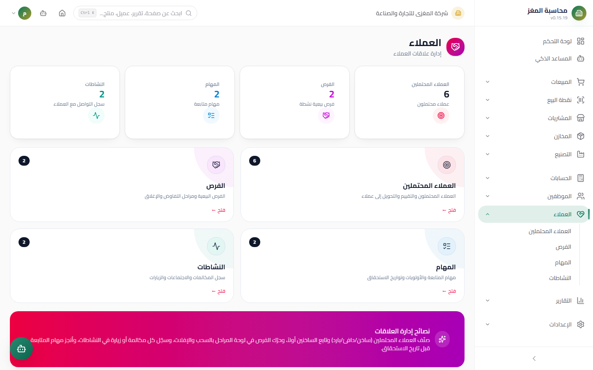
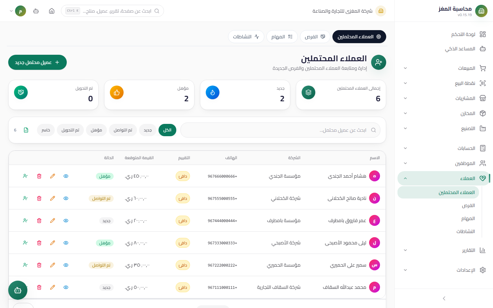
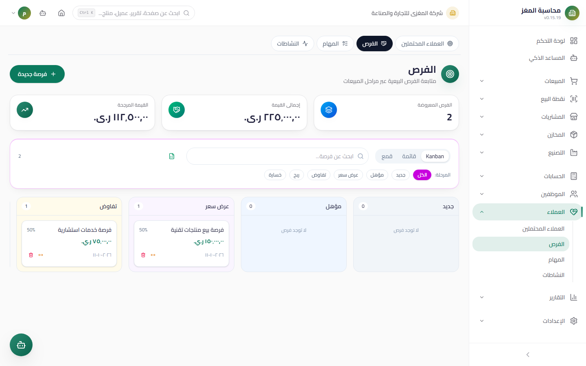
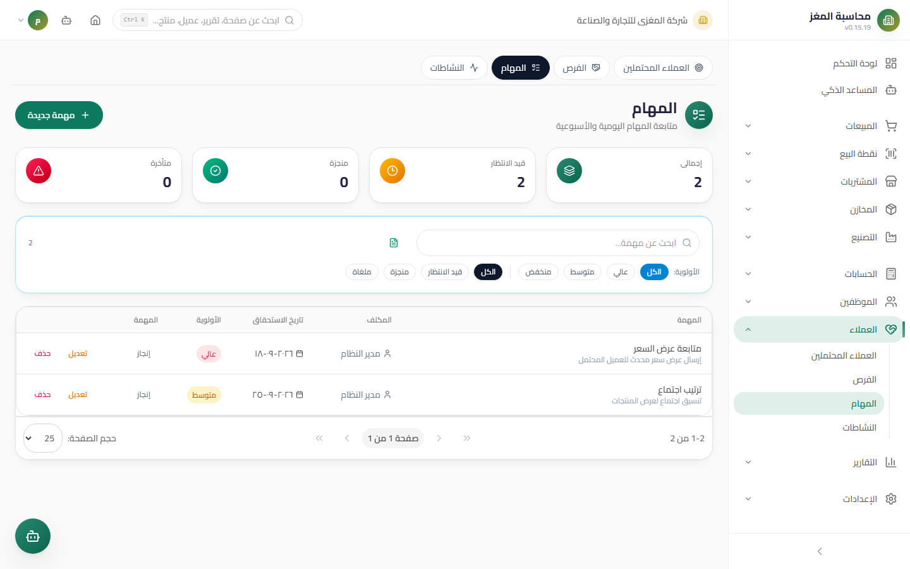
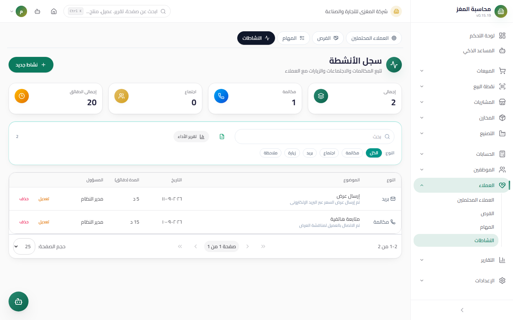

# CRM — User Guide

> Customer relationship management: from lead to won deal — a strictly staged sales funnel with tasks, activities, and follow-up reports.

## Overview



The CRM module manages the sales cycle before the invoice: **Leads (العملاء المحتملون)** → **Opportunities (الفرص)** → a real customer with an invoice. It also includes **Tasks (المهام)** and **Activities (الأنشطة)** for tracking the daily work, plus funnel and performance reports in the Reports Hub.

- **Access:** Sidebar ← CRM.
- **Permissions:** `crm.view` to view, `crm.create` to add, `crm.edit` to edit, `crm.delete` to delete.

| Role | Access |
|---|---|
| `super_admin` / `admin` | Everything |
| `manager` | All screens and reports |
| `sales_rep` | Their own leads and opportunities (per their permissions) |
| `viewer` | View only |

---

## Leads



### The Leads Screen

- **Access:** CRM ← Leads.

### Lead Fields

| Field | Description | Required |
|---|---|---|
| Name | The name of the person or company | Required |
| Phone / email / company | Contact details — carried over to the customer on conversion | Optional |
| Source | Where they came from (an ad, a referral, an exhibition...) | Optional |
| Status | `New → Contacted → Qualified → Converted/Lost (جديد ← تم التواصل ← مؤهل ← محوَّل/مفقود)` | Required |
| Rating | **Hot / Warm / Cold (ساخن / فاتر / بارد)** | Required |
| Estimated value | The expected deal size, which supports prioritization | Optional |
| Owner | The employee who owns the relationship | Optional |
| Notes | Free description | Optional |
| **Last Contact (آخر تواصل)** | **Stamped automatically (timestamp)** when any activity linked to the lead is recorded — not editable manually | Automatic |

### The Lead Lifecycle

| Status | Meaning | Transitions |
|---|---|---|
| **New (جديد)** | Not contacted yet | → Contacted / Qualified / Lost |
| **Contacted (تم التواصل)** | An initial reply or interaction | → Qualified / Lost |
| **Qualified (مؤهل)** | Serious about buying (need + ability) | → Converted / Lost |
| **Converted (محوَّل)** | Became a real customer — **a final status**; a converted lead leaves the active work lists | Final |
| **Lost (مفقود)** | The relationship was lost | Final |

### Convert to Customer — An Atomic Operation

The **Convert to Customer (تحويل لعميل)** button executes **one operation (all or nothing)**:

1. It creates a **real customer** in the customer manager (the same tables used by Sales):
   - **An automatic code from the sequences** (`CUS-`)
   - Contact details filled in from the lead (phone/email/company)
   - **Tax number / credit limit / address** — optional, entered in the conversion dialog
2. It updates the lead's status to **"Converted"**.
3. It creates an **optional first opportunity** named "Opportunity [lead name]" linked to the new customer — enable it if the deal is actually under negotiation.

> Atomicity means: a customer cannot be created without the status conversion, and the status cannot convert without a customer. After the conversion, the customer code (and the opportunity link) appear in the success message.

---

## Opportunities



### The Opportunities Screen

- **Access:** CRM ← Opportunities.

### Opportunity Fields

| Field | Description | Required |
|---|---|---|
| Name | The deal's title | Required |
| Value | The deal's expected value | Required |
| Stage | The stage machine below | Required |
| Probability (%) | The deal's weight — set automatically to 100% on "Won" and 0% on "Lost" | Optional |
| Expected close date / customer / owner / notes | The deal's context | Optional |

### The Strict Stage Machine

```
New ──▶ Qualified ──▶ Proposal ──▶ Negotiation ──▶ Won (مكسبَة) / Lost (مفقودة)
```

| Rule | Detail |
|---|---|
| **Forward only** | Between the open stages (New/Qualified/Proposal/Negotiation), only a transition to a **later** stage is accepted — no going back |
| **Won/Lost are final and lock the record** | The stage cannot be edited after either one — any attempt is rejected with the message "Cannot change the stage of a locked opportunity (لا يمكن تغيير مرحلة فرصة مقفلة)" |
| Reaching **"Won"** | The **probability is set to 100%** and the **close date** is stamped automatically |
| Reaching **"Lost"** | The probability is set to 0% and the close date is stamped |
| Transitioning to the same stage | Accepted (no effect) |

### Weighted Pipeline Indicators

Value × Probability = the **weighted value** of each opportunity, and their sum across the open deals gives a realistic picture of the pipeline: an opportunity of 1,000,000 YER at 40% probability weighs 400,000 YER — not 100%.

---

## Tasks



- **Access:** CRM ← Tasks.

| Field | Description |
|---|---|
| Title / description | What needs to be done |
| Due date | When it must be done (overdue items appear in a warning color) |
| Priority | Low / Medium / High |
| Status | **Pending → Completed / Cancelled (معلق ← مكتمل / ملغى)** |
| Link | To a lead, an opportunity, or a customer |
| Assignee | Who will do it |

## Activities



- **Access:** CRM ← Activities — a log of what actually happened (as opposed to Tasks = what should happen).

| Field | Description |
|---|---|
| Type | **Call / Meeting / Email / Visit / Note (مكالمة / اجتماع / بريد / زيارة / ملاحظة)** |
| Subject | A title of what happened |
| Date + duration | When and how long it took (in minutes) |
| Link | Lead / opportunity / customer |
| Assignee | Who did it |

> **The lead connection:** recording an activity linked to a lead **stamps its "Last Contact" automatically** in the same atomic operation — the basis of the stale follow-ups report.

## CRM Reports

From the **Reports Hub**:

| Report | What it answers |
|---|---|
| **Sales Funnel (Funnel)** | How many leads/opportunities sit at each stage — where deals leak |
| **Rep Performance** | Sales and opportunities per owner |
| **Lead Conversion** | The conversion rate from total leads, and their sources |
| **Opportunity Pipeline** | Values and weighted values per stage |
| **Stale Follow-ups** | Leads whose "Last Contact" is long past — an instant call list |

## Step-by-Step Workflow — A Full Example

1. **Enter a lead:** "Al-Noor Trading Est.", a phone number, source "Sana'a Exhibition", rating **Hot**, estimated value 2,500,000 YER, owner: Ahmed.
2. Call them and record an **activity** of type "Call" → the status moves to **Contacted** and "Last Contact" is stamped automatically.
3. After a qualifying meeting: the status is **Qualified**.
4. Click **Convert to Customer**: enter the tax number and a credit limit of 500,000 → the customer `CUS-0042` is created + the opportunity "Opportunity Al-Noor Trading Est.", and the lead becomes "Converted".
5. Move the opportunity: Qualified → **Proposal** (you submitted a proposal for 2,400,000) → **Negotiation** → **Won** → the probability is 100% and the close date is stamped.
6. Create a **task** "Follow up on the delivery of the first payment" with a due date and high priority.
7. Check the Reports Hub for the deal's footprint in the funnel, the pipeline, and Ahmed's performance.

## Important Rules

- **An opportunity never goes back:** the stage machine forces a real decision (won/lost) instead of "reopening" dead deals — the funnel statistics stay honest.
- **Converted is final:** a converted lead never returns to the active leads list — continue its work through the customer and opportunities.
- **Last Contact is never written manually:** recording an activity is the only way to update it — no shortcuts.
- **The triple link:** tasks and activities link to a lead, an opportunity, or a customer — always set the link so the stale follow-ups report works.

## Common Errors & Fixes

| Message as shown in the system | Cause | Solution |
|---|---|---|
| "لا يمكن تغيير مرحلة فرصة مقفلة" (Cannot change the stage of a locked opportunity) | The opportunity is Won or Lost | Create a new opportunity for the follow-up work |
| "انتقال غير قانوني من مرحلة … إلى …" (Illegal transition from stage … to …) | Going backwards or an illogical skip | Forward only between the open stages |
| The lead does not appear in the list | Its status is "Converted" or "Lost" | Check the status filter |
| "Last Contact" is old despite the calls | Activities are recorded without linking the lead | Link the activity when recording it |
| "العميل المحتمل محوَّل بالفعل" (The lead is already converted) | A double conversion attempt (a repeated click) | Check the customer code in the first success message |

## Tips

- Rate leads honestly (Hot/Warm/Cold) — realistic ratings make the funnel a forecasting tool, not decoration.
- Make it a daily rule: every Hot lead has an activity within the last 7 days — the "Stale Follow-ups" report exposes violators.
- When you lose an opportunity, do not delete it — mark it "Lost"; the loss data feeds the funnel and conversion reports.
- Use Tasks for promises (a call on Thursday) and Activities for facts (a one-hour meeting took place) — the difference between them is the quality of your follow-up.
