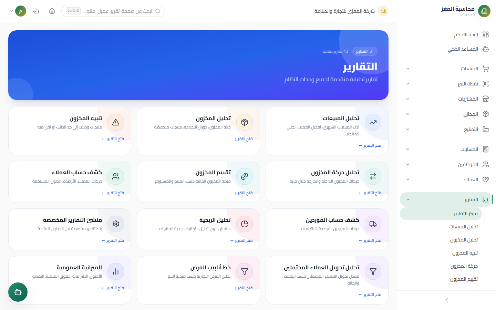
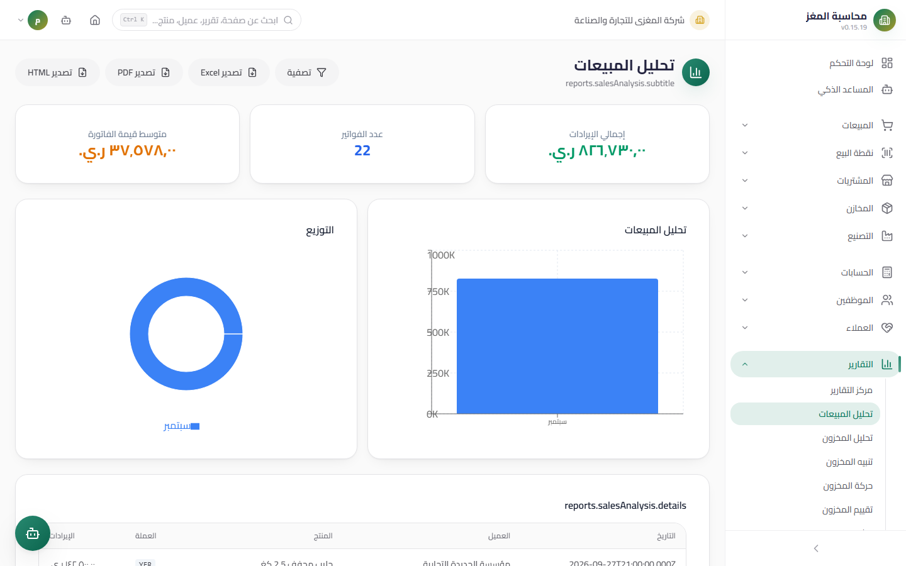
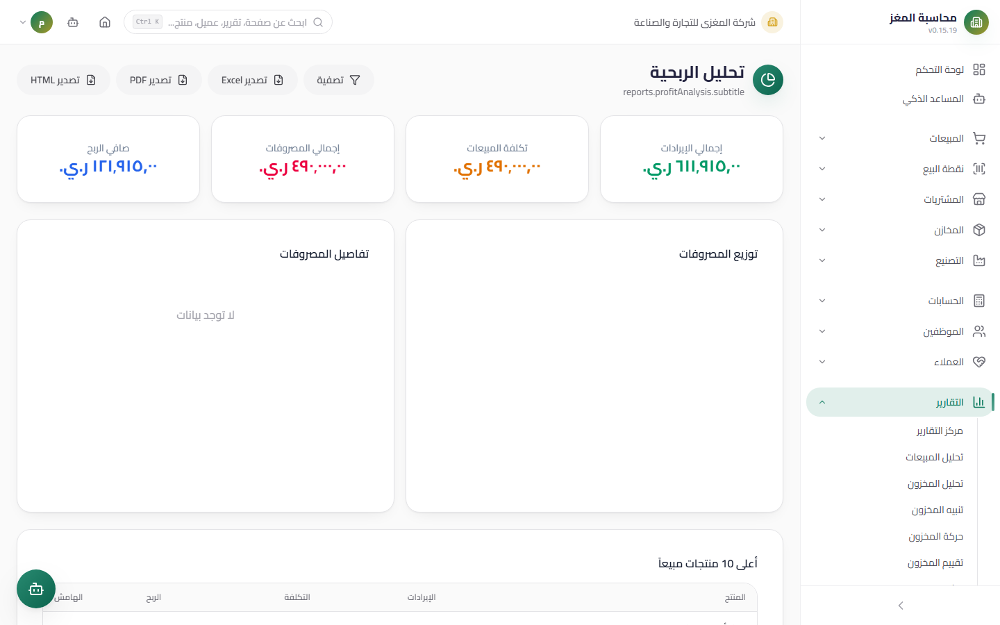
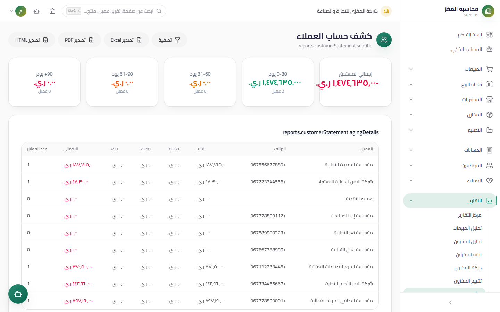
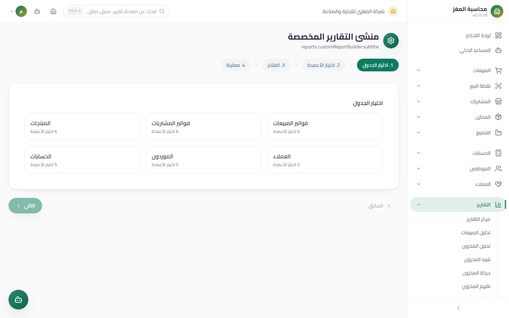

# Reports Hub — User Guide

> A unified gateway to every report in the system: a card grid that takes you straight to any report, with permission protection and unified export.

## Overview

The Reports Hub at the `/reports` route displays **12 reports** in a colorful card grid (3 cards per row). Each card carries: an icon, the report name, a two-line description, and an "Open Report ←" link, with a badge in the header showing the number of available reports.

## Access & Permissions

- Required permission: `reports.view` to view the Hub.
- A user without `reports.view` sees an explicit "You do not have permission to view this page (لا تملك صلاحية لعرض هذه الصفحة)" message instead of the card grid.
- The **Custom Report Builder** is completely hidden from the grid for anyone without `reports.custom`.
- Exporting any report requires `reports.export` (the buttons are disabled without it).
- The "Financial Overview" card does not open a standalone report but takes you to the accounting Balance Sheet (Statement of Financial Position) list (`/accounting/balance`).
- The export buttons inside every report work with the same `reports.export` permission — see the permission matrix file.

## The 12 Reports

| # | Report | Path | What it shows |
|---|---|---|---|
| 1 | Sales Analysis | `/reports/sales-analysis` | The period's revenue per invoices, with a breakdown by customer and product |
| 2 | Inventory Analysis | `/reports/inventory-analysis` | The items' status in the warehouses (good/low/out) with their quantities and values |
| 3 | Low Stock Alert | `/reports/low-stock-alert` | Items that reached the minimum alert threshold before running out |
| 4 | Stock Movement | `/reports/stock-movement` | The in/out log per item (issue and receipt movements) |
| 5 | Stock Valuation | `/reports/stock-valuation` | The total inventory value at cost price per item and warehouse |
| 6 | Customer Statement | `/reports/customer-statement` | The customers' outstanding balances with **receivables aging** (0-30/31-60/61-90/90+) |
| 7 | Supplier Statement | `/reports/supplier-statement` | The suppliers' outstanding balances with payables aging |
| 8 | Profit Analysis | `/reports/profit-analysis` | Profitability by products and periods from actual invoice data |
| 9 | **Custom Report Builder** | `/reports/custom-builder` | Build your own report (hidden without `reports.custom`) |
| 10 | Lead Conversion | `/reports/lead-conversion` | The rate of converting leads into opportunities |
| 11 | Opportunity Pipeline | `/reports/opportunity-pipeline` | The distribution of opportunities and their values across the sales stages |
| 12 | Financial Overview | `/accounting/balance` | Takes you to the Balance Sheet (Statement of Financial Position) list |

## Filter Details per Report

| Report | Available filters |
|---|---|
| Sales Analysis | Period (from/to), a specific customer, a specific product |
| Inventory Analysis | Item status: All / Good / Low / Out |
| Low Stock Alert | Warehouse |
| Stock Movement | Product, period |
| Stock Valuation | Warehouse/period as shown in the filter bar |
| Customer Statement | Period (from/to) — only invoices with an outstanding balance and not cancelled are shown |
| Supplier Statement | Period (from/to) |
| Profit Analysis | Period (from/to) |
| Lead Conversion | Period (from/to) with a clear-filters button |
| Opportunity Pipeline | Shows a comprehensive distribution with no date filters |
| Custom Report Builder | Table + columns + pagination selection (see the section below) |

> The "Reset filters" button returns every filter to its default in all reports.

## When to Use Each Report

| Report | When to use it |
|---|---|
| Sales Analysis | Reviewing sales performance: who buys the most, and which products sell |
| Inventory Analysis | A comprehensive view of inventory health: what is good, low, and out |
| Low Stock Alert | **Daily**: what will run out soon and needs an urgent purchase order |
| Stock Movement | Tracing the source and timing of any issue or receipt movement |
| Stock Valuation | Knowing the value of what is in the warehouses at cost — an input for budgets and period closes |
| Customer Statement | Following up collections: who owes me how much, and when the balance became old |
| Supplier Statement | Scheduling supplier payments by the age of the balance |
| Profit Analysis | Which products actually make a profit after the purchase cost |
| Lead Conversion | Measuring the sales team's efficiency in turning calls into opportunities |
| Opportunity Pipeline | Seeing the ongoing deals and where they stand in the sales stages |
| Custom Report Builder | A tailored report that the ready-made reports do not cover |

## Export & Print (General)

Every report in the system (not just the Hub) follows the same unified export system:

| Button | Output | Notes |
|---|---|---|
| **Export Excel** | An `.xlsx` file of the report table | The library loads dynamically on the first click only (no weight at startup) |
| **Export PDF** | A formatted PDF file | Generated via the dynamically loaded `jspdf` library, with RTL support |
| **Export HTML** | An HTML file for sharing | Saves the report table in a format that opens in any browser |

Common rules:

- The file carries a unified header: **the active company name + the report name + the creation date** (the report identity `useReportBranding`).
- The file name is derived from the report and the date, e.g. `SalesAnalysis_2026-09-12`.
- The export buttons appear disabled for anyone without `reports.export`.
- For paper printing: export a PDF and print it, or print the HTML file from the browser.
- The export captures the result of the current filters — export after setting the filters, not before.

## Custom Report Builder

A tool that lets the account owner build a simple report from the core data tables without technical involvement:

1. **Choose the table** from the available lists: sales invoices, purchase invoices, products, customers, suppliers.
2. **Choose the columns** you want to appear — each table has a predefined set of columns.
3. **Browse the results** in a table with pagination and navigation buttons.
4. **Export** the result with the same unified export buttons (Excel / PDF / HTML).

The available columns per table (a selection):

| Table | Example columns |
|---|---|
| Sales invoices | Invoice number, customer, date, total, status |
| Purchase invoices | Invoice number, supplier, date, total, status |
| Products | Name, SKU, cost price, sale price, active/inactive |
| Customers | Code, name, phone, balance |
| Suppliers | Code, name, phone, balance |

Notes:

- The report enforces company isolation automatically — you see your company's data only, whatever your role.
- The columns are predefined per table (no free-form queries); this guarantees that the builder cannot expose data outside your permissions.
- Completely hidden from the Hub cards for anyone without `reports.custom`.

## Common Errors & Fixes

| Message/Situation | Cause | Solution |
|---|---|---|
| "لا تملك صلاحية لعرض هذه الصفحة" (You do not have permission to view this page) in the Hub | Your role lacks `reports.view` | Ask for the permission from Settings ← Roles |
| The Custom Report Builder card is not visible | Your role lacks `reports.custom` | Ask for the custom reports permission |
| The export buttons are disabled | Your role lacks `reports.export` | Ask for the export permission |
| The PDF export does not open a file | The browser blocked the popup | Allow popups for the site, then export again |
| The customer statement is empty although invoices exist | The statement shows only invoices with an unpaid balance and not cancelled | Check the invoices' recorded payments or the invoice's status |
| The aging report shows a balance you did not expect | The calculation uses the due date and the difference between the total and the paid amount | Review the due dates on the invoices |
| "Financial Overview" takes you outside the Hub | This is intentional — the card opens the accounting Balance Sheet list | Use Sidebar ← Accounting ← Balance Sheet |

## Tips

- Set a weekly routine: the Low Stock Alert on Saturday, the Customer Statement on Sunday, and Profit Analysis at the end of the month.
- Use the aging in the customer statement to decide which customers deserve an immediate phone follow-up (the 90+ bucket first).
- Export the statements as PDF and send them to customers as a formal monthly follow-up.
- When you need a report that is not among the 12, try the Custom Report Builder before requesting new development.
- Link the Hub reports to the Reports page in the sidebar — every card has a direct path you can save in the browser.
