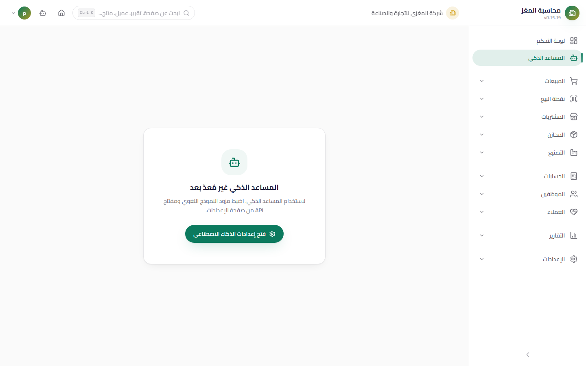
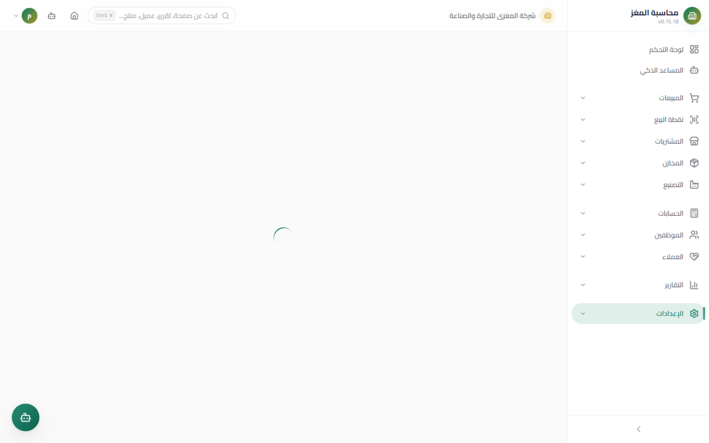

# "Maghz" AI Assistant (مغزى) — Complete User Guide

> An Arabic AI assistant built into the system: it searches, reads your reports, and executes operations (an invoice, a journal entry, a payroll run...) only after your explicit approval of every write.

## Overview

The **"Maghz" AI Assistant (مغزى)** turns the system into a conversation: type what you want in Arabic («اعرض مبيعات هذا الشهر» — "Show this month's sales", «أنشئ فاتورة للعميل الأمل بمنتجين» — "Create an invoice for customer Al-Amal with two products") and it executes it through roughly **250 internal tools**. Every write tool goes through a human confirmation card, and every tool is filtered according to your permissions.

## Three Entry Points

| Entry Point | How to Open It | When to Use It |
|---|---|---|
| **Full Chat Page** | Sidebar ← AI Assistant (the `/ai` path) | Long working sessions, browsing previous sessions, exporting the conversation |
| **Floating Chat Widget** | The round button at the bottom of any page, or the **Ctrl+Shift+K** shortcut | A quick question while working — opens a small chat panel over the current page (it goes full screen on mobile) |
| **Quick Suggestions** | Chips above the input field (Sales / Invoice / Inventory / Report) | A quick start without typing |

Notes:

- The **Ctrl+K** shortcut is reserved for the Command Palette — the floating chat opens with **Ctrl+Shift+K**, and **Escape** closes it.
- The floating button is visible to anyone holding the `ai.use` permission even before the assistant is set up, so it can show the setup card first.
- On the `/ai` page the floating button hides automatically (there is no need for two layers of chat).

## Chat Features

| Feature | Description |
|---|---|
| **Sessions Drawer** | Every conversation is saved under an automatic name; search your sessions, rename them, delete them, or switch between them — sessions are stored in the database and are not lost when you close the app |
| **Regenerate** | A button on the last response to regenerate it from scratch |
| **Arabic Markdown Rendering** | Responses support headings, lists, and **tables** rendered with correct RTL directionality |
| **Suggestion Chips** | After every response, interactive chips appear: they take you straight to a page, or suggest the next step (such as «رحّل آخر فاتورة» — "Post the latest invoice") |
| **Voice Input** | The microphone button dictates in Arabic (depends on browser support) — the same button cycles through states: microphone ⇄ send ⇄ stop |
| **Processing Indicator** | A "thinking" indicator while the response is being generated, plus a stop button (■) to end generation early |
| **Export Conversation** | From the `/ai` page: download the current conversation as a JSON or Markdown file |

## Attachments (Multimodal)

From the paperclip 📎 button next to the input field: **choose a file from your device** or **capture a photo with the camera** directly.

| Type | Maximum Size | What Happens to the File |
|---|---|---|
| Images (JPG/PNG/WebP/GIF) | 5 MB | Scaled down to a maximum side of 1600 px in JPEG quality, and EXIF/GPS data (any location or camera information) is stripped before the file leaves your device |
| PDF files | 10 MB, first 5 pages | Text is extracted locally on your device and sent to the assistant as text |
| Spreadsheets (XLSX/XLS/CSV) | 10 MB | The sheet's text is extracted locally, with a summary preview in the input field |
| Audio (MP3/WAV/M4A/OGG...) | 10 MB | Sent as-is to the assistant for processing |

Attachment rules:

- **Duplicate files are blocked**: every file is fingerprinted with a SHA-256 hash, so the same file is never sent twice within one message.
- Extracted attachment text has a per-message cap (protecting the assistant's context window) — very large files are summarized.
- Binary file data is not stored in the database with the conversation; an Arabic description of the file remains in the record.

## Capabilities (~250 Tools)

| Category | Examples | Approximate Count |
|---|---|---|
| **Entity Search** | `search.customers`, `search.products`, `search.sales_invoices`... typo-tolerant search by name | ~35 searchers |
| **Reading & Detailed Reports** | KPIs, account ledgers, customer and supplier statements, receivables/payables aging, sales/inventory/purchases/accounting/CRM analytics | ~70 |
| **Writes (require your approval)** | Create/edit/delete/post for Accounting (`accounting.create_entry`), Sales (`sales.create_invoice`), Purchases, Inventory, CRM, Manufacturing, and Settings | ~125 |
| **Human Resources** | Recording attendance, leave requests, **a payroll run in three stages: Preview → Generate → Post** | ~23 |
| **One-Step Composite Handlers** | Create and post an invoice in one step, the full payroll cycle, convert a lead into an opportunity | 7 |
| **Navigation** | `app.list_pages`, `app.navigate` — takes you to the requested system page | 2 |
| **Diagnostics** | Why won't this invoice post? Where are the unbalanced journal entries? | 2 |
| **Batch Queues** | Prepare/resume/batch status | 3 |

> Not all tools are sent to the assistant on every turn — only the relevant ones are selected (up to 48 tools per turn) based on the topic of your request, to speed up the response.

## Security Model (Very Important)

1. **An amber confirmation card for every write**: when the assistant asks to perform an operation (create/edit/delete/post), the operation pauses and an **amber confirmation card** appears showing a plain-Arabic summary of the parameters (for example: «إنشاء فاتورة للعميل شركة الأمل بإجمالي 150,000 ر.ي — بندين» — "Create an invoice for customer Al-Amal Company with a total of 150,000 YER — two lines"). You choose **Approve (موافقة)** or **Reject (رفض)**. No write is executed before you click Approve.
2. **Clear status badges on every tool card**: Pending (awaiting your approval) / Running / Success / Error / Rejected.
3. **Permission filtering**: tools are checked against your RBAC permissions — an employee without `accounting.create` never sees the journal-entry creation tools at all, and they cannot be executed from their chat.
4. **AI keys never reach the browser**: the provider key is managed by the desktop (Electron) process and is never exposed to the user interface; the setup page shows the key masked only.
5. **Hallucination guard**: if the assistant claims in a response that it performed an operation without actually calling a real tool, its response is automatically discarded and it is asked to correct itself — it cannot trick you with a false "I created the invoice".
6. **Audit Log**: every successful write is recorded in the Audit Log with the user's name and the truthful operation type (create/edit/delete/post).
7. **Usage limits and rate limits**: a weekly hourly cap on provider calls (120/hour by default), plus per-minute limits on read and write tools to protect the database.

## Batch Queues (One Approval for Many Operations)

When a request involves more than two write operations (such as «سجّل 50 فاتورة من هذا الجدول» — "Record 50 invoices from this table"), the operations are grouped into a single **batch**:

- A **single approval card** summarizes all items (it supports 20–100+ items, and even hundreds of items are accepted in chunks of 500).
- **Order dependencies are preserved**: the second item may need the first item's output (such as the invoice ID to create its payment) through named `{{ref}}` references.
- On approval, processing starts gradually with a **progress card** (completed/failed/skipped) and pause/resume/cancel/**retry-failed** buttons.
- The batch state is **stored in the database**, so if the app closes or the machine loses power, the batch resumes where it stopped when you return.

## Language Understanding

- **Modern Standard Arabic and dialects**: it understands common Yemeni and Gulf business phrasing.
- **Typo-tolerant search**: «شركة الامل» / «الامل» / «عميل الئمل» all reach the same customer.
- **Arabic-Indic numerals**: `٠١٢٣٤٥٦٧٨٩` are understood just like 0123.
- **Currency words**: «ألفين وخمسمئة» ("two thousand five hundred"), "2500", or «2.5 ألف» ("2.5 thousand").
- **Free-form dates**: «أمس» ("yesterday"), «الجمعة الماضية» ("last Friday"), «بداية الشهر» ("start of the month"), "15/8".
- **Entity name resolution**: «شركة الأمل» ("Al-Amal Company") is automatically matched to the correct customer record before any operation, and the assistant asks you if the name is ambiguous across several results.

## Setup — Path: Sidebar ← Settings ← AI Settings (`/settings/ai`)

| Field | Description |
|---|---|
| Provider | Gemini (default), OpenAI, OpenRouter, Groq, local Ollama, or Custom |
| API URL | Auto-filled according to the provider |
| Model | The model name at the provider |
| API Key | Entered once and stored by the desktop process — **never shown in the browser UI** and always displayed masked |
| Enable/Disable | Activates the assistant for the company |

Setup steps:

1. Open `/settings/ai` (requires the `ai.settings` permission — super admin and admin).
2. Choose the provider and paste the API key from your account with that provider.
3. Click **Save (حفظ)**, then the **Test Connection (اختبار الاتصال)** button to verify.
4. In browser mode (without the desktop app), the key is saved encrypted locally with a clear security warning — desktop mode is preferred.

## Practical Command Examples

1. «اعرض مبيعات هذا الشهر» — "Show this month's sales" — an instant KPI summary.
2. «كم رصيد العميل شركة الأمل؟» — "What is the balance of customer Al-Amal Company?" — typo-tolerant name search + balance.
3. «أنشئ فاتورة للعميل مؤسسة النور بمنتجين: شاي 10 كراتين وعسل 5 عبوات» — "Create an invoice for customer Al-Nour Establishment with two products: 10 cartons of tea and 5 packs of honey" — a confirmation card before saving.
4. «رحّل آخر فاتورة مبيعات» — "Post the latest sales invoice" — posted after your approval.
5. «جهّز مسير رواتب أغسطس ورحّله بعد موافقتي» — "Prepare the August payroll run and post it after my approval" — a full cycle: Preview → Generate → Post.
6. «سجّل حضور كل الموظفين اليوم» — "Record attendance for all employees today" — a bulk write with a single card.
7. «حوّل العميل المحتمل أحمد صالح إلى فرصة بمرحلة تفاوض» — "Convert lead Ahmed Saleh into an opportunity at the negotiation stage" — a composite handler.
8. «لماذا لا يمكن ترحيل فاتورة PINV-00012؟» — "Why can't invoice PINV-00012 be posted?" — diagnosis of the blocking reasons.
9. «اعرض القيود غير المتوازنة هذا الشهر» — "Show unbalanced journal entries this month" — accounting diagnostics.
10. «افتح صفحة كشوف الحسابات» — "Open the account statements page" — direct navigation.
11. «كم قيمة المخزون في المستودع الرئيسي؟» — "What is the inventory value in the main warehouse?" — a valuation report.
12. «أعمار الذمم المدينة لكل العملاء» — "Receivables aging for all customers" — a detailed aging report.
13. «ألغِ مسودة الفاتورة INV-00034» — "Delete draft invoice INV-00034" — deleting a draft after your confirmation.
14. «أنشئ أمر شراء من المورد العالمية بثلاثة أصناف ورحّله» — "Create a purchase order for supplier Al-Alamia with three items and post it" — a composite batch.
15. «اقرح لي المرتجعات المعلقة للاستبعاد من تقرير هذا الأسبوع» — "Walk me through the pending returns to exclude from this week's report" — analytical reading.

## Common Errors & Fixes

| Message / State | Cause | Solution |
|---|---|---|
| A setup card appears instead of the chat | The key or provider has not been configured | Complete the setup at `/settings/ai` |
| The floating button does not appear | You do not have `ai.use`, or no active company is loaded | Request the permission or log in again |
| «تم رفض الطلب» ("Request rejected") on a tool card | You clicked Reject, or the system refused execution | Re-issue the request and approve it, or review the permissions |
| The assistant apologizes for not performing an operation | The call limit was exceeded or the provider connection dropped | Wait a moment and retry, and check the connection |
| An attachment was rejected | It exceeded a limit (image 5 MB / PDF 10 MB and 5 pages / spreadsheet 10 MB / audio 10 MB) | Shrink or split the file |
| A response claims an action that did not happen | Rare — the hallucination guard discards it and corrects automatically | Check for a "Success (نجاح)" badge on the tool card before relying on the result |

## Tips

- Make a habit of reading the entire confirmation card summary before approving — it is your last line of defense.
- For repeated bulk operations, request them as one batch instead of separate requests.
- Use the suggestion chips under responses; they usually contain the logical next step.
- If you doubt a result, ask the assistant «أرني الفاتورة INV-...» — "Show me invoice INV-..." — to verify the actual state in the database.
