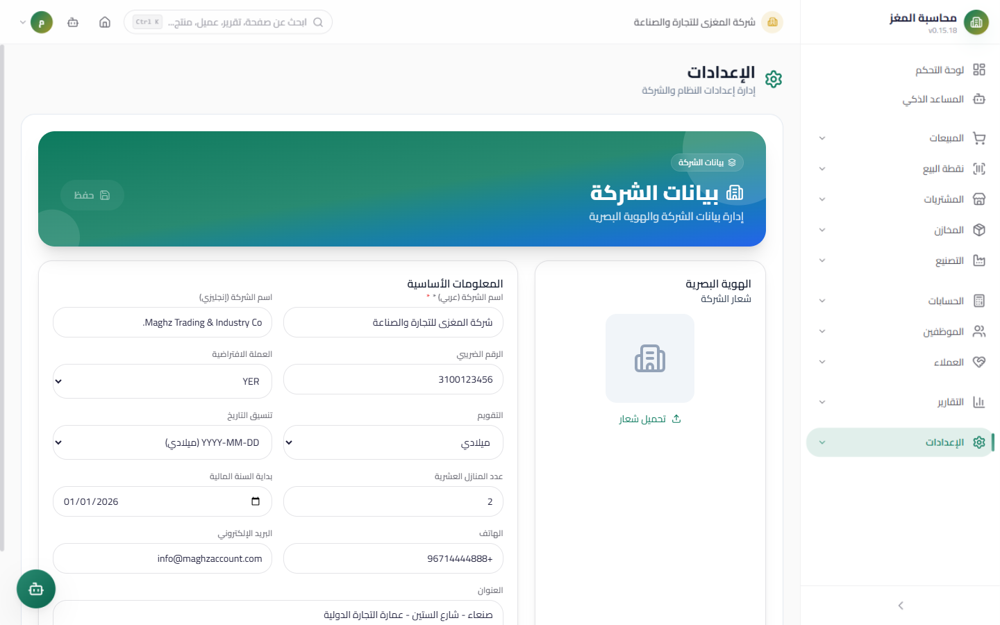

# Multi-Currency — User Guide

> Working with more than one currency: defining them, their exchange rates, using them in invoices and vouchers, and reading them in reports.

## Overview

**MaghzAccountPro** supports working with multiple currencies, with the **Base Currency (YER by default)** as the single reference for all totals and reports. You issue an invoice in USD or SAR, it is stored with its YER equivalent, and it appears in reports with a currency breakdown card showing each currency's share.

- **Administration access:** Sidebar ← Settings ← Currencies (`/settings/currencies`)
- **Usage access:** every invoice and voucher screen (Sales, Purchases, Receipt Voucher, Payment Voucher)
- **Permissions:** managing currencies falls under `settings.*`; using currencies in documents falls under each module's own permissions (`sales.*`, `purchases.*`, `accounting.*`)

## 1. Managing Currencies



Everything about adding and editing currencies is documented in `04-settings/02-branches-currencies.md`. Summary:

| Element | Rule |
|---|---|
| Code | 3 mandatory Latin characters (`YER`, `USD`, `SAR`) |
| Exchange Rate | How much of the base currency equals 1 of this currency: `rate(USD) = 1500` means 1 USD = 1500 YER |
| Base Currency | Marked with the star; its rate is always 1 and it cannot be deleted |
| Enabled | Disabled currencies do not appear in document lists |

## 2. The Exchange Rate and Conversion Rule

```
Converted value = Value × Source rate ÷ Target rate
```

**Examples** (base YER, `USD = 1500`, `SAR = 400`):

| From → To | Calculation | Result |
|---|---|---|
| 100 USD → YER | 100 × 1500 ÷ 1 | 150,000 YER |
| 2,000 SAR → YER | 2000 × 400 ÷ 1 | 800,000 YER |
| 375 SAR → USD | 375 × 400 ÷ 1500 | 100 USD |

## 3. In Invoice and Voucher Forms

When creating or editing a sales invoice, purchase invoice, Receipt Voucher, or Payment Voucher, three fields appear side by side at the top of the form:

| Field | Function |
|---|---|
| **Currency** | A dropdown of the active currencies (indexed by code). **Changing the currency automatically pulls its saved exchange rate** from the currencies page |
| **Exchange Rate** | Manually editable at creation time (for example, for a special rate negotiated with the customer). Step: 0.0001 |
| **Base Currency Amount** | A live, read-only display of the document total converted to the base currency; it updates instantly with every change to the amounts or the rate |

### A Full Calculation Example

A sales invoice in USD, with YER as the base currency:

| Item | Value |
|---|---|
| Amount entered on the invoice | 100 USD |
| Exchange rate (pulled automatically when USD is selected) | 1500 |
| Total in the currency | 100 USD |
| **Base Currency Amount (live read)** | `100 × 1500 ÷ 1 = 150,000 YER` |

If you change the rate to 1600 before saving, the live read changes instantly to `100 × 1600 = 160,000 YER`.

### What Is Stored on Save

| Stored | Note |
|---|---|
| Currency (e.g. USD) | The selected currency code |
| The exchange rate at creation time | Remains historical even if the rate changes in Settings later |
| **Base Currency Amount** | **Always computed server-side** on save — the client (browser) value is not relied upon for the final rounding, so reports stay consistent for all users |

After saving: the invoice view and details show the Base Currency Amount next to the total in the original currency, and the currency column appears in the invoices table with a small badge if it differs from the base.

## 4. Multi-Currency Reports

Financial reports (Sales Analysis, Profit Analysis, and others) display the **currency breakdown card** under the totals:

| Column | Content |
|---|---|
| Currency | The currency code with a mono badge + its symbol (e.g. `USD $`) |
| Amount | The sum of documents in that currency, formatted with its symbol |
| Base Currency Amount | The same amount converted to YER at its stored rate (shown only when multiple currencies exist) |
| Percentage % | The currency's share of the base-currency total, with a visual progress bar |

Additional card elements:

| Element | When It Appears |
|---|---|
| **Multi-Currency (متعدد العملات)** badge (amber) | Only if the period contains two or more currencies |
| A **Total in Base Currency** row | In the card footer when multiple currencies exist — the sum of all base-currency equivalents |

**Example:** a period containing a 100 USD invoice at rate 1500 and a 200,000 YER invoice:

| Currency | Amount | Base Currency Amount | Share |
|---|---|---|---|
| YER ري.ي | 200,000 | 200,000 | 57% |
| USD $ | 100 | 150,000 | 43% |
| **Total in Base Currency** | | **350,000 YER** | 100% |

## 5. Step-by-Step Workflow

1. **Define your currencies:** Settings ← Currencies ← add USD at 1500 and SAR at 400 (see `04-settings/02-branches-currencies.md`).
2. **Update the rate daily with the market:** edit the exchange rates on the currencies page whenever the price changes — new documents pull the new rate automatically.
3. **Issue an invoice in a non-base currency:** Sales ← Invoices ← New Invoice (فاتورة جديدة) ← select the USD currency ← the rate is pulled automatically (edit it if needed) ← watch the Base Currency Amount readout update instantly.
4. **Collect in the same currency:** from the Receipt Voucher, select the same currency and the agreed rate — the equivalent is computed server-side and deducted from the customer's balance.
5. **Read the reports:** Reports Hub ← Sales Analysis ← review the currency breakdown card, the Multi-Currency badge, and the total in base currency.

## Important Rules

- **The exchange rate is captured at creation time** and stored with the document: changing the rate later does not modify old documents — historical reports stay fixed.
- **The Base Currency Amount is always computed server-side:** what you see live in the form is a preview; the authoritative value is built on the server at save.
- **All aggregated totals** (aging, profits, cash flows) are built in the base currency.
- If a currency is not enabled, it will not appear in document lists, even if it is defined.
- Currency management itself is governed by the `settings.*` permissions and the Audit Log — documented in `04-settings/02-branches-currencies.md`.

## Common Errors & Fixes

| Message / Behavior | Cause | Solution |
|---|---|---|
| The currency does not appear in the invoice dropdown | It is not enabled on the currencies page | Enable it from Settings ← Currencies |
| The Base Currency Amount is zero or strange | The exchange rate is zero or entered inverted | Fix the rate: 1 USD = 1500 YER means the rate is 1500, not 0.00067 |
| The old invoice does not change after updating the rate | Working as designed — the rate is stored historically | This is intentional; edit the invoice itself if you want it to carry its own rate |
| The currency breakdown card shows no Base Currency Amount | Only one currency exists in the period | The detailed columns appear only when multiple currencies exist |
| The report total does not equal the sum of my invoices | Some invoices are in different currencies — the total is in base currency | Check the currency breakdown card: each currency with its equivalent, then the base-currency total |
| I cannot edit the exchange rate on an old voucher | The rate is fixed at creation time | Create a new voucher at the current rate |

## Tips

- Update exchange rates at the start of every business day — one minute that guarantees the accuracy of all of the day's documents.
- Leave the exchange rate as pulled automatically unless you actually have a rate agreed with the other party.
- Watch for the Multi-Currency badge in reports: its presence means part of your revenue is exposed to exchange-rate movement between the moment of invoicing and the moment of collection.
- For a detailed look at the currency screen fields and the "default currency cannot be deleted" rule, see `04-settings/02-branches-currencies.md`.
